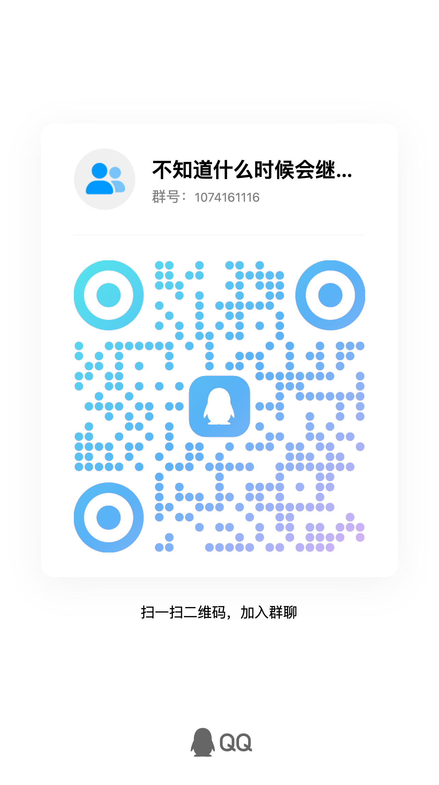

# 项目说明

欢迎来到 Anyayay's Chemistry Note！

这是一个基于中国普通高中教科书的化学笔记项目，主要围绕 Bilibili Up主 [@一化儿](https://space.bilibili.com/1526560679/) 的视频展开的，也或许是你见过的 **免费的 最完整的 最真实的** 高中化学笔记，不仅仅是知识点的笔记，也有超多的实战解题技巧，以及我自己总结出来的经验，或一个盲猜技巧，或一个口诀。

多的不说了，学习更重要，左侧有目录（移动设备是顶上有一个 Menu 可以展开），上面有搜索。

以及一个 PDF 的下载链接：[https://www.alipan.com/s/aU66F4xRH2w](https://www.alipan.com/s/aU66F4xRH2w)

加油！

> [!NOTE]
> 下面是一个小小的 QQ 群，欢迎加入交流学习，不过目前还没啥人 QwQ
> 
> 群号：[1074161116](https://qm.qq.com/q/CljGJy9p8Q)
> 
> 

## 共建者

如果有空？欢迎加入我们，一起完善这个项目！

<VPTeamMembers size="small" :members />

> [!NOTE]
> 当前该笔记项目正在寻找共建者！（有意者与我联系 seeridia@gmail.com ）

## 参考资料

1.  Bilibili Up主 [@一化儿](https://space.bilibili.com/1526560679/)
    
2.  普通高中教科书 化学（人教版、鲁科版、苏教版、沪科技版）[*国家中小学智慧教育平台*](https://www.zxx.edu.cn/elecEdu)
    
3.  解题觉醒-化学 [天星教育](https://www.tesoon.com/)
    
4.  [璎晴宫·霁月台·芳兰亭](https://www.zhihu.com/column/c_1266657933414342656)
    
5.  [维基百科](https://zh.wikipedia.org/)
    
6.  [维基教科书 《高中化学》](https://zh.wikibooks.org/wiki/%E9%AB%98%E4%B8%AD%E5%8C%96%E5%AD%A6)

7.  高考必刷题 [*众望教育*](https://www.lxzwedu.com/)
    
8.  一本涂书
    
9.  教材划重点
    
10.  [Khan Academy](https://zh.khanacademy.org/)
    
11. 邢其毅等.基础有机化学:第4版[M].北京:北京大学出版社,2016.

## 以及...

本项目从你所看到的这个在线网站到 PDF 文件，都是完全免费的，可以自由下载和使用的，全程没有任何广告和付费墙。

如果这份材料对你的帮助很大，可以考虑下赞赏吗？赞赏也将是支持网站和这份笔记的维护工作。

> [!NOTE]
> 如果您选择赞赏，希望能在备注中留下您的名字或昵称，也可以带上一句话，以便我们在项目的感谢名单中提及您！谢谢您的支持！😊

感谢下面这些朋友对本项目的赞赏支持：

<VPAppreciators :items="appreciators" />