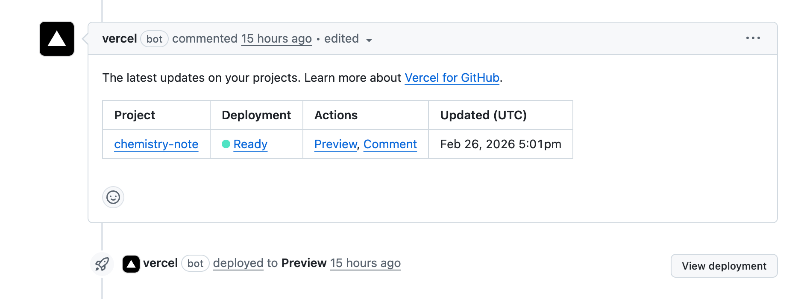

# 贡献指南

感谢你愿意参与 **Chemistry Note** 的共建。

本章节主要讲的是如何参与贡献内容、提交修改、规范命名以及提交前的自检。参与的前置要求是需要有一个 GitHub 账号，并且熟悉基本的 Git 操作 和 Markdown 语法。

如果你是第一次参与开源项目，或者不太熟悉 Git 和 Markdown，那请不要花时间去学习这些工具的使用，他们会花费你大量的时间。如果你只是要反馈问题，参见 [反馈问题](./错误反馈.md) 部分。

## 项目结构

Chemistry Note 的项目示例如下：

```
├── docs
│   ├── 01 原子结构与元素性质
│   │   ├── 01 核外电子排布方式.md
│   │   ├── 02 构造原理、泡利原理、洪特规则
│   │   ├── 03 电子排布式与轨道表示式.md
│   │   └── 考点 元素周期律与元素推断.md
...
```

其中，我们的内容主要分为两类：
1. **章节内容**：以数字开头的 Markdown 文件，如 `03 电子排布式与轨道表示式.md`，这些文件包含了章节的主要内容。
2. **考点内容**：以 `考点` 开头的 Markdown 文件，如 `考点 元素周期律与元素推断.md`，这些文件包含了章节的考点等等。

请务必遵循上述的命名规范，以便我们能够更好地管理和维护项目内容。

## 文章结构

每篇文章的结构示例如下：

```
---
description: "介绍电子排布式、简化电子排布式和轨道表示式的概念、书写规则和意义，包括实例和价层电子轨道表示式表格。"
---
# 03 · 电子排布式与轨道表示式

正文...
```

其中，文章的开头需要包含一个 YAML Front Matter，用于描述文章的元信息，如 `description`。接下来是文章的标题，格式为 `# 数字 · 章节标题`，数字部分需要与文件名中的数字保持一致。

另外结构中也有要求如下：

1. 每篇文章有且仅有一个一级标题（`#`），且该标题必须以数字开头，后面跟着章节标题。
2. 每篇文章的标题深度不能超过三级标题（`###`），以保持内容的层次清晰。更多的结构请使用无序列表、有序列或者表格等方式来组织内容。

## 提交内容修改

如果你发现了文本中的错误，或者有更好的表达方式，欢迎提交修改建议。请按照以下步骤操作：

1. Fork 这个仓库到你的 GitHub 账号。
2. 在你的 Fork 中找到需要修改的文件，进行修改。
3. 提交修改，并创建一个 Pull Request，描述你修改的内容和原因。
4. 等待维护者的审核和合并。

对于 PR 的命名，请遵循以下规范：

- **文本修改**：`fix: 修正了某某错误` 或 `feat: 优化了某某表达`
- **新增内容**：`feat: 添加了某某内容`
- **其他修改**：`chore: 更新了某某内容`

## 自检

我们部署了 CD 流程，在 PR 打开后会自动构建到预览环境，提交者可以在 PR 中查看预览链接，检查修改后的内容是否正确显示。

如下图所示，你可以点击 `Preview` 链接，进入预览环境查看修改后的效果



## 负责任地使用 LLM

请注意我们的首要贡献原则：**我们不接受 LLM 全篇生成的内容**，LLM 只能参与下面三个部分：

1. **内容的润色**：LLM 可以帮助我们优化文本的表达，使其更清晰、流畅，但不能生成新的内容。
2. **内容的校对**：LLM 可以帮助我们检查文本中的语法错误、拼写错误和逻辑不清的地方，但不能替代人工的校对
3. **OCR 转写**：LLM 可以帮助我们将图片中的文本转写成可编辑的文本，但需要人工进行校对和润色。

## Markdown 语法拓展

这边会介绍一些我们在项目中使用的 Markdown 语法拓展，以便你能够更好地编写内容。有一部分是 Vitepress 自带的，一部分是我们自定义的。

> 感谢 [Linho1219/LinhoNotes](https://github.com/Linho1219/LinhoNotes) 项目提供的 Markdown 语法拓展示例，我们在此基础上进行了一些修改。

### 公式

我们使用 mathjax 来渲染公式，支持行内公式和块级公式。行内公式使用 `$...$` 包裹，块级公式使用 `$$...$$` 包裹。

特别的，对于化学式的书写，我们使用 `$\ce{...}$` 来包裹化学式，这样可以更好地渲染化学式中的元素、离子、分子等。

```markdown
$$
\ce{2H2 + O2 -> 2H2O}
$$
```

$$
\ce{2H2 + O2 -> 2H2O}
$$

### Github 风格的警报

```markdown
> [!NOTE]
> 强调用户在快速浏览文档时也不应忽略的重要信息。

> [!TIP]
> 有助于用户更顺利达成目标的建议性信息。

> [!IMPORTANT]
> 对用户达成目标至关重要的信息。

> [!WARNING]
> 因为可能存在风险，所以需要用户立即关注的关键内容。

> [!CAUTION]
> 行为可能带来的负面影响。
```

> [!NOTE]
> 强调用户在快速浏览文档时也不应忽略的重要信息。

> [!TIP]
> 有助于用户更顺利达成目标的建议性信息。

> [!IMPORTANT]
> 对用户达成目标至关重要的信息。

> [!WARNING]
> 因为可能存在风险，所以需要用户立即关注的关键内容。

> [!CAUTION]
> 行为可能带来的负面影响。


### 徽章

可以使用全局组件 Badge 来创建徽章，支持不同的类型和颜色。

```markdown
### Title <Badge type="info" text="超纲内容" />
### Title <Badge type="tip" text="苏教版" />
### Title <Badge type="warning" text="整理中" />
```

### Title <Badge type="info" text="超纲内容" />
### Title <Badge type="tip" text="苏教版" />
### Title <Badge type="warning" text="整理中" />

### 图片反色

图片默认在深色模式下会进行反色处理，如果你不希望图片被反色，可以在图片标签中添加 `&keep-color` 参数。

```markdown

```

更多 Markdown 语法拓展请参见 [Vitepress 官方文档](https://vitepress.dev/zh/guide/markdown)