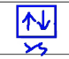
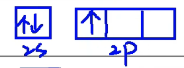
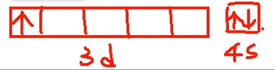
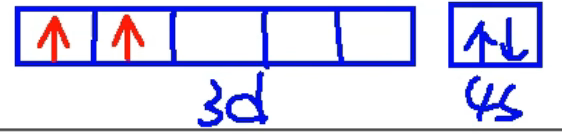
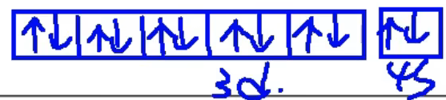

#原子结构 · 三 · 电子排布式与轨道表示式

> 价层电子排布式书写规则是处于稳定状态的原子，核外电子将尽可能地按能量最低原理排布

<table>
    <tr>
        <th rowspan="3">电子排布式</th>
        <th>含义</th>
        <td>用数字在能级符号右上角标明该能级上排布的 <b>电子数</b> ，这就是电子排布式</td>
    </tr>
    <tr>
        <th>意义</th>
        <td>能直观反映出核外的电子层、能级及各能级上的电子数</td>
    </tr>
    <tr>
        <th>实例</th>
        <td>K： 1s22s22p63s23p64s1 </td>
    </tr>
    <tr>
        <th rowspan="3">简化电子排布式</th>
        <th>含义</th>
        <td>为了避免电子排布式书写过于繁琐，把内层电子达到稀有气体原子结构的部分以相应稀有气体元素符号外加 方括号 表示</td>
    </tr>
    <tr>
        <th>意义</th>
        <td>避免书写电子排布式过于繁琐</td>
    </tr>
    <tr>
        <th>实例</th>
        <td>K： [Ar] 4s1 </td>
    </tr>
    <tr>
        <th rowspan="3">轨道表示式</th>
        <th>含义</th>
        <td>每个方框代表一个原子轨道，每个箭头代表一个 <b>电子</b> </td>
    </tr>
    <tr>
        <th>意义</th>
        <td>能直观反映出电子的排布情况及电子的 <b>自旋</b> 状态</td>
    </tr>
    <tr>
        <th>实例</th>
        <td></td>
    </tr>
</table>

<table>
    <tr>
        <th>原子序数</th>
        <th>元素名称</th>
        <th>元素符号</th>
        <th>电子排布式</th>
        <th>价层电子轨道表示式</th>
    </tr>
    <tr>
        <td>1</td>
        <td> 氢 </td>
        <td> H </td>
        <td> 1s1 </td>
        <td></td>
    <tr>
    <tr>
        <td>2</td>
        <td> 氨 </td>
        <td> He </td>
        <td> 1s2 </td>
        <td></td>
    <tr>
    <tr>
        <td>3</td>
        <td> 锂 </td>
        <td> Li </td>
        <td> 1s22s1 </td>
        <td></td>
    <tr>
    <tr>
        <td>4</td>
        <td> 铍 </td>
        <td> Be </td>
        <td> 1s22s2 </td>
        <td></td>
    <tr>
    <tr>
        <td>5</td>
        <td> 硼 </td>
        <td> B </td>
        <td> 1s22s22p1 </td>
        <td></td>
    <tr>
    <tr>
        <td>6</td>
        <td> 碳 </td>
        <td> C </td>
        <td> 1s22s22p2 </td>
        <td></td>
    <tr>
    <tr>
        <td>7</td>
        <td> 氮 </td>
        <td> N </td>
        <td> 1s22s22p3 </td>
        <td></td>
    <tr>
    <tr>
        <td>10</td>
        <td> 氖 </td>
        <td> Ne </td>
        <td> 1s22s22p6 </td>
        <td></td>
    <tr>
    <tr>
        <td>11</td>
        <td> 钠 </td>
        <td> Na </td>
        <td> 1s22s22p63s1 </td>
        <td></td>
    <tr>
    <tr>
        <td>12</td>
        <td> 镁 </td>
        <td> Mg </td>
        <td> 1s22s22p63s2 </td>
        <td></td>
    <tr>
    <tr>
        <td>13</td>
        <td> 铝 </td>
        <td> AI </td>
        <td> 1s22s22p63s23p1 </td>
        <td></td>
    <tr>
    <tr>
        <td>14</td>
        <td> 硅 </td>
        <td> Si </td>
        <td> 1s22s22p63s23p2 </td>
        <td></td>
    <tr>
    <tr>
        <td>18</td>
        <td> 氩 </td>
        <td> Ar </td>
        <td> 1s22s22p63s23p6 </td>
        <td></td>
    <tr>
    <tr>
        <td>19</td>
        <td> 钾 </td>
        <td> K </td>
        <td> [Ar]4s1 </td>
        <td></td>
    <tr>
    <tr>
        <td>20</td>
        <td> 钙 </td>
        <td> Ca </td>
        <td> [Ar]4s2 </td>
        <td></td>
    <tr>
    <tr>
        <td><b>21</b></td>
        <td><b> 钪 </b></td>
        <td><b> Sc </b></td>
        <td><b> [Ar]3d14s2 </b></td>
        <td></td>
    <tr>
    <tr>
        <td>22</td>
        <td> 钛 </td>
        <td> Ti </td>
        <td> [Ar]3d24s2 </td>
        <td></td>
    <tr>
    <tr>
        <td>23</td>
        <td> 钒 </td>
        <td> V </td>
        <td> [Ar]3d34s2 </td>
        <td></td>
    <tr>
    <tr>
        <td><b>24</b></td>
        <td> <b>铬</b> </td>
        <td><b> Cr </b></td>
        <td> <b>[Ar]3d54s1 </b></td>
        <td></td>
    <tr>
    <tr>
        <td>25</td>
        <td> 锰 </td>
        <td> Mn </td>
        <td> [Ar]3d54s2 </td>
        <td></td>
    <tr>
    <tr>
        <td>26</td>
        <td> 铁 </td>
        <td> Fe </td>
        <td> [Ar]3d64s2 </td>
        <td></td>
    <tr>
    <tr>
        <td>27</td>
        <td> 钴 </td>
        <td> Co </td>
        <td> [Ar]3d74s2 </td>
        <td></td>
    <tr>
    <tr>
        <td>28</td>
        <td> 镍 </td>
        <td> Ni </td>
        <td> [Ar]3d84s2 </td>
        <td></td>
    <tr>
    <tr>
        <td><b>29</b></td>
        <td><b> 铜 </b></td>
        <td><b> Cu </b></td>
        <td><b> [Ar]3d104s1 </b></td>
        <td></td>
    <tr>
    <tr>
        <td>30</td>
        <td> 锌 </td>
        <td> Zn </td>
        <td> [Ar]3d104s2 </td>
        <td></td>
    <tr>
    <tr>
        <td>31</td>
        <td> 镓 </td>
        <td> Ga </td>
        <td> [Ar]3d104s24p1 </td>
        <td></td>
    <tr>
    <tr>
        <td>32</td>
        <td> 锗 </td>
        <td> Ge </td>
        <td> [Ar]3d104s24p2 </td>
        <td></td>
    <tr>
    <tr>
        <td>33</td>
        <td> 砷 </td>
        <td> As </td>
        <td> [Ar]3d104s24p3 </td>
        <td></td>
    <tr>
    <tr>
        <td>36</td>
        <td> 氪 </td>
        <td> Kr </td>
        <td> [Ar]3d104s24p6 </td>
        <td></td>
    <tr>
    <tr>
        <td>37</td>
        <td> 铷 </td>
        <td> Rb </td>
        <td> [Kr]5s1 </td>
        <td></td>
    <tr>
</table>

> 特殊情况：
> $ Cr:[Ar]3d^54s^1$
> $ Cu: [Ar]3d^{10}4s^1$

## 过渡金属阳离子

> **从最外层电子开始失去**

- $Fe:[Ar]3d^64s^2$
  $Fe^{2+}:[Ar]3d^6$
  $Fe^{3+}:[Ar]3d^5$
- $Cu:[Ar]3d^{10}4s^1$
  $Cu^{1+}:[Ar]3d^{10}$
  $Cu^{2+}:[Ar]3d^9$
- $Zn:[Ar]3d^{10}4s^2$
  $Zn^{1+}:[Ar]3d^{10}$