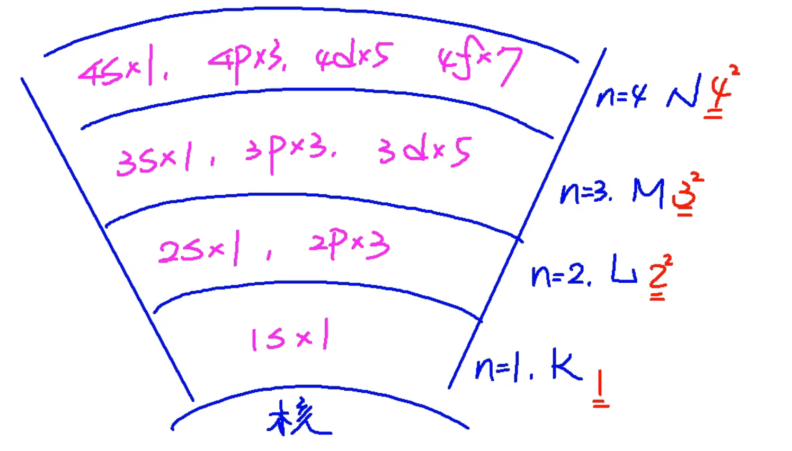
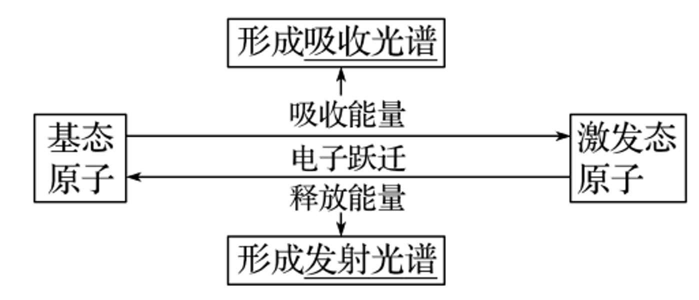

# 原子结构与元素性质 · 二 · 「构造原理、泡利原理、洪特规则」

## 原子轨道

对每个 $n$ 值而言：

- 有 **$n$** 种能级

- 有 $n^2$ 个原子轨道

- 最多可容纳 $2n^2$ 个 $e^-$

## 构造原理

**构造原理（aufbau principle）**：从氢开始，随核电荷数递增，新增电子填入能级的顺序称为构造原理。

**顺序** ：$1s - 2s - 2p - 3s -  3p - 4s - 3d - 4p - 5s - 4d - 5p - 6s - ...$

${\displaystyle E_{1l}<E_{2l}<E_{3l}<...<E_{nl}}$

${\displaystyle E_{ns}<E_{np}<E_{nd}<E_{nf}}$

${\displaystyle E_{ns}<E_{(n-2)f}<E_{(n-1)d}<E_{np}}$

我们把第三个不等式中涉及到的能级组成的集合称为能级组。

| 能级组序号       | 一   | 二     | 三     | 四        | 五        | 六           | 七           |
| ----------- | --- | ----- | ----- | -------- | -------- | ----------- | ----------- |
| **能级**      | $1s$  | $2s$ $2p$ | $3s$ $3p$ | $4s$ $3d$ $4p$ | $5s$ $4d$ $5p$ | $6s$ $4f$ $5d$ $6p$ | $7s$ $5f$ $6d$ $7p$ |
| **最大电子容纳量** | $2$  | $8$     | $8$     | $18$       | $18$       | $32$          | $32$          |

## 泡利不相容原理

**泡利原理**：在一个原子轨道里，最多只能容纳  **2**  个电子，它们的自旋  **相反** ，常用上下箭头( ↑ 和 ↓ )表示自旋相反的  **电子**  

> $_8O$ 的轨道表示式如下：
>  
> $$
> _8O \qquad \frac{↑↓}{1s} \quad \frac{↑↓}{2s} \quad \frac{↑↓\!\quad ↑↓\!\quad ↑↓\!\quad}{2p}
> $$
> 
> - 简并轨道： **能量** 相同的原子轨道
> - 电子对：同一个原子轨道中，自旋方向  **相反**  的一对电子
> - 单电子：一个原子轨道中若只有一个电子，则该电子称为单电子
> - 自旋平行：**箭头同向**  的单电子称为自旋平行
> - 在氧原子中，有  **3**  对电子对，有  **2**  个单电子
> - 在氧原子中，有  **5**  种 *空间运动状态*，有  **8**  种 *运动状态不同* 的电子

## 洪特规则

1. 内容：基态原子中，填入  **简并轨道**  的电子总是先单独分占，且自旋平行
2. 特例：在简并轨道上的电子排布处于全充满、半充满和全空状态时，具有  **较低** 的能量和  **较大** 的稳定性

$$相对稳定的状态   \begin{cases}
全充满& s^2, p^6, d^{10}, f^{14} \\
半充满& s^1, p^3, d^{5}, f^{7}\\
全空& s^0, p^0, d^{0}, f^{0} \\
\end{cases}$$

> $_{24}Cr$ 的电子排布式为  $[Ar]3d^54s^1$  ，为半充满状态，易错写为 $[Ar]3d^44s^2$
> $_{29}Cu$ 的电子排布式为  $[Ar]3d^{10}4s^1$  ，为全充满状态，易错写为 $[Ar]3d^94s^2$

> 1. 基态原子：处于 **最低能量** 状态的原子
> 
> 2. 激发态原子：基态原子 **吸收能量**，它的电子会跃迁到 **较高能级**，变成 **激发态原子**

## 能量最低原理

1. 内容：在构建基态原子时，电子将尽可能地占据  **能量最低**  的原子轨道，使整个原子的能量最  **低** 
2. 因素：整个原子的能量由  **核电荷数**  、  **电子数**  和  **电子状态**  三个因素共同决定

## 原子光谱

### 焰色反应

物理反应，进行焰色反应应使用 **铂丝**（镍丝、无锈铁丝）。把嵌在玻璃棒上的金属丝在 **稀盐酸** 里蘸洗后，放在酒精灯的火焰里灼烧，不同金属元素会使火焰变为各种颜色，这便是焰色反应。焰色反应的形成与原子光谱有关

详见 [06 元素及其化合物 - 01 钠及其化合物](../06%20元素及其化合物/01%20钠及其化合物.md)

### 光谱分析

在现代化学中，常利用原子光谱上的  **特征谱线**  来鉴定元素，称为光谱分析