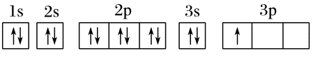

# 03 · 电子排布式与轨道表示式

> 价层电子排布式书写规则是处于稳定状态的原子，核外电子将尽可能地按能量最低原理排布

<table>
    <tbody>
        <tr>
        <th rowspan="3"> 电子排布式 </th>
        <th> 含义 </th>
        <td> 用数字在能级符号右上角标明该能级上排布的 <b> 电子数 </b> ，这就是电子排布式 </td>
        </tr>
        <tr>
        <th> 意义 </th>
        <td> 能直观反映出核外的电子层、能级及各能级上的电子数 </td>
        </tr>
        <tr>
        <th> 实例 </th>
        <td> Ne: 1s²,2s²,2p⁶ </td>
    </tr>
    <tr>
        <th rowspan="3"> 简化电子排布式 </th>
        <th> 含义 </th>
        <td> 为了避免电子排布式书写过于繁琐，把内层电子达到稀有气体原子结构的部分以相应稀有气体元素符号外加 方括号 表示 </td>
        </tr>
        <tr>
        <th> 意义 </th>
        <td> 避免书写电子排布式过于繁琐 </td>
        </tr>
        <tr>
        <th> 实例 </th>
        <td> K: [Ar]4s¹ </td>
    </tr>
    <tr>
        <th rowspan="3"> 轨道表示式  （电子排布图）  </th>
        <th> 含义 </th>
        <td> 每个方框代表一个原子轨道，每个箭头代表一个 <b> 电子 </b> </td>
        </tr>
        <tr>
        <th> 意义 </th>
        <td> 能直观反映出电子的排布情况及电子的 <b> 自旋 </b> 状态 </td>
        </tr>
        <tr>
        <th> 实例 </th>
        <td>  </td>
        </tr>
    </tbody>
</table>

| 原子序数 | 元素名称 | 元素符号  | 电子排布式                 | 价层电子轨道表示式                                                                                                                                                    |
| -------- | -------- | --------- | -------------------------- | --------------------------------------------------------------------------------------------------------------------------------------------------------------------- |
| 1        | 氢       | $\ce{H}$  | $1s^1$                     | $\mathop{\boxed{\uparrow \enspace } }\limits^{1s}$                                                                                                              |
| 2        | 氦       | $\ce{He}$ | $1s^2$                     | $\mathop{\boxed{\uparrow \downarrow} }\limits^{1s}$                                                                                                                   |
| 3        | 锂       | $\ce{Li}$ | $1s^2 2s^1$                | $\mathop{\boxed{\uparrow \enspace } }\limits^{2s}$                                                                                                                    |
| 4        | 铍       | $\ce{Be}$ | $1s^2 2s^2$                | $\mathop{\boxed{\uparrow \downarrow } }\limits^{2s}$                                                                                                                  |
| 5        | 硼       | $\ce{B}$  | $1s^2 2s^2 2p^1$           | $\mathop{\boxed{\uparrow \downarrow } }\limits^{2s} \mathop{\boxed{\uparrow \enspace } \boxed{\enspace^{\ ^{} }_{\ } } \boxed{\enspace^{\ ^{} }_{\ } } }\limits^{2p}$ |
| 6        | 碳       | $\ce{C}$  | $1s^2 2s^2 2p^2$           | $\mathop{\boxed{\uparrow \downarrow } }\limits^{2s} \mathop{\boxed{\uparrow \enspace } \boxed{\uparrow \enspace } \boxed{\enspace^{\ ^{} }_{\ } } }\limits^{2p}$         |
| 7        | 氮       | $\ce{N}$  | $1s^2 2s^2 2p^3$           | $\mathop{\boxed{\uparrow \downarrow } }\limits^{2s} \mathop{\boxed{\uparrow \enspace } \boxed{\uparrow \enspace } \boxed{\uparrow \enspace } }\limits^{2p}$             |
| 10       | 氖       | $\ce{Ne}$ | $1s^2 2s^2 2p^6$           | $\mathop{\boxed{\uparrow \downarrow } }\limits^{2s} \mathop{\boxed{\uparrow \downarrow } \boxed{\uparrow \downarrow } \boxed{\uparrow \downarrow } }\limits^{2p}$       |
| 11       | 钠       | $\ce{Na}$ | $1s^2 2s^2 2p^6 3s^1$      | $\mathop{\boxed{\uparrow \enspace } }\limits^{3s}$                                                                                                                     |
| 12       | 镁       | $\ce{Mg}$ | $1s^2 2s^2 2p^6 3s^2$           | $\mathop{\boxed{\uparrow\downarrow}}\limits^{3s}$                                                                                                                      |
| 13       | 铝       | $\ce{Al}$ | $1s^2 2s^2 2p^6 3s^2 3p^1$       | $\mathop{\boxed{\uparrow\downarrow}}\limits^{3s}\; \mathop{\boxed{\uparrow}\;\boxed{\phantom{\uparrow}}\;\boxed{\phantom{\uparrow}}}\limits^{3p}$                     |
| 14       | 硅       | $\ce{Si}$ | $1s^2 2s^2 2p^6 3s^2 3p^2$       | $\mathop{\boxed{\uparrow\downarrow}}\limits^{3s}\; \mathop{\boxed{\uparrow}\;\boxed{\uparrow}\;\boxed{\phantom{\uparrow}}}\limits^{3p}$                               |
| 18       | 氩       | $\ce{Ar}$ | $1s^2 2s^2 2p^6 3s^2 3p^6$       | $\mathop{\boxed{\uparrow\downarrow}}\limits^{3s}\; \mathop{\boxed{\uparrow\downarrow}\;\boxed{\uparrow\downarrow}\;\boxed{\uparrow\downarrow}}\limits^{3p}$           |
| 19       | 钾       | $\ce{K}$  | $[\ce{Ar}] 4s^1$                | $\mathop{\boxed{\uparrow}}\limits^{4s}$                                                                                                                                |
| 20       | 钙       | $\ce{Ca}$ | $[\ce{Ar}] 4s^2$                | $\mathop{\boxed{\uparrow\downarrow}}\limits^{4s}$                                                                                                                      |
| 21       | 钪       | $\ce{Sc}$ | $[\ce{Ar}] 3d^1 4s^2$           | $\mathop{\boxed{\uparrow}\;\boxed{\phantom{\uparrow}}\;\boxed{\phantom{\uparrow}}\;\boxed{\phantom{\uparrow}}\;\boxed{\phantom{\uparrow}}}\limits^{3d}\; \mathop{\boxed{\uparrow\downarrow}}\limits^{4s}$ |
| 22       | 钛       | $\ce{Ti}$ | $[\ce{Ar}] 3d^2 4s^2$           | $\mathop{\boxed{\uparrow}\;\boxed{\uparrow}\;\boxed{\phantom{\uparrow}}\;\boxed{\phantom{\uparrow}}\;\boxed{\phantom{\uparrow}}}\limits^{3d}\; \mathop{\boxed{\uparrow\downarrow}}\limits^{4s}$           |
| 23       | 钒       | $\ce{V}$  | $[\ce{Ar}] 3d^3 4s^2$           | $\mathop{\boxed{\uparrow}\;\boxed{\uparrow}\;\boxed{\uparrow}\;\boxed{\phantom{\uparrow}}\;\boxed{\phantom{\uparrow}}}\limits^{3d}\; \mathop{\boxed{\uparrow\downarrow}}\limits^{4s}$                     |
| 24       | 铬       | $\ce{Cr}$ | $[\ce{Ar}] 3d^5 4s^1$           | $\mathop{\boxed{\uparrow}\;\boxed{\uparrow}\;\boxed{\uparrow}\;\boxed{\uparrow}\;\boxed{\uparrow}}\limits^{3d}\; \mathop{\boxed{\uparrow}}\limits^{4s}$               |
| 25       | 锰       | $\ce{Mn}$ | $[\ce{Ar}] 3d^5 4s^2$           | $\mathop{\boxed{\uparrow}\;\boxed{\uparrow}\;\boxed{\uparrow}\;\boxed{\uparrow}\;\boxed{\uparrow}}\limits^{3d}\; \mathop{\boxed{\uparrow\downarrow}}\limits^{4s}$     |
| 26       | 铁       | $\ce{Fe}$ | $[\ce{Ar}] 3d^6 4s^2$           | $\mathop{\boxed{\uparrow\downarrow}\;\boxed{\uparrow}\;\boxed{\uparrow}\;\boxed{\uparrow}\;\boxed{\uparrow}}\limits^{3d}\; \mathop{\boxed{\uparrow\downarrow}}\limits^{4s}$                            |
| 27       | 钴       | $\ce{Co}$ | $[\ce{Ar}] 3d^7 4s^2$           | $\mathop{\boxed{\uparrow\downarrow}\;\boxed{\uparrow\downarrow}\;\boxed{\uparrow}\;\boxed{\uparrow}\;\boxed{\uparrow}}\limits^{3d}\; \mathop{\boxed{\uparrow\downarrow}}\limits^{4s}$                 |
| 28       | 镍       | $\ce{Ni}$ | $[\ce{Ar}] 3d^8 4s^2$           | $\mathop{\boxed{\uparrow\downarrow}\;\boxed{\uparrow\downarrow}\;\boxed{\uparrow\downarrow}\;\boxed{\uparrow}\;\boxed{\uparrow}}\limits^{3d}\; \mathop{\boxed{\uparrow\downarrow}}\limits^{4s}$          |
| 29       | 铜       | $\ce{Cu}$ | $[\ce{Ar}] 3d^{10} 4s^1$        | $\mathop{\boxed{\uparrow\downarrow}\;\boxed{\uparrow\downarrow}\;\boxed{\uparrow\downarrow}\;\boxed{\uparrow\downarrow}\;\boxed{\uparrow\downarrow}}\limits^{3d}\; \mathop{\boxed{\uparrow}}\limits^{4s}$ |
| 30       | 锌       | $\ce{Zn}$ | $[\ce{Ar}] 3d^{10} 4s^2$        | $\mathop{\boxed{\uparrow\downarrow}\;\boxed{\uparrow\downarrow}\;\boxed{\uparrow\downarrow}\;\boxed{\uparrow\downarrow}\;\boxed{\uparrow\downarrow}}\limits^{3d}\; \mathop{\boxed{\uparrow\downarrow}}\limits^{4s}$ |
| 31       | 镓       | $\ce{Ga}$ | $[\ce{Ar}] 3d^{10} 4s^2 4p^1$   | $\mathop{\boxed{\uparrow\downarrow}}\limits^{4s}\; \mathop{\boxed{\uparrow}\;\boxed{\phantom{\uparrow}}\;\boxed{\phantom{\uparrow}}}\limits^{4p}$                    |
| 32       | 锗       | $\ce{Ge}$ | $[\ce{Ar}] 3d^{10} 4s^2 4p^2$   | $\mathop{\boxed{\uparrow\downarrow}}\limits^{4s}\; \mathop{\boxed{\uparrow}\;\boxed{\uparrow}\;\boxed{\phantom{\uparrow}}}\limits^{4p}$                              |
| 33       | 砷       | $\ce{As}$ | $[\ce{Ar}] 3d^{10} 4s^2 4p^3$   | $\mathop{\boxed{\uparrow\downarrow}}\limits^{4s}\; \mathop{\boxed{\uparrow}\;\boxed{\uparrow}\;\boxed{\uparrow}}\limits^{4p}$                                        |
| 36       | 氪       | $\ce{Kr}$ | $[\ce{Ar}] 3d^{10} 4s^2 4p^6$   | $\mathop{\boxed{\uparrow\downarrow}}\limits^{4s}\; \mathop{\boxed{\uparrow\downarrow}\;\boxed{\uparrow\downarrow}\;\boxed{\uparrow\downarrow}}\limits^{4p}$          |
| 37       | 铷       | $\ce{Rb}$ | $[\ce{Kr}] 5s^1$                | $\mathop{\boxed{\uparrow}}\limits^{5s}$                                                                                                                                |

> 特殊情况：$\ce{Cr}:[\ce{Ar}]3d^54s^1$，$\ce{Cu}: [\ce{Ar}]3d^{10}4s^1$

## 过渡金属阳离子

> **从最外层电子开始失去**

- $\ce{Fe}: [\ce{Ar}] 3d^64s^2$

    $\ce{Fe}^{2+}:[\ce{Ar}]3d^6$

    $\ce{Fe}^{3+}:[\ce{Ar}]3d^5$

- $\ce{Cu}: [\ce{Ar}] 3d^{10}4s^1$

    $\ce{Cu}^{+}:[\ce{Ar}]3d^{10}$

    $\ce{Cu}^{2+}:[\ce{Ar}]3d^9$

- $\ce{Zn}: [\ce{Ar}] 3d^{10}4s^2$

    $\ce{Zn}^{2+}:[\ce{Ar}]3d^{10}$
