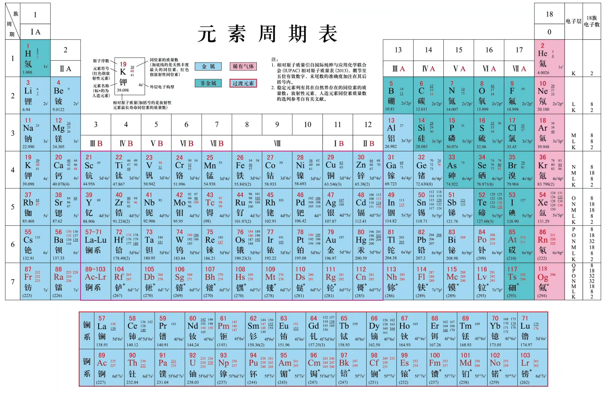

# 原子结构与元素性质 · 四 · 原子结构 元素周期表

> 类金属：$Te,Sb,B,Ge,As,Si$（记忆：弟弟捧着神龟-碲锑硼锗砷硅）

## 核外电子排布与周期的划分

>化学家鲍林(L.Pauling)基于大量光谱实验数据及近似的理论计算，提出的多电子原子的原子轨道 **近似能级图**

在这个图中，如果将**能量相近的原子轨道归为一组**，所得到的能级组按照能量从低到高的顺序与元素周期表中的周期相对应。**不同能级组之间的能量差较大，同一能级组内能级之间的能量差较小**

进一步研究表明，**通常只有最外能级组的电子才有可能参与化学反应，最外能级组中那些有可能参与 化学反应的电子称为 价电子(valence electron)**

一般情况下，主族元素原子的价电子只包括最外层电子；过渡元素原子的价电子除最外层电子外，还包括次外层的部分电子，甚至倒数第三层的电子

## 价层电子排布与周期的划分

- 第一周期：$1s^1→1s^2$
- 第二周期：$2s^1→2s^2→2s^22p^1→...→2s^22p^6$
- 第三周期：$3s^1→3s^2→3s^23p^1→...→3s^23p^6$
- 第四周期：$4s^1→4s^2→3d^14s^2→...→3d^{10}4s^2→4s^24p^1→...→4s^24p^6$
- 第五周期：$5s^1→5s^2→4d^15s^2→...→4d^{10}5s^2→5s^25p^1→...→5s^25p^6$
- 第六周期：$La$系$6s→4f→5d→6p$
- 第七周期：$Ac$系$7s→5f→6d→7p$

除第一周期外，其余周期总是从$ns$能级开始，以$nsnp$能级结束；**一个能级组最多能容纳的电子数等于对应的周期包含的元素种数**

过渡元素优先填充内层的$d$轨道，其余元素的价层电子无需写$d$轨道
> 如：
> 
> $_{33}As$:核外电子排布式：$[Ar]3d^{10}4s^24p^3$
> 
> $_{33}As$:价层电子排布式：$4s^24p^3$
> 
> $_{54}Xe$:核外电子排布式：$[Kr]4d^{10}5s^25p^6$
> 
> $_{54}Xe$:价层电子排布式：$5s^25p^6$

价层电子排布式书写方式：（以$Sb为例$）
1. $Sb$为第五周期$ⅤA$族
2. $ⅤA$族：最外层有五个电子
3. 第五周期：第五能层
4. 所以电子排布式为$5s^25p^3$

## 各族元素价层电子排布特点

- **主族**：$ns^1→ns^2np^5$，且主族序数$(n)$=最外层电子数=价层电子数
- **0族**：$He$为$1s^2$，其他为$ns^2np^6$（最外层 $8$ 电子）
- **过渡元素**（全部都是金属，最外层电子数不超 $2$ ）
   1. $ⅢB$族~$ⅤⅡB$族：
        $(n-1)d^{1-5}ns^{1-2}$
        族序数=价电子数
        $d$ 轨道未全满 
        > 特殊：$Cr:3d^54s^1$ $Cu:3d^{10}4s^1$
        > 例外：$Pd:4d^{10}$（ $d$ 轨道全满） 以及 镧系、锕系
   2. $ⅤⅢ$族（8、9、10列）：$(n-1)d+ns$能级的电子数之和
   3. $ⅠB、ⅡB$族：
        $(n-1)d^{10}ns^{1-2}$  [$(n-1)d$ 轨道为全充满状态]
   4. 镧系/锕系：$(n-2)f^{0-14}(n-1)d^{0-2}ns^2$
   
## 元素周期表的分区
按照核外电子排布，可把元素周期表划分成5个区：$s$区、$p$区、$d$区、$ds$区、$f$区
除$ds$区外，**各区的名称来自按构造原理最后填入电子的能级符号**

