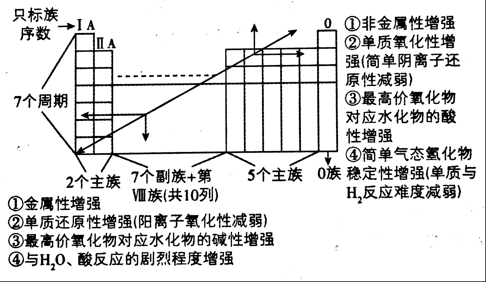

# 考点 · 元素周期律与元素推断

## 考点一 元素周期表结构与元素周期律

- **随周期的↘，主族的↗而↗的性质**（从左下 **至右上**）：

    1. 非金属性 

    2. 单质的氧化性（简单阴离子的还原性降低） 

    3. 最高价氧化物对应的水化物的酸性（ $\ce{F}$ 无含氧酸）

    4. 简单气态氢化物稳定性（单质与 $\ce{H2}$ 反应难度减弱） 

    5. 第一电离能（存在例外） 

    6. 电负性 

    7. 金属单质熔沸点
   
- **随周期的↗，主族的↘而↗的性质**（从右上 **至左下**）：

    1. 金属性 

    2. 单质的还原性（简单阳离子的氧化性降低） 

    3. 最高价氧化物对应的水化物的碱性 

    4. 与 $\ce{H2O}$、酸反应的剧烈程度

    5. 氢化物还原性（非金属性越强，单质的氧化性越强，离子或化合物的还原性越弱）
   
- **金属氢化物稳定性**: 
    向左上方向增大（同周期左侧金属性强，但同主族向下时原子半径大，键长长，键能小，分子稳定性低，因此左上方稳定）
    
    > $\ce{NaH} > \ce{MgH_{2}} > \ce{AlH_{3}}$，$\ce{LiH} > \ce{NaH} > \ce{KH}$。
  
- **非金属简单氢化物稳定性**: 向右上方向增大（右上方原子半径小，键长短，键能大，分子稳定性高）
    > $\ce{HF} > \ce{HCl} > \ce{HBr} > \ce{HI}$，$\ce{HF} >\ce{H_{2}O} > \ce{NH_{3}} > \ce{CH_{4}}$
  
- **氢化物的熔沸点**

    同为 **分子晶体** 的氢化物的熔沸点与 **氢键** 及 **范德华力** 有关，在有氢键的情况下，熔沸点较高，且数量越多，熔沸点越高；否则，相对分子质量越大，熔沸点越高
  
    对于 **离子晶体** 的氢化物的沸点则一定大于分子晶体
  
- **原子半径的比较方法**

    1. 同周期主族元素，从左到右，原子半径依次滅小

    2. 同主族元素，从上到下，原子半径依次增大
   
- **离子半径的比较方法**

    1. 核外电子排布不同，电子层数多的半径大

    2. 核外电子排布相同，序大径小

## 考点二 元素推断

前提知识：短周期主族元素与其形成的共价键数目

|            共价键数目            |      元素       |                                                                                                                        说明                                                                                                                         |
| :------------------------------: | :-------------: | :-------------------------------------------------------------------------------------------------------------------------------------------------------------------------------------------------------------------------------------------------: |
|            一个共价键            | $\ce{H、F、Cl}$ | $\ce{H}$ 最外层有 1 个电子，差 1 个电子满足稀有气体 $\ce{He}$ 的 2 电子稳定结构  $\ce{F}$、$\ce{Cl}$ 最外层有 7 个电子，差 1 个电子满足 8 电子稳定结构  $\ce{H}$、$\ce{F}$、$\ce{Cl}$ 都是差 1 电子满足稳定结构，所以在化合物中形成 1 个共价键 |
|            二个共价键            |   $\ce{O、S}$   | $\ce{O}$、$\ce{S}$ 最外层有 6 个电子，都是差 2 个电子满足 8 电子稳定结构，所以在化合价中形成 2 个共价键                                                                                                                                             |
|            三个共价键            | $\ce{B、N、P}$  | $\ce{B}$ 最外层有 3 个电子，可以形成 3 个共价键  $\ce{N}$、$\ce{P}$ 最外层有 5 个电子，都是差 3 个电子满足 8 电子稳定结构，所以在化合物中形成 3 个共价键                                                                                         |
|            四个共价键            |  $\ce{C、Si}$   | $\ce{C}$、$\ce{Si}$ 最外层有 4 个电子，都是差 4 个电子满足 8 电子稳定结构，所以在化合物中形成 4 个共价键                                                                                                                                            |
|  得一个电子后，再形成四个共价键  |  $\ce{B、Al}$   | $\ce{B}$、$\ce{Al}$ 最外层有 3 个电子，在复杂阴离子中，若多得 1 个电子，最外层有 4 个电子后，再差 4 个电子满足 8 电子稳定结构，所以在化合物中形成 4 个共价键  在阴离子如 $\ce{[BH4]^-}$、$\ce{[AlH4]^-}$ 中，B 或 Al 通过接受一个电子形成类碳结构（$sp^3$ 杂化），从而形成 4 个共价键 |
| 失去一个电子后，再形成四个共价键 |   $\ce{N、P}$   | $\ce{N}$、$\ce{P}$ 最外层有 5 个电子，在复杂阳离子中，若失去一个电子，最外层有 4 个电子后，再差 4 个电子满足 8 电子稳定结构，所以在化合物中形成 4 个共价键                                                                                          |
|            五个共价键            |    $\ce{P}$     | $\ce{P}$ 最外层有 5 个电子，可以直接形成 5 个共价键  但要注意的是 P 才能形成 5 个共价键，$\ce{N}$ 不能  第三周期及以后元素具有空的 $d$ 轨道，可扩充价层形成更多共价键（扩展八隅体）                                                |
|            六个共价键            |    $\ce{S}$     | $\ce{S}$ 最外层有 6 个电子，可以直接形成 6 个共价键  但要注意的是 $\ce{S}$ 才能形成 6 个共价键，$\ce{O}$ 不能  第三周期及以后元素具有空的 $d$ 轨道，可扩充价层形成更多共价键（扩展八隅体）                                         |
|            七个共价键            |    $\ce{Cl}$    | $\ce{Cl}$ 最外层有 7 个电子，可以直接形成 7 个共价键  但要注意的是 $\ce{Cl}$ 才能形成 7 个共价键，$\ce{F}$ 不能  第三周期及以后元素具有空的 $d$ 轨道，可扩充价层形成更多共价键（扩展八隅体）                                      |

**总结：**

1. 一般少几个电子满足 8 电子稳定结构（ $\ce{H}$ 是满足 2 电子稳定结构），就会形成几个共价键。

2. 不满足 8 电子稳定结构的情况：

    1. $\ce{B}$、$\ce{Al}$ 若只形成 3 个共价键（且无孤电子对），则不满足 8 电子稳定结构

    2. $\ce{P}$、$\ce{S}$、$\ce{Cl}$ 分别形成 $5$、$6$、$7$ 个共价键时，也不满足 $8$ 电子稳定结构

    3. 一些电子总数为奇数的分子，如 $\ce{NO2}$、$\ce{NO}$，不满足 $8$ 电子稳定结构

    4. 只要有 $\ce{H}$ 原子出现时，所有原子不可能都满足 $8$ 电子稳定结构
   
3. 一定要注意阴离子多出的电子落在哪种元素，阳离子少的电子从哪种元素扣，判定方式如下：

    1. 与正常的共价键数目不一样，例如 $\ce{O}$ 理应形成 $2$ 个共价键，若给定的结构式中 $\ce{O}$ 只形成 $1$ 个共价键，可知 $\ce{O}$ 多一个电子，最外层 $7$ 电子，所以只形成 $1$ 个共价键
      
    2. $\ce{X}$ 原子形成的共价键数目若有两种，得失电子算在 $\ce{X}$ 原子上

        > 如：，$\ce{X}$ 既形成 $1$ 个共价键也形成 $2$ 个共价键，可知该 $-1$ 价阴离子多出的 $1$ 个电子算在 $\ce{X}$ 上，因此 $\ce{X}$ 最外层有 $6$ 个电子，若限定该离子的元素都是短周期元素，则 $\ce{W}$ 为 $\ce{S}$，$\ce{X}$ 为 $\ce{O}$ 
      
    3. 复杂离子中，若其他元素的多个原子形成的共价键数目都只有 $1$ 种，而 $\ce{X}$ 只有 $1$ 个原子，得失电子算在 $\ce{X}$ 原子上
      
        > 如：，由于所有 $\ce{Z}$ 形成的共价键数目都是 2 ，所有 $\ce{Y}$ 形成的共价键数目都是 4 ，而 $\ce{X}$ 只有 1 个原子，因此该阴离子多出的 1 个电子算在 $\ce{X}$ 上，可知 $\ce{X}$ 得 1 个电子后形成 4 个共价键，若限定该离子的元素都是短周期元素，则 $\ce{X}$ 可以是 $\ce{B}$ 或 $\ce{Al}$ 

**方法：**

1. **利用原子结构推断元素**

    1. 利用原子结构及元素在周期表中的位置推断

        $$
        原子^A_ZX \begin{cases}
        原子核\begin{cases}
        中子(决定核素的种类)N 个\\
        质子(决定元素的种类)Z 个\\
        \end{cases}\\
        原子核外电子 Z 个\\
        \end{cases}
        $$

        1. 电荷角度：核内质子数($Z$)= 核电荷数 = 核外电子数 = 原子序数

        2. 质量角度：质量数($A$)= 质子数($Z$)+中子数($N$)
        
        3. 原子电子层数 $=$ 周期序数

        4. 原子最外层电子数 $=$ 主族序数

    2. 根据元素主要化合价的关系推断

        1. 确定元素在周期表中的位置：最高化合价 $=$ 最外层电子数 $=$ 主族序数 ($\ce{O}$ 无最高正价、$\ce{F}$ 无正价)

        2. 如果已知非金属元素的最低化合价（或简单阴离子的符号），则常先求出最高化合价：最高化合价 $= 8- |\text{最低化合价}|$，再确定元素在周期表中的位置

        3. 若最高化合价与最低化合价之和 $= 8$，则该元素一定为主族非金属

    3. 根据原子半径的递变规律推断

        同周期主族元素中左边元素的原子半径一般比右边元素的大，同主族中下边元素的原子半径比上边元素的大

2. **利用元素周期表的片段推断元素**

    1. 元素周期表中第一周期只有 $\ce{H}$ 和 $\ce{He}$ 两种元素，如果推断时已知元素位于不同周期，可优先考虑或排除第一周期的 $\ce{H}$，简化推断思路

    2. 短周期中主族序数与周期序数相同的元素有 $\ce{H}、\ce{Be}、\ce{Al}$

3. **根据物质的转化关系推断元素**

    **常见元素提示词：**

    | 元素 | 核心提示 |
    | ---- | -------- |
    | $\ce{H}$ | 原子半径最小，某种同位素没有中子，密度最小的气体 |
    | $\ce{C}$ | 形成化合物最多的元素，单质有三种常见的同素异形体（金刚石、石墨、富勒烯），$\ce{^{14}C}$ 可用于测定年代 |
    | $\ce{N}$ | 空气中含量最多的气体（$78\%$），单质有惰性，化合时价态很多(-3,**-1/3-叠氮化物**,0,+2,+4,+5)，化肥中的重要元素 |
    | $\ce{O}$ | 地壳中含量最多的元素，空气中含量第 $2$ 的气体（$21\%$），生物体中含量最多、与生命活动关系密切，有两种气态的同素异形体，有正价(OF2; O2F2),但无最高正价 |
    | $\ce{F}$ | 除 $\ce{H}$ 外原子半径最小，无正价，不存在含氧酸，氧化性最强的单质 |
    | $\ce{Na}$ | 短周期主族元素中原子半径最大，焰色反应为黄色 |
    | $\ce{Mg}$ | 烟火、照明弹中的成分，植物叶绿素中的元素，铝热反应的引燃剂 |
    | $\ce{Al}$ | 地壳中含量第三多的元素、含量最多的金属，两性的单质，常温下遇**氧化性**强酸会钝化(加热可推动反应) |
    | $\ce{Si}$ | 地壳中含量第二多的元素，半导体工业的支柱 |
    | $\ce{P}$ | 有三种常见的同素异形体（白磷P4、红磷-多分子不规则排列、黑磷-具有石墨片状结构和导电性-三者中最稳定），制造火药的原料（红磷）、化肥中的重要元素 拓展：*将白磷加热至400℃以下或用紫外光照射白磷即可获得红磷，在硫、碘或钨丝的催化下加热可以加快转化速率；黑磷是用白磷在很高压强（12,000 atm）和较高温度（200℃）下转化而形成的* |
    | $\ce{S}$ | 单质为淡黄色质脆固体，能在火山口发现，制造黑火药的原料(一硫二硝三木炭) |
    | $\ce{Cl}$ | 单质为黄绿色气体，海水中含量最多的元素，氯碱工业的产物之一 |
    | $\ce{K}$ | 焰色反应呈紫色（透过蓝色钴玻璃观察），化肥中的重要元素 |
    | $\ce{Ca}$ | 人体内含量最多的矿质元素，骨骼和牙齿中的主要矿质元素 |
    | $\ce{Fe}$ | 地壳中含量第四的元素，用于制在常温下盛装HNO3(*conc.*) H2SO4(*conc.*)的容器，**其三价离子比二价离子更稳定** |
    | 地壳元素 | $\ce{O}、\ce{Si}、\ce{Al}、\ce{Fe}、\ce{Ca}$ |
