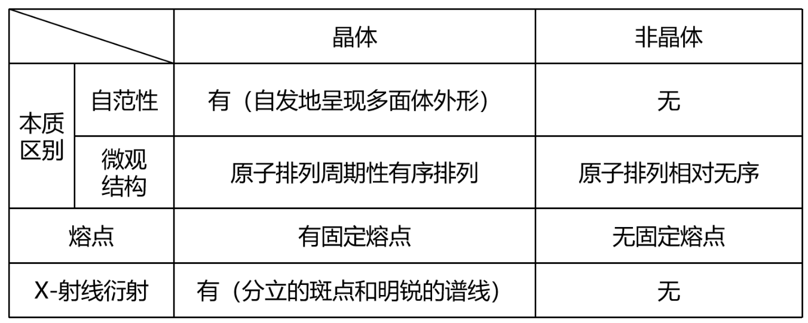

# 微粒间作用力与物质性质 · 一 · 「晶体与晶胞」

## 物质的聚集状态

1. 20世纪前，人们以为分子是所有化学物质能够保持其性质的最小粒子，物质固、液、气三态的相互转化只是分子间距离发生了变化
2. 20世纪初，通过X射线衍射等实验手段，发现许多常见的晶体中并无分子，如氯化钠、石墨、二氧化硅、金刚石以及各种金属等
3. 气态和液态物质不一定都是由分子构成。如 **等离子体** 是由 **电子** 、 **阳离子** 和 **电中性粒子（分子或原子）** 组成的整体上呈电中性的气态物质；离子液体是熔点不高的仅由离子组成的液体物质
4. 其他物质聚集状态，如晶态、非晶态、塑晶态、液晶态等

**晶体**：内部微粒在三维空间里呈周期性有序排列而构成的具有规则几何外形的固体，分为离子晶体、分子晶体(共价晶体)、原子晶体、金属晶体

**非晶体**：内部微粒排列呈相对无序状态，不具有规则几何外形的固体

## 晶体的特点

1. 自范性：
   1. 定义：在 **适宜的条件** 下，晶体能够 **自发地呈现封闭的、规则的几何多面体外形**
   2. 形成条件：晶体生长的速率适当
   >
   > 晶体呈自范性的条件之一是晶体生长的速率适当熔融态物质冷却凝固，有时得到晶体，但凝固速率过快，常常只得到看不到多面体外形的粉末或没有规则外形的块状物。水晶球是岩浆里熔融态的 $SiO_2$ 侵入地壳内的空洞冷却形成的。剖开水晶球，它的外层是看不到晶体外形的玛瑙，内层才是呈现晶体外形的水晶。不同的是，玛瑙是熔融态 $SiO_2$ 快速冷却形成的，而水晶则是熔融态 $SiO_2$ ，缓慢冷却形成的
   >

   3. 本质原因：**晶体的自范性是晶体中原子、分子和离子等微粒在三维空间里呈现周期性有序排列的宏观表现** 。相反， **非晶体** 中微粒的排列则相对无序，因而 **无自范性** 。例如，自然界中存在的各种石英晶体（晶体 $SiO_2$ ),它们几乎都具有对称的六角形棱柱状的外形，而玻璃、玛瑙(非晶体 $SiO_2$ )等就没有天然的、有规则的外形
2. 各向异性：
   晶体内部微粒的排列呈现周期性，而 **不同方向上的微粒排列情况是不同的** 。因此，在晶体中， **不同的方向上具有不同的物理性质** ，如导电性、导热性、硬度、解理性等
    >
    > 例：石墨在与层平行的方向上的电导率数值约为在与层垂直的方向上的电导率数值的1万倍。云母晶体各个方向解理性不同，若沿两层平面的平行方向施加外力就容易剥离，若沿着垂直于平面的方向剥离就困难得多
    > 非晶体在各个方向上的物理性质都一致，显各向同性。例如，玻璃的折光率、热膨胀系数等，一般不随测定的方向而改变。
    >

3. 晶体有固定的熔点。
4. 外形和内部质点排列的高度有序性。

## 晶体与非晶体的辨别

**区分晶体和非晶体最好的方法：X-射线衍射**

## 获得晶体的途径

1. 熔融态物质凝固
2. 气态物质冷却不经液态直接凝固（凝华）
3. 溶质从溶液中析出

## 晶胞

1. 概念：描述晶体结构的基本单元
2. 晶胞与晶体的关系一般来说，晶胞都是 **平行六面体**，整块晶体可以看作是数量巨大的晶胞“无隙并置”而成
   - “无隙”是指相邻晶胞之间无任何间隙
   - “并置”是指所有晶胞都是 **平行排列** 的，**取向相同**
   - 所有晶胞的 **形状** 及其内部的原子**种类**、**个数** 及几何排列是完全相同的

## 晶胞中粒子数目的计算：均摊法

晶胞中粒子数目的计算：均摊法确定晶胞中粒子的个数
若晶胞中某个粒子为 $n$ 个晶胞所共用，则该粒子有 $\frac{1}{n}$ 属于这个晶胞。
长方体形（正方体形）晶胞中不同位置的粒子对晶胞的贡献