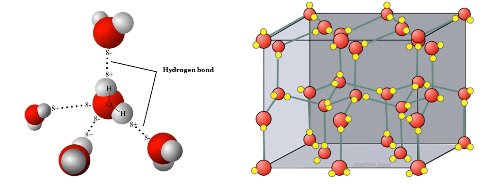
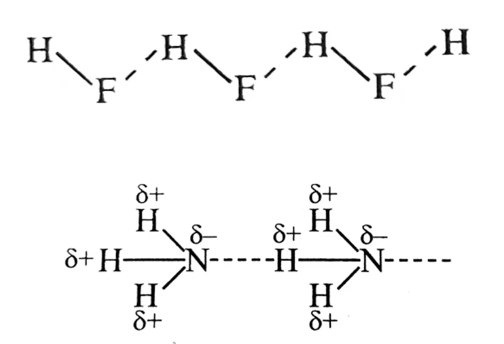
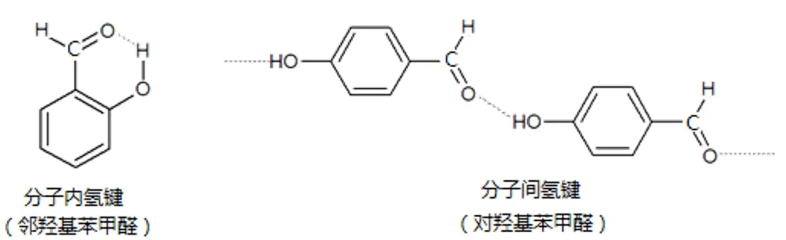
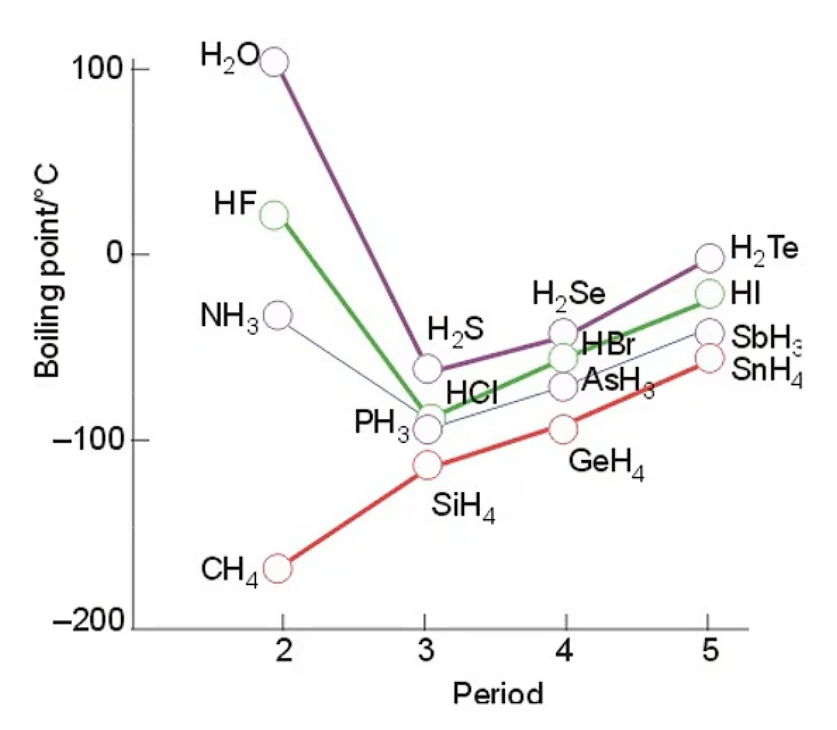
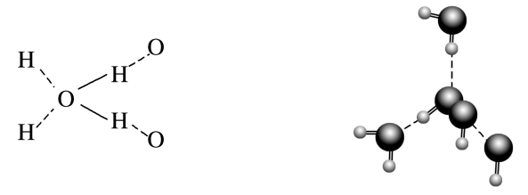
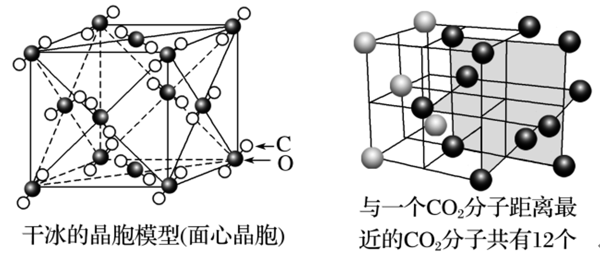

# 02 · 分子间作用力 分子晶体

## 分子间作用力

1. 日常生活中，我们经常见到许多由分子聚集成的物质，它们常以液态或固态的形式存在，如汽油、水、冰、干冰等。降温加压时气体会液化降温时液体会凝固，这些事实表明分子之间存在着相互作用力

2. 将分子聚集起来的作用力叫分子间作用力

    1. 共价分子间都存在分子间作用力
    
    2. 分子间作用力本质上是一种 **静电作用**，比化学键弱得多
    
    3. **范德华力** 和 **氢键** 是两种最常见的分子间作用力

### 范德华力

1. 范德华力的特点

    1. 范德华力 **很弱**，比化学键的键能小 $1\sim2$ 数量级
    
    2. 范德华力一般 **没有方向性和饱和性**
    
    3. 范德华力主要影响物质的 **熔点、沸点、溶解度** 等物理性质
   
2. 影响因素：

    1. 组成和结构相似的分子，其范德华力一般 **随着相对分子质量的增大而增大**
   
    2. 相对分子质量相近时，分子的极性越大，范德华力一般也越大
    
    3. 对于相对分子质量相同、极性相似的分子，分子之间的接触面积越大，范德华力越大。如范德华力：正丁烷>异丁烷

        > | 分子                   | $\ce{Ar}$   | $\ce{CO}$   | $\ce{HI}$    | $\ce{HBr}$   | $\ce{HCl}$   |
        > | :---------------: | :----: | :----: | :-----: | :-----: | :-----: |
        > | 分子量                 | $40$   | $28$   | $128.5$ | $81.5$  | $36.5$  |
        > | 范德华力（$KJ/mol$） | $8.50$ | $8.75$ | $26.00$ | $23.11$ | $21.14$ | 
        >
        > 1. 为什么范德华力：$\ce{HI>HBr>HCl>CO}$
        >
        >     > 答：相对分子质量越大，分子间作用力越大
        >
        > 2. 为什么范德华力：$\ce{CO>Ar}$
        >
        >     > 答：分子极性越大，范德华力越大

3. 对物质性质的影响因素

    1. 对物质熔、沸点的影响：由分子构成的物质中范德华力越大，物质的熔、沸点越高

    2. 对物质溶解性的影响：

        液体的互溶以及固态、气态的非电解质在液体里的溶解度都与范德华力有密切的关系。溶剂与溶质分子间作用力越大，溶质的溶解度越大。如 $273K、101kPa$ 时，氧气在水中的溶解量（$49cm^3 \cdot L^{-1}$）比氮气在水中的溶解量（$24cm^3 \cdot L^{-1}$）大，就是 $\ce{O_2}$ 与水分子之间的作用力比 $\ce{N_2}$ 与水分子之间的作用力大所导致的

        > 怎么解释卤素单质从 $\ce{F_2}\sim \ce{I_2}$ 的熔点与沸点越来越高
        >
        >    > 答：组成和结构相似的分子，相对分子质量越大，范德华力越大，熔沸点越高
        >
        > 范德华力主要影响物质的物理性质，而化学键主要影响物质的化学性质

### 氢键

1. 概念：由已经与电负性很强的原子（如 $\ce{F、O、N}$）形成共价键的氢原子，与另一个分子中电负性很强的原子之间的作用力

2. 表示：通常用 $A-H\cdots B,A、B$ 为 $\ce{N、O、F}$ 等中的一种，「$-$」表示共价键，「$\cdots$」表示氢键

3. 特征：比化学键的键能小，但比范德华力强，**不属于化学键**

4. 存在：

    1. $\ce{H_2O、HF、NH_3}$、含氧酸、含氧酸的酸式盐、醇、羧酸、酚等

    2. 醛、酮等有机物，虽有 $\ce{H_2O}$ 存在，但与 $\ce{H}$ 原子直接连接的是电负性较小的 $\ce{C}$，故分子之间不能形成氢键

5. 氢键和范德华力共存：

    如 $\ce{H_2O、HF、NH_3}$ 的分子之间 **既存在范德华力**，**又存在氢键**。因此，把冰融化或把水汽化不仅要破坏范德华力，还必须提供额外的能量破坏分子间氢键，不能认为有氢键就不存在范德华力

#### 特点

1. **方向性**

    $X-H\cdots Y$ 三个原子一般在同一直线上，在这样的方向上成键两原子电子云之间的排斥力最小，形成的氢键最强，体系最稳定

    

2. **饱和性**

    每一个 $X-H$ 只能与 $1$ 个 $Y$ 原子形成氢键，这是因为 $\ce{H}$ 原子半径很小，若再有一个原子 $Y$ 接近时，则 $Y$ 会受到 $X$ 原子电子云的排斥

    > 
    >
    > 平均 $1$ 分子 $H-F$，只有 $1$ 个氢键；平均 $1$ 分子 $\ce{NH_3}$，只有 $1$ 个氢键；平均 $1$ 分子 $\ce{H_2O}$，只有 $2$ 个氢键

#### 分子内氢键与分子间氢键

邻羟基苯甲醛能形成分子内氢键，而对羟基苯甲醛能形成分子间氢键。当对羟基苯甲醛熔融时，需要消耗较多的能量克服分子间氢键，所以对羟基苯甲醛的熔点高于邻羟基苯甲醛。邻羟基苯甲酸和对羟基苯甲酸也有类似的现象

> 总结：形成分子内氢键会降低物质熔点 （意味着分子间氢键数目减少，熔点降低）

#### 氢键对物质物理性质的作用

1. 含有分子间氢键的物质具有较高的熔点、沸点

    > 
    >
    > $\ce{H_2O > H_2Te > H_2Se > H_2 S}$
    >
    > $\ce{HF > HI > HBr > HCl}$
    >
    > $\ce{NH_3 > SbH_3 > AsH_3 > PH_3}$
    >
    > $\ce{H_2O > HF > NH_3}$

2.  形成分子内氢键会降低物质熔点

3. 含有分子间氢键的液体一般黏度比较大

4. 分子间氢键的存在使溶质在水中的 **溶解度** 比较大

5. 含有分子内氢键的物质具有 **较低的熔、沸点**

6. 对物质密度的影响：氢键的存在会使某些物质的密度反常，如水的密度比冰的密度大

7. 对相对原子质量测定的影响：例如接近水的沸点的水蒸气的相对分子质量测定值比按化学式 $\ce{H_2O}$ 计算出来的相对分子质量大一些，原因是水分子因氢键而相互缔合

## 分子晶体的概念

1. 概念：只含 **分子** 的晶体，或者分子间以 **分子间作用力** 结合形成的晶体

2. 分子晶体中的粒子及粒子间的相互作用

    $$
    分子晶体 \begin{cases}
    构成微粒 & \longrightarrow  & 分子\\
    微粒间的作用力 & \longrightarrow  & 分子间作用力\\
    分子内各原子间 & \longrightarrow  & 共价键\\
    \end{cases}
    $$

3. 常见的典型分子晶体

    1. 所有 **非金属氢化物**：如 $\ce{H_2O}、\ce{H_2S}、\ce{NH_3}、\ce{CH_4}、\ce{HX}$ (卤化氢)等

    2. 部分 **非金属单质**：如 $X_2$ (卤素单质)、$\ce{O_2}、\ce{H_2}、\ce{S_8}、\ce{P_4}、\ce{C_{60}}$ 、稀有气体等

    3. 部分 **非金属氧化物**：如 $\ce{CO_2}、\ce{SO_2}、\ce{NO_2}、\ce{P_4O_6}、\ce{P_4O_{10} }$ 等

    4. 几乎所有的 **酸**：如 $\ce{H_2SO_4}、\ce{HNO_3}、\ce{H_3PO_4}、\ce{H_2SiO_3}$ 等

    5. 绝大多数 **有机物** ：如 苯、四氯化碳、乙醇、冰醋酸、蔗糖 等

4. 分子晶体的物理性质

    1. **分子晶体熔、沸点较低 ，硬度很小** （多数分子晶体在常温时为气态或液态）

        > 除 $\ce{Hg}$ 、离子液体 外，常温常压下呈气体或液体都是分子晶体

    2. 分子晶体不导电

    3. 分子晶体的溶解性一般符合「 **相似相溶** 」规律

        > $\ce{Br_2}$ 与 $\ce{CCl_4}$ 均为非极性分子，「相似相溶」，可相互溶解
        >
        > 而 $\ce{Br_2}$ 不易溶于 $\ce{H_2O}$ （极性分子）

|      堆积类型        | 分子密堆积                         | 分子非密堆积                                       |
| :----: | :----: | :----: |
| 微粒间作用力 | **范徳华力**                      | **范德华力和氢键**                                |
| 空间特点     | 通常每个分子周围有 $12$ 个紧邻的分子 | 每个分子周围紧邻的分子数小于 $12$ 个，空间利用率不高 |
| 举例         | $\ce{C_{60} }$、干冰、$\ce{I_2}$、$\ce{O_2}$       | $\ce{HF}$、$\ce{NH_3}$、冰                                   |

## 常见分子晶体的结构分析

### 分子非密堆积：冰晶体

1. 条件：分子间的主要作用力是氢键

2. 结构：冰晶体中，水分子间主要通过 **氢键** 形成晶体。由于氢键具有一定的 **方向性**，一个水分子与周围四个水分子结合，这四个水分子也按照同样的规律再与其他的水分子结合。

    这样，**每个 $\ce{O}$ 原子周围都有四个 $\ce{H}$ 原子，其中两个 $\ce{H}$ 原子与 $\ce{O}$ 原子以共价键结合，另外两个 $\ce{H}$ 原子与 $\ce{O}$ 原子以氢键结合**，使水分子间构成 **四面体** 骨架结构。其结构可用下图表示

    

3. 性质：由于氢键具有方向性，冰晶体中水分子未采取密堆积方式，这种堆积方式使冰晶体中水分子的空间利用率不高，留有相当大的空隙。当冰刚刚融化成液态水时，水分子间的空隙 **减小** ，密度反而增大，超过 $4 \ce{°\!C}$ 时，分子间距离 **加大** ，密度逐渐减小

### 分子密堆积：干冰

1. 条件：分子间作用力只有范德华力，无分子间氢键

2. 结构：固态 $\ce{CO_2}$ 称为干冰，干冰也是分子晶体。 $CO_2$ 分子内存在 $C\xlongequal{} O$ 共价键，分子间存在 **范德华力** ， $CO_2$ 的晶胞呈面心立方体形，立方体的每个顶角有一个 $CO_2$ 分子，每个面上也有一个 $CO_2$ 分子。每个 $\ce{CO_2}$ 分子与  $12$  个 $CO_2$ 分子等距离相邻(在三个互相垂直的平面上各 $4$ 个或互相平行的三层上，每层上各 $4$ 个)

    

3. 性质：干冰的外观很像冰，硬度也跟冰相似，熔点却比冰低得多，在常压下极易升华，在工业上广泛用作制冷剂；由于干冰中的 $\ce{CO_2}$ 之间只存在 **范德华力** 不存在 **氢键** ，密度比 **冰** 的高。