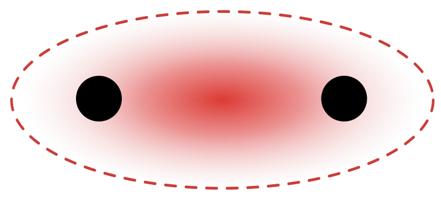
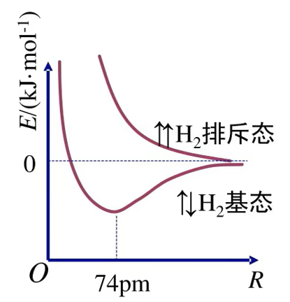
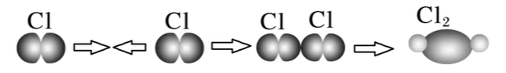
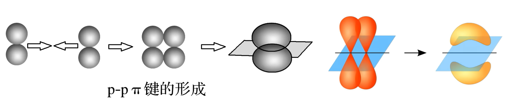
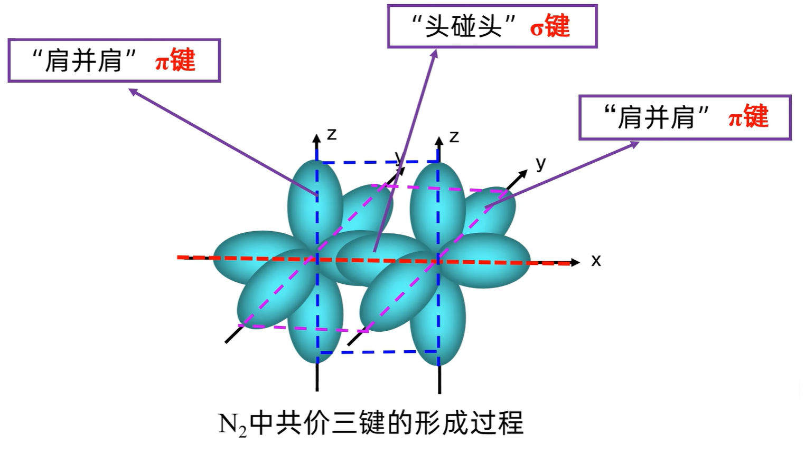
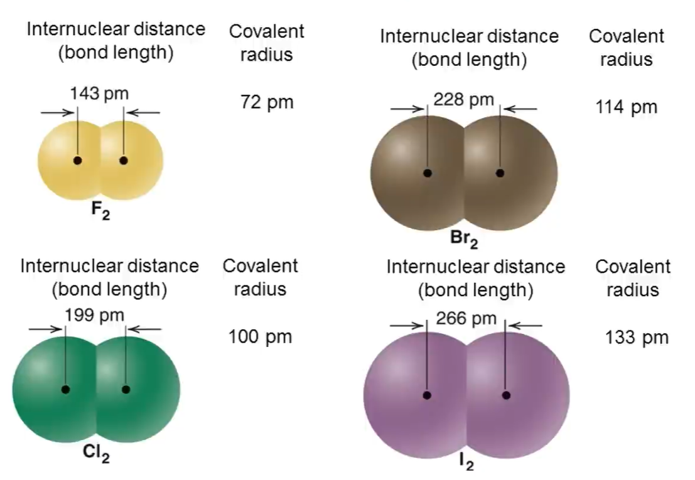
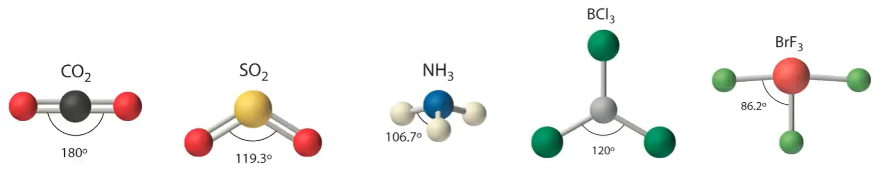
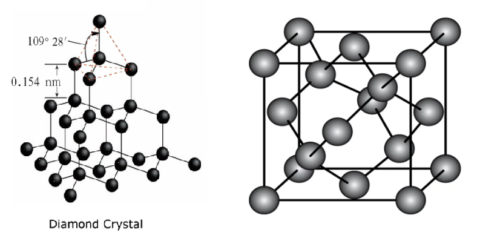
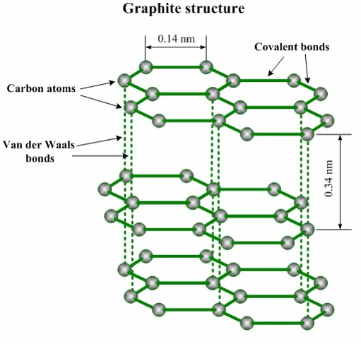

# 微粒间作用力与物质性质 · 三 · 「共价键 共价晶体」

## 共价键
1. **概念**：原子间通**过共用电子对**所形成的相互作用，叫做**共价键**
2. **成键粒子**：通常是**电负性相同或差值小**(小于$1.7$)的非金属原子或金属原子与非金属原子
3. **本质**：原子间通过**原子轨道重叠**，高概率地出现在两个原子核之间的电子与两个原子核之间的电性作用

4. **共价键的形成**
   1. 当两个氢原子相互接近时，若两个氢原子核外电子的**自旋方向相反**，它们接近到一定距离时，两个$1s$轨道发生重叠，电子在两原子核间出现的机会较大。**随着核间距的减小，核间电子出现的机会增大，体系的能量逐渐下降，达到能量最低状态**。核间距进一步减小时，两原子间的斥力使体系的能量迅速上升这种排斥作用又将氢原子推回到平衡位置。氢分子的形成过程中能量（主要指势能）随核该间距的变化如图所示
   2. 若两个氢原子核外电子的自旋方向相同，当它们相互接近时，原子间总是排斥作用占主导地位。所以两个带有自旋方向相同的电子的氢原子不可能形成氢分子
   

### 共价键的类型

#### $\sigma$ 键（成键方式）
1. **形成**：由两个原子的$s$轨道或$p$轨道「**头碰头**」重叠形成
2. **类型**
   1. $s-s$ 型：（$H-H$的$s-s$ $ σ $ 键的形成）
   
   2. $s-p$ 型：（$H-Cl$的$s-p$ $ σ $ 键的形成）
   
   3. $p-p$ 型：（$Cl-Cl$的$p-p$ $ σ $ 键的形成）
   
3. **特征**
   以形成化学键的两原子核的连线为轴做旋转操作，共价键电子云的图形不变，这种特征称为**轴对称**；$\sigma$ 键的强度较大（稳定性较高）

#### $\pi$ 键（成键方式）
1. **形成**：由两个原子的$p$轨道或轨道「**肩并肩**」重叠形成
2. $p-p$ $\pi$ 键：（$H-H$的$s-s$ $ σ $ 键的形成）
   
3. **特征**
   $\pi$ 键的电子云具有**镜面对称性**即每个 $\pi$ 键的电子云由两块组成，分别位于由两原子核构成平面的两侧，如果以它们之间包含原子核的平面为镜面，它们互为镜像；**$\pi$ 键不能旋转，不如 $\sigma$ 键牢固，较易断裂** (所以优先形成 $\sigma$ 键)
   

#### 极性共价键与非极性共价键（电子偏向）
   见 [3.3 分子的极性 手性分子](/03%20%E5%88%86%E5%AD%90%E7%A9%BA%E9%97%B4%E7%BB%93%E6%9E%84%E4%B8%8E%E7%89%A9%E8%B4%A8%E6%80%A7%E8%B4%A8/03%20%E5%88%86%E5%AD%90%E7%9A%84%E6%9E%81%E6%80%A7%20%E6%89%8B%E6%80%A7%E5%88%86%E5%AD%90.md)

#### 配位共价键与一般共价键（成键过程）
   见 [3.4 配位键 配合物](/03%20%E5%88%86%E5%AD%90%E7%A9%BA%E9%97%B4%E7%BB%93%E6%9E%84%E4%B8%8E%E7%89%A9%E8%B4%A8%E6%80%A7%E8%B4%A8/04%20%E9%85%8D%E4%BD%8D%E9%94%AE%20%E9%85%8D%E5%90%88%E7%89%A9.md)

### 成键规律判断
1. 共价单键是 $\sigma$ 键
2. 共价双键中一个是 $\sigma$ 键，另一个是 $\pi$ 键
3. 共价三键中一个是 $\sigma$ 键，另两个是 $\pi$ 键
>  

> 注意：
>
> 1. 如给出有机物的结构式，有可能会省略 $\ce{H}$ 原子
> 2. 注意是否需要加上单位（ $\ce{N_A}$ ）

### 以 $N_2$ 的共价键为例
电子式：$N \equiv N$

### 共价键的键参数

#### 键能
1. 共价键的强弱可用键能来衡量。**键能是指气态分子中 $1mol$ 化学键解离成气态原子所吸收的能量**。它通常是$298.15K$、$100kPa$条件下的标准值，单位是 $kJ\cdot mol^{-1}$
2. 应用
   1. **判断共价键的稳定性**
   原子间形成共价键时，原子轨道重叠程度越大，释放能量越多，所形成的共价键键能越大，共价键越稳定
   2. **判断分子的稳定性**
   一般来说，结构相似的分子，共价键的键能越大，分子越稳定
   > 如分子的稳定性：$HF>HCl>HBr>HI$
   3. **利用键能计算反应热**
   $$△H=反应物总键能-生成物总键能$$

#### 键长
1. **概念**
   构成化学键的两个原子的核间距，因此原子半径决定共价键的键长，原子半径越小，共价键的键长越短 
2. **应用**
   共价键的键长越短，**往往**键能越大，表明共价键越稳定，反之亦然
   > 键长：$C\equiv C<C=C<C-C$
   > 键能：$C\equiv C>C=C>C-C$
   
   > 例外：（键氟三）
   > 键长：$F_2<Cl_2<Br_2<I_2$
   > 键能：$Cl_2>Br_2>F_2>I_2$ 

   > 特殊：键长（$C-C$）$C_6H_6 < C_2H_6$ 
   > 
> 共价半径、范德华半径：两核间距离的一半
> 

#### 键角
1. **概念**：在多原子分子中，两个相邻共价键之间的夹角
2. **应用**：在多原子分子中键角是一定的，这表明共价键具有方向性，因此键角影响着共价分子的空间结构
   
3. **知识点**：
   1. 杂化类型: $s p ^ { 1 }  → 1 8 0 ^ { \circ }  ， s p ^ { 2 }  → 1 2 0 ^ { \circ }  ， s p ^ { 3 } → 1 0 9 ^ { \circ } 2 8 ^ { \prime }$
   2. 中心原子存在孤电子对，对成键电子对有较大的排斥力，键角减小（半径相等时孤对电子分割更多圆周角）
      > 例: $C H _ { 4 } > N H _ { 3 } > H _ { 2 } O$
   3. （影响较小）双键对单键有较大的排斥力，单键键角减小（半径相等时双键分割更多圆周角）
      > 例: $C O C l _ { 2 }$ 中 $C$ 为中心原子，$\angle O - C - C l > \angle C l - C - C l$
   4. （影响较小）大体积的基团有较大的排斥力，单键键角减小（半径相等时大基团分割更多圆周角）
      > 例: $N H _ { 3 }  ， N H _ { 2 } O H  ， N H _ { 2 } \left( C H _ { 3 } \right)$ 中 $\angle H - N - H$ 递减
   5. 中心原子电负性增大，成键电子受到向中心更大的吸引力（半径减小），键
      角增大
      > 例: $N H _ { 3 } > P H _ { 3 }  ， H _ { 2 } O > H _ { 2 } S$
   6. 配原子电负性增大，成键电子受到向外侧更大的吸引力(半径增大)，键角减小
      > 例: $N H _ { 3 } > N F _ { 3 }  ， H _ { 2 } O > O F _ { 2 }$

## 共价晶体

1. 概念：相邻原子间以  **共价键**  相结合形成共价键三维骨架结构的晶体。
2. 构成微粒：原子
3. 微粒间作用力：共价键
4. 典型的共价晶体
   1. 某些单质：如  **硼($B$)**  、  **硅($Si$)**  、**锗($Ge$)** 、  **金刚石**  等
   2. 某些非金属化合物：如 **碳化硅($SiC$)** 、**二氧化硅($SiO_2$)** 、**氮化硼($BN$)** 、**氮化硅($Si_3N_4$)** 等
   3. 极少数金属氧化物，如 **刚玉($α-Al_2O_3$)** 等
5. 物理性质
   1. 共价晶体中，由于各原子均以强的共价键相结合，因此一般熔点  **很高**  ，硬度  **很大**  ，**难**  溶于常见溶剂，一般  **不导电**
   2. 结构相似的共价晶体，原子半径越  **小**  ，键长  **越短**  ，键能越  **大** ，晶体的熔点越高
   >
   > 熔点：$金刚石>金刚砂(SiC)>单晶硅$
   > 键长：$C-C<Si-C<Si-Si$
   > 键能：$C-C>Si-C>Si-Si$
   >
> 
> 1. 共价晶体中不存在单个的分子
> 2. 共价晶体汽化或熔化时破坏的作用力是共价键
> 3. 共价晶体中只有其价键，但含有共价键的晶体不一定是共价晶体，如 $CO_2、H_2O$ 等分子晶体中也含有共价键

### 常见共价晶体的结构分析
#### 金刚石

1. 在金刚石晶体中每个碳原子周围紧邻的碳原子有 $4$ 个，每个碳原子都采取 $sp^3$ 杂化

2. 所有的 $C-C$ 键长相等，键角相等，键角为$109^\circ28^\prime$

3. 晶体中每个 $C$ 参与了 $4$ 个 $C-C$ 键的形成，而在每个键中的贡献只有一半，故金刚石中$ 1molC$ 原子含 $C-C$ 键数目为 $2N_A$

4. 整块金刚石晶体就是以共价键相连的三维骨架结构。其中最小的环是 **六元环**

5. 在金刚石晶胞中占有的碳原子数 $8$

6. 两个原子的最近距离：$\frac{\sqrt{3}}{4}\times晶胞参数$ （对角线的 $\frac{1}{4}$ ）

    

#### 二氧化硅

1. 杂化方式：$sp^3$ 杂化
2. 在 $SiO_2$ 晶体中，每个硅原子均与 $4$ 个氧原子结合；每个氧原子与 $2$ 个硅原子结合
3. 在 $SiO_2$ 晶体中硅原子与氧原子个数之比是 $1:2$
4. 在 $SiO_2$ 晶体中，每个硅原子形成 $4$ 个共价键；每个氧原子形成 $2$ 个共价键
5. 在 $SiO_2$ 晶体中，最小环为十二元环，有 $6$ 个硅原子和 $6$ 个氧原子
6. 硅原子个数与 $Si-O$ 共价键个数之是 $1:4$ ；氧原子个数与 $Si-O$ 共价键个数之比是 $1:2$
7.  $SiO_2$ 晶体 中并不存在 $SiO_2$ 分子
   
   

### 石墨晶体（混合型晶体）
1. **晶体类型**
   石墨晶体中既有共价键，又存在类似金属键的作用力，还有范德华力，属于**混合型晶体**
2. **结构特点**
   1. 石墨晶体中，同层的碳原子采取 $sp^2$ 杂化形成共价键，每个碳原子通过共价键（$σ$ 键）与相邻的 $3$ 个碳原子相连，形成平面六元并环结构。层中 $C-C$ 键的键长( $142pm$ )、键角( $120°$ )相等。在同一平面的碳原子还各剩下一个 $p$ 轨道，它们相互平行且相互重叠，使 $p$ 轨道中的电子可在整个碳原子平面中运动
   2. 石墨晶体中，每个碳原子参与了 $3$ 个 $C-C$ 键的形成，每个 $C-C$ 键被 $2$ 个碳原子共用，因此每个碳原子成键数为 $1.5$；每个碳原子为 $3$ 个六元环共用，每个 $C-C$ 键被 $2$ 个六元环共用，每个六元环平均占有 $2$ 个碳原子、$3$ 个 $C-C$ 键
   3. 石墨晶体中层与层之间相隔距离较大( $335pm$ )，以范德华力相结合
   
3. 物理性质
   1. 石墨的熔点很高，比金刚石高，原因是石墨晶体中 $C-C$ 键的键长更短，键能更大
   2. 石墨质软，原因是石墨层与层间靠范德华力维系，可以发生层间的相对滑动
   3. 有良好的导电性，在同一层内，每个碳原子未参与杂化的 $p$ 轨道中的电子可以在整个碳原子平面中运动，形成大 $\pi$ 键。有类似金属晶体的导电性