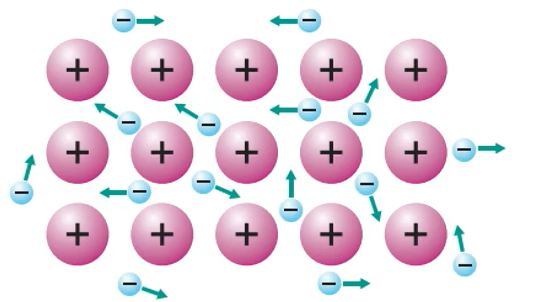
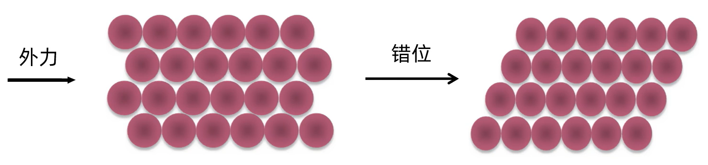
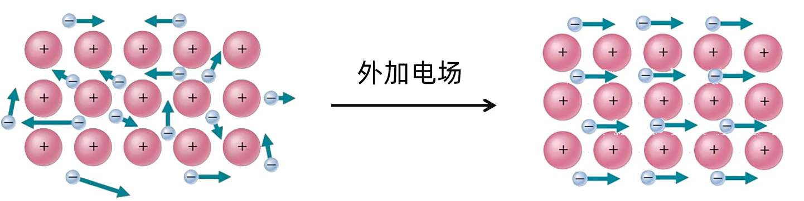
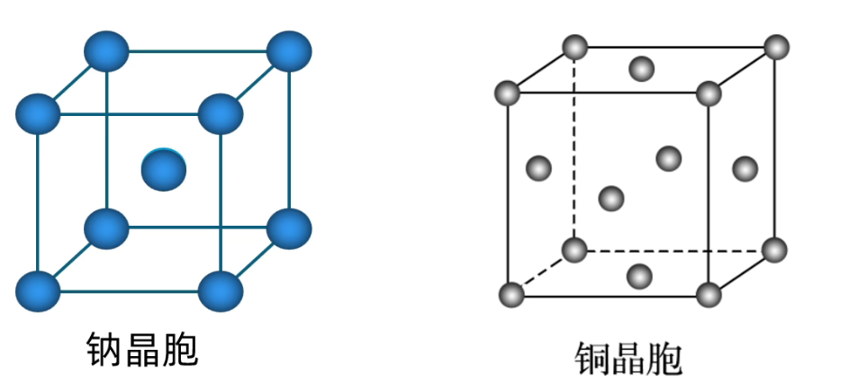

# 04 · 金属键 金属晶体

## 金属键
1. **金属键的概念**
    除汞等少数金属外，大多数金属单质具有 **较高的熔点**，说明金属晶体中存在着 **强烈的相互作用**
    1. 金属键：金属阳离子与自由电子之间的强烈的相互作用
    2. 成键微粒： 金属阳离子和自由电子
    3. 存在：**金属单质** 或 **合金**
2. **金属键的本质**
    描述金属键本质的最简单理论是 「**电子气理论**」。该理论把金属键形象地描绘为金属原子脱落下来的价电子形成遍布整块晶体的「电子气」，被所有原子所共用，从而把所有的金属原子维系在一起，形成一种「巨分子」
3. **金属键的特征**
    金属键 **无方向性和饱和性**。金属晶体里的自由电子不专属于某几个特定的金属原子，而是几乎均匀地分布在整个晶体里，把所有金属原子维系在一起，所以金属键没有方向性和饱和性（共价键则有方向性和饱和性）
    

## 电子气理论解释金属的物理性质
1. **金属的延展性**
    弥漫在金属原子间的电子气可以起到类似轴承中滚珠之间润滑剂的作用。当金属晶体受到外力作用时，晶体中的各原子层就会发生相对滑动
    
2. **金属的导电性**
    在金属晶体中，存在许多自由电子，这些电子移动是没有方向的，但是 **在外加电场的作用下，自由电子就会发生定向移动，形成电流，使金属表现出导电性**
    当温度升高时，阳离子的振动加剧，对自由电子的定向移动产生了阻碍作用，故导电能力下降。金属导电的粒子是自由电子，而电解质溶液导电的粒子是自由移动的阴阳离子
    
3. **金属的导热性**
    自由电子在运动时与金属阳离子碰撞，引起两者能量的交换。当金属某部分受热时，那个区域里的自由电子能量增加，运动速度加快，通过碰撞，把能量传递给金属阳离子。自由电子与金属阳离子频繁碰撞，把能量从温度高的部分传递到温度低的部分，从而使整块金属达到相同的温度
4. 金属光泽：
    由于金属内部原子以最紧密堆积状态排列，且存在自由电子，所以当光线照射到金属表面时，**自由电子可以吸收所有频率的光并迅速释放**，使金属不透明且具有金属光泽。而金属在粉末状态时，晶格排列不规则，吸收可见光后反射不出去，所以金属粉末常呈暗灰色或黑色

## 金属晶体的熔沸点、硬度比较
1. 金属的熔沸点高低及硬度大小与金属键的强弱直接相关。金属键越强，金属的熔沸点越高，硬度一般也越大
2. **金属键的强弱主要取决于金属阳离子的半径和离子所带的电荷数**
3. 同周期金属单质，从左到右（如 $Na、Mg、AI$）熔、沸点逐渐升高同主族金属单质，从上到下（如碱金属）熔、沸点逐渐降低
    >$$熔点: Na < Mg < Al  \begin{cases}
    半径 & Na^+> Mg^{2+}> Al^{3+}\\
    电荷数 & Na^+< Mg^{2+}< Al^{3+}\\
    \end{cases}$$

4. 金属晶体熔点差别很大，如汞常温为液体，熔点很低 ( $38.9\ce{°\!C}$ ) ，而铁等金属熔点很高( $1535\ce{°\!C}$ )，这是由于金属晶体紧密堆积方式、金属键强弱不同而造成的差别（碱金属的堆积方式类似，只考虑金属键强弱）
    > $碱金属熔点：Li>Na>K>Rb>Cs$ (常考)

## 常见金属结构

|                | 简单立方堆积                                          | 体心立方堆积                                                 | 面心立方最密堆积                                             | 六方最密堆积                                            |
| -------------- | ----------------------------------------------------- | ------------------------------------------------------------ | ------------------------------------------------------------ | :------------------------------------------------------ |
| **原子位置**  | 顶角                                                  | 顶角、体心                                                   | 顶角、面心                                                   |                                                         |
| **原子数**    | $8 \times \frac{1}{8}=1$                              | $8\times\frac{1}{8}+1=2$                                     | $8\times\frac{1}{8}+6\times\frac{1}{2}=4$                    | $12\times\frac{1}{6}+2\times\frac{1}{2}+3=6$            |
| **配位数**    | $6$                                                   | $8$                                                          | $12$                                                         | $12$                                                    |
| **空间利用率** | $\dfrac{\dfrac{4}{3}πr^3}{8r^3}\cdot100\%\approx52.4\%$ | $\dfrac{2\cdot \dfrac{4}{3}πr^3}{(\dfrac{4}{\sqrt{3}}r)^3}\cdot100\%\approx68.02\%$ | $\frac{4\cdot \dfrac{4}{3}πr^3}{16\sqrt{2}r^3}\cdot 100\%\approx74.05\%$ | $\frac{8\pi R^3}{24\sqrt2R^3}\times100\%\approx74.05\%$ |
| **代表金属**  | $Po$                                                  | $Na、K、Fe、Li、Ba$                                          | $Cu、Ag、Au、Al、Pd、Ca$                                     | $Mg、Zn、Ti$                                            |

> 性质: 原子配位数越高，金属延展性、可塑性越好

> 
>
> 钠晶胞（体心堆积）：钠原子：$8\times\frac{1}{8}+1=2$，配位数：$8$
>
> 铜晶胞（面心立方最密堆积）：铜原子：$8\times\frac{1}{8}+6\times\frac{1}{2}=4$，配位数：$12$
>

> 
>
> 六方最密堆积：分子数：$12\times\frac{1}{6}+2\times\frac{1}{2}+3=6$ 配位数：$12$