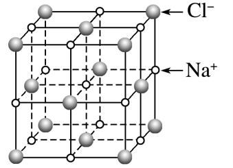
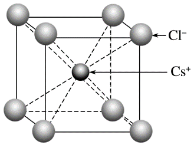
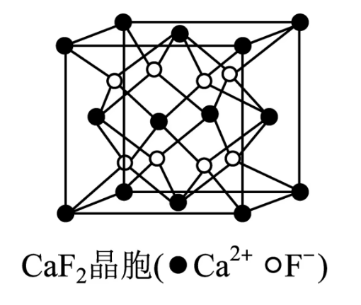

# 微粒间作用力与物质性质 · 五 · 离子键 离子晶体

## 离子键及其影响因素

1. 概念：带相反电荷离子之间的相互作用称为离子键（ionic bond）。其成键粒子为阴阳离子，相互作用为**静电作用**（引力和斥力），成键过程为：阴阳离子接近到某一定距离时, 吸引和排斥达到平衡
2. 离子键没有方向性和饱和性

### 晶格能
1. 概念：离子晶体中阴、阳离子间相互作用力的大小可用晶格能（lattice energy）来衡量。**晶格能**（符号为 $U$）是指拆开$1 mol$离子晶体使之形成气态阴离子和气态阳离子时所吸收的能量。例如
$$NaCl(s)\rightarrow Na^+(g)＋Cl^－(g) \qquad U=786 kJ·mol^{－1}$$
2. **影响因素**：
   1. **离子的电荷数**：离子所带的电荷数越多，晶格能越大
   2. **离子半径**：离子半径越小，晶格能越大
3. 与离子晶体性质的关系
   **晶格能越大，形成的离子晶体更稳定，熔点更高，硬度更大**

## 离子晶体及其物理性质
1. 概念：由  **阳离子**  和  **阴离子**  相互作用而形成的晶体。
2. 离子晶体的性质
   1. 熔、沸点较  **高**  ，硬度较  **大** 
   2. 离子晶体不导电，但  **熔化**  或  **溶于水**  后能导电
   3. 大多数离子晶体能溶于水，难溶于有机溶剂

## 常见离子晶体的结构
1. $NaCl$ 晶胞
   
   NaCl晶胞如图所示，每个 $Na^＋$ 周围距离最近的 $Cl^－$ 有  $6$  个(上、下、左、右、前、后各 $1$ 个)，构成正八面体，每个 $Cl^－$ 周围距离最近的 $Na^＋$ 有  $6$ 个，构成正八面体，由此可推知晶体的化学式为 $NaCl$ 
   1. 每个$Na＋(Cl－)$周围距离相等且最近的$Na＋(Cl－)$是  $12$  个
   2. 每个晶胞中实际拥有的 $Na^＋$ 数是 $4$ 个，$Cl^－$数是 $4$ 个
   3. 若晶胞参数为$a$ $pm$，则氯化钠晶体的密度为$\frac{234}{N_A\cdot a^3\times10^{-30}} g·cm^{－3}$
2. $CsCl$ 晶胞
    
   $CsCl$ 晶胞如图所示，每个 $Cs^＋$ 周围距离最近的 $Cl^－$ 有  $8$ 个，每个 $Cl^－$ 周围距离最近的$Cs^＋$有 $8$ 个，它们均构成正六面体，由此可推知晶体的化学式为$CsCl$
   1. 每个$Cs^＋(Cl^－)$周围距离最近的$Cs^＋(Cl^－)$有 $6$ 个，构成  正八面体  
   2. 每个晶胞中实际拥有的$Cs^＋$有 $1$ 个，$Cl^－$有 $1$ 个
   3. 若晶胞参数为$a$ $pm$，则氯化铯晶体的密度为$\frac{168.5}{N_A\cdot a^3\times10^{-30}}g·cm^{－3}$
3. $CaF_2$ 晶胞
    
   1. $Ca^{2+}$的堆积方式为面心立方堆积，$F^-$所处位置为$8$个小正方体的体心
   2. $Ca^{2+}$呈立方密堆积，阴离子$F^-$填充在四面体空隙中，位于对角线的$\frac{1}{4}$和$\frac{3}{4}$处。$Ca^{2+}、F^-$离子的配位数分别为$8$和$4$
   3. 在一个晶胞中有$4$个$Ca^{2+}$、$8$个$F^-$
