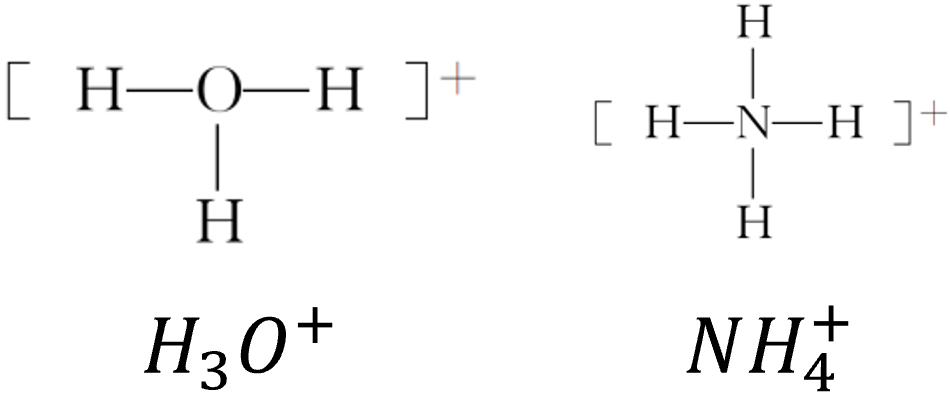
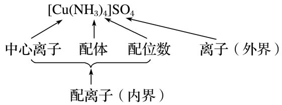

# 分子空间结构与物质性质 · 四 · 「配位键 配合物」

## 配位键
1. 概念：由一个原子单方面提供  **孤电子对**  ，而另一个原子提供  **空轨道**  而形成的化学键，即“电子对给予—接受”键
2. 表示方法：配位键常用 $A-B$ 表示，其中$A$是  **提供**  孤电子对的原子，叫给予体，$B$是接受孤电子对的原子，叫  **接受体**  
> 如：
1. 形成条件：形成配位键的一方(如$A$)是能够提供  **孤电子对**  的原子，另一方(如$B$)是具有能够接受孤电子对的空轨道的原子
   1. 孤电子对：分子或离子中，没有跟其他原子共用的电子对就是孤电子对
   > 含有孤电子对的微粒：分子如$CO$、$NH_3$、$H_2O$等，离子如$Cl^－$、$CN^－$、$NO^{2－}$等

   > 如：
   2. 含有空轨道的微粒：过渡金属的原子或离子。一般来说，多数过渡金属的原子或离子形成配位键的数目基本上是固定的，如$Ag^＋$形成$2$个配位键，$Cu^{2＋}$形成$4$个配位键等
> 配位键与共价键的区别
> 1. 配位键是共价键的一种，只不过是一种特殊的共价键
> 2. 共价键一般是成键的双方都提供电子，配位键是一方提供孤电子对，一方提供空轨道

## 配合物
1. 概念：通常把金属离子或原子(称为 **中心离子** 或原子)与某些分子或离子(称为  **配体或配位体**  )以  **配位键**  结合形成的化合物称为配位化合物，简称配合物。如 $[Cu(NH_3)_4]SO_4$、$[Ag(NH_3)_2]OH$ 等均为配合物
2. 组成：配合物$[Cu(NH_3)_4]SO_4$的组成如下图所示：
   
   1. 中心原子：提供 空轨道 接受  **孤电子对**  的原子。中心原子一般都是带正电荷的阳离子(此时又叫  **中心离子**  )，最常见的有过渡金属离子：$Fe^{3＋}、Ag^＋、Cu^{2＋}、Zn^{2＋}$等
   2. 配体：提供  **孤电子对**  的阴离子或分子，如$Cl^－、NH_3、H_2O$等。配体中直接同  **中心原子配位**  的原子叫做配位原子。配位原子必须是含有  **孤电子对**  的原子，如$NH_3$中的$N$原子，$H_2O$中的$O$原子等
   3. 配位数：直接与中心原子形成的  **配位键**  的数目。如$[Fe(CN)_6]_4^－$中$Fe^{2＋}$的配位数为  $6$
3. 配合物的形成对性质的影响
   1. **对溶解性的影响**
   一些难溶于水的金属氢氧化物、氯化物、溴化物、碘化物、氰化物，可以溶解于氨水中，或依次溶解于含过量的$OH^－、Cl^－、Br^－、I^－、CN^－$的溶液中，形成可溶性的配合物
   > 如：$Cu(OH)_2＋4NH_3=\!=\!=[Cu(NH_3)_4]_2^＋＋2OH^－$
   2. **颜色的改变**
   当简单离子形成配离子时，其性质往往有很大差异。颜色发生变化就是一种常见的现象，根据颜色的变化就可以判断是否有配离子生成
   > 如：$Fe^{3＋}$与$SCN^－$形成硫氰化铁配离子，其溶液显  **红色**  
   3. **稳定性增强**
   配合物具有一定的稳定性，配合物中的配位键越  **强**  ，配合物越  **稳定** 。当作为中心离子的金属离子相同时，配合物的稳定性与配体的性质有
   > 如：血红素中的$Fe^{2＋}$与$CO$分子形成的配位键比$Fe^{2＋}$与$O_2$分子形成的配位键强，因此血红素中的$Fe^{2＋}$与$CO$分子结合后，就很难再与$O_2$分子结合，血红素失去输送氧气的功能，从而导致人体$CO$中毒
4. 常见配合物的形状
   1. 正四面体：$[ZnCl_4]^{2-}\quad[Cd(CN)_4]^{2-}\quad[Zn(NH_3)_4]^{2+}$
   2. 平面正方形：$[PtCl_4]^{2-}\quad[Ni(CN)_4]^{2-}\quad[Cu(NH_3)_4]^{2+}$