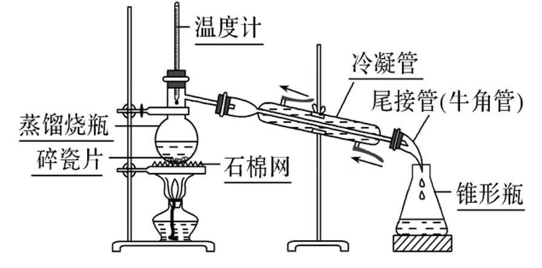

# 有机化学基础 · 一 · 「研究有机化合物的一般方法」

## 蒸馏

1. **蒸馏原理**：利用有机物与杂质的沸点差异，将有机化合物以蒸汽的形式蒸出，然后冷凝得到产品
2. **适用对象**：互相溶解、沸点不同的液态有机混合物
3. **适用条件**：
   1. 用于分离互溶的液体混合物
   2. 有机物的热稳定性较强
   3. 有机物与杂质的沸点相差较大(一般约大于 $30℃$ )
> 
> 无水乙醇的制取：
> 会先加入 $CaO$（吸水剂）$CaO\stackrel{H_2O}{\longrightarrow}Ca(OH)_2(s)$，直接蒸馏出乙醇
> 

4. **实验装置与注意事项**
   1. 使用 **直形冷凝管**（不得使用球形冷凝管）
   2. 使用 **锥形瓶**（不用烧杯，口径较大，导致液体汽化）
   3. 蒸馏烧瓶里盛液体的用量不超 $2/3$，不少于 $1/3$
   4. 加入沸石或碎瓷片，**防止暴沸**，若忘记加沸石，应停止加热，待冷却之后再补加
   5. 温度计水银球应与蒸馏烧瓶的支管口平齐
   6. 冷凝水应**下口进入**，**上口流出**，与蒸汽流向相反，以充分冷凝
   7. 蒸馏烧瓶需要垫石棉网加热
   8. 实验开始时，**先通冷凝水，后加热**；实验结束时，**先停止加热，后停止通冷凝水**
zhixingllg

