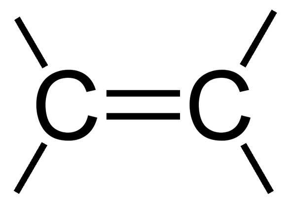
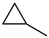
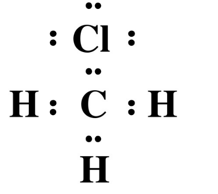
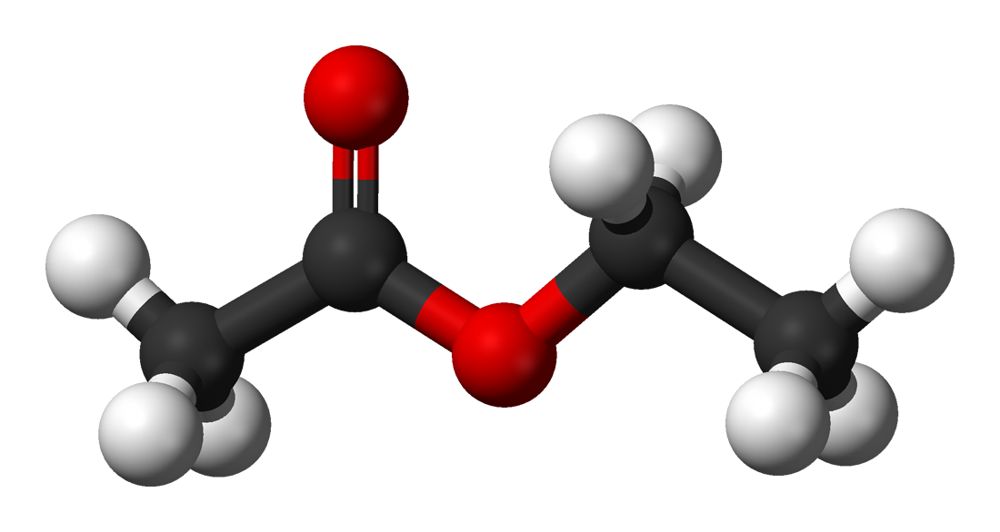
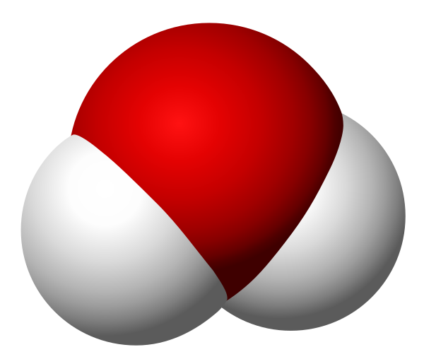
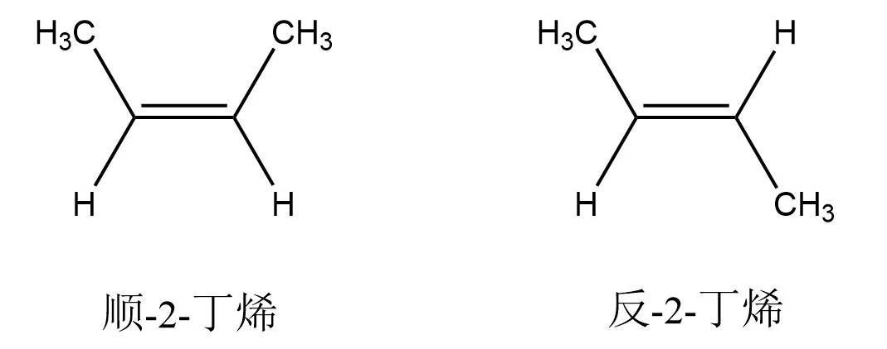
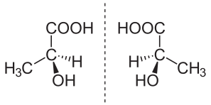
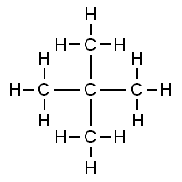

# 有机化学基础 · 二 · 「有机化合物的结构」

## 有机化合物中碳原子的成键特点

### 碳原子的成键特点

碳原子最外电子层有 $4$ 个电子，不易失去或获得电子而形成阳离子或阴离子，可以彼此间或与$H、O、Cl、S、N$ 等非金属元素原子形成共价键

### 碳原子间的成键方式

1. 碳原子间不仅可以形成碳碳单键（ $-C-C-$ ）如乙烷( $CH_3一CH_3$ )；还可以形成碳碳双键或碳碳三键( $-C=C-$ )，如乙烯( $CH_2=CH_2$ )、乙炔( $CH\equiv CH$ )
2. 多个碳原子之间可以结合形成碳链，碳链既可以是一条直链，也可以带有支链，如正丁烷( $CH_3-CH_2-CH_2-CH_3$ )和异丁烷()；碳原子间也可以结合成碳环，环上的碳原子还可以连接支链，如环丁烷()和甲基环丙烷()

### 碳原子与其他原子间的成键方式

1. 碳原子与氢原子、卤素原子间只能形成单键
2. 碳原子与氧原子、硫原子间可以形成单键、双键
3. 碳原子与氧原子、硫原子间可以形成单键、双键、三键

### 碳原子的成键方式与分子结构

$$
\begin{cases}
饱和碳原子 & 单键碳原子 \\
不饱和碳原子 &\begin{cases}
双键碳原子 \\
三键碳原子 \\
苯环碳原子 \\
\end{cases}\
\end{cases}
$$

含有不饱和键的有机化合物分子由于双键或三键中有部分键容易断裂，双键或三键两端的碳原子还可以结合其他原子或原子团，一般易于发生加成反应（苯环结构具有特殊性）

## 有机化合物分子组成或结构的表示方法

<table>
    <thead>
        <tr>
            <th>种类</th>
            <th>表示方法</th>
            <th>示例</th>
        </tr>
    </thead>
    <tbody>
        <tr>
            <td>分子式</td>
            <td>用元素符号表示物质的分子组成</td>
            <td></td>
        </tr>
        <tr>
            <td>最简式(实验式)</td>
            <td>用元素符号表示化合物中各元素原子个数的最简整数比</td>
            <td></td>
        </tr>
        <tr>
            <td>电子式</td>
            <td>在元素符号周围用「·」或「×」表示原子的最外层电子的成键情况</td>
            <td></td>
        </tr>
        <tr>
            <td>结构式</td>
            <td>用短线「-」来表示1个共价键，用「-」（单键）「=」（双键）或「≡」（三键）将所有原子连接起来</td>
            <td></td>
        </tr>
        <tr>
            <td>结构简式</td>
            <td>①在结构式的基础上，表示单键的「-」可以省略，将与碳原子相连的其他原子写在其旁边，在右下角注明其个数
                ②表示双键、三键的「=」「≡」不能省略
                ③醛基、羧基可简化成-CHO、-COOH</td>
            <td></td>
        </tr>
        <tr>
            <td>键线式</td>
            <td>①在结构简式的基础上，进一步省去碳原子及与碳原子直接相连的氢原子的元素符号，只要求表示出分子中键的连接情况和基团
                ②键线式中的每个拐点或端点均表示一个碳原子，每个碳原子都形成四个共价键，不足的用氢原子补足</td>
            <td></td>
        </tr>
        <tr>
            <td>球棍模型</td>
            <td>小球表示原子，短棍表示化学键</td>
            <td></td>
        </tr>
        <tr>
            <td>空间填充模型</td>
            <td>用不同体积的小球表示不同大小的原子</td>
            <td></td>
        </tr>
    </tbody>
</table>

> 注意：
>
> 1. 书写结构简式时，同一个碳原子上的相同原子或原子团可以合并，相邻且相同的原子团亦可以合并，如：$2,2-$二甲基戊烷可以写作 $(CH_3)_3C(CH_2)_2CH_3$
> 2. 结构简式不能表示有机化合物的真实空间结构。如从结构简式看，$CH_3-CH_2-CH_2-CH_3$ 中的碳链是直线形的，而实际上是锯齿形的
> 3. 键线式中只可以省略与碳原子相连的氢原子，与其他原子相连的氢原子（如 $-OH$ 中的氢原子）不可以省略
> 4. 用空间填充模型表示有机化合物结构时，代表不同原子的各小球的相对大小关系应与原子实际相对大小关系一致

## 有机化合物的同分异构现象

**同分异构现象**：分子内部原子的成键方式、连接顺序等差异产生分子式相同而结构不同的现象叫同分异构现象
**同分异构体**：分子式相同，结构不同，性质不同

### 同分异构现象的分类

$$
同分异构现象 \begin{cases}
构造异构 & \begin{cases}
碳链异构 \\
位置异构 \\
官能团异构 \\
\end{cases}\\
立体异构 & 顺反异构、对映异构等\\
\end{cases}
$$

**碳链异构**
碳链骨架不同

> $CH_3CH_2CH_2CH_3$ 和 $CH_3CH(CH_3)_2$

**位置异构**
官能团或取代基在碳骨架（碳链或碳环）上位置不同

> $C H _ { 2 } = C H C H _ { 2 } C H _ { 3 }$ 和 $C H _ { 3 } C H = C H C H _ { 3 }$
> $C H _ { 3 } C H _ { 2 } C H _ { 2 } O H$ 和 $C H _ { 3 } C H ( O H ) C H _ { 3 }$
> $C H _ { 3 } O C H _ { 2 } C H _ { 2 } C H _ { 3 }$ 和 $C H _ { 3 } C H _ { 2 } O C H _ { 2 } C H _ { 3 }$
> $R _ { 1 } C O O R _ { 2 }$ 和 $R _ { 2 } C O O R _ { 1 }$ ($R _ { 1 } \neq R _ { 2 }$ ，且均为烃基)

**官能团异构**
官能团不同

> $C H _ { 3 } C H _ { 2 } O H $ 和 $C H _ { 3 } O C H _ { 3 }$
> $C H _ { 3 } C H _ { 2 } C H O$  和 $C H _ { 3 } C O C H _ { 3 }$
> $C H _ { 3 } C O O H$  和 $H C O O C H _ { 3 }$

**顺反异构**
原子或原子团在碳碳双键上的位置不同

> 双键上的碳原子及与其直接相连的原子位于同一平面，碳碳双里中任意一个双键碳原子上连接2个相同的原子或原子团时，不存在顺反异构

**对映异构**
互为镜像且不能重叠的结构

### 同分异构体的书写与数目判断

#### 同分异构体的书写方法

高中阶段有关同分异构体的考查主要考虑构造异构（如需考虑立体异构，一般会给出说明），其中碳链异构是基础。书写同分异构体时要有一定的原则和顺序，做到不重复、不遗漏

1. **烷烃同分异构体的书写**
   由于烷烃只存在碳链异构，其书写一般采用「减碳法」。「减碳法」书写同分异构体的技巧如下：
   1. **三注意**：注意要选择最长的碳链作主链；注意要找出对称轴；注意要保证每次减掉碳原子后的碳链仍为主链
   2. **三原则**：对称性原则、有序性原则、互补性原则
   3. **四顺序**
      1. **主链由长到短**：选取最长的碳链为主链，再逐步减少主链的碳原子数，余下的碳原子作为取代基。
      2. 取代基由整到散余下的碳原子先作为一个取代基，再逐步拆散为多个小取代基。当有多个取代基存在时，应按连接在同一碳原子、相邻碳原子、相间碳原子…的顺序依次移动，避免漏项
      3. **位置由心到边不到端**：把取代基连在主链上，由主链的对称中心开始，逐步向一边移动，但注意不要移到端点
      4. **排列由对、邻到间**：两个取代基可以相对(连在同一个碳原子上)、相邻（分别连在相邻的两个碳原子上）和相间（分别连在不相邻的两个碳原子上）

   > 注意：利用减碳法书写同分异构体时应注意保证减掉碳原子后的碳链仍为主链，如甲基连在主链的端点碳原子上、乙基连在主链的二号碳原子上，均会改变主链，导致书写重复
   >
2. **具有官能团的有机化合物同分异构体的书写**
   书写步骤为先确定可能含有的官能团类别，之后按照烷烃同分异构体的书写方法分别写出除官能团外的碳链异构，然后再移动官能团的位置，最后按照碳原子形成四个共价键的原则，把氢原子补齐

#### 同分异构体数目的判断方法

1. **等效氢法**
   等效氢法在判断有机化合物的一元取代物同分异构体的数目时尤其适用。有机化合物分子中有几种不同化学环境的氢原子，则其一元取代物就有几种同分异构体
   1. **同一碳原子上所连接的氢原子是等效的**，如 $CH_4$ 分子中的 $4$ 个氢原子是等效的
   2. **同一碳原子上所连接的相同基团上的氢原子是等效的**，如新戊烷()分子中的 $4$ 个甲基等效，各甲基上的氢原子完全等效，即新戊烷分子中的 $12$ 个氢原子是等效的
   3. **分子中处于镜面对称位置**（相当于平面镜成像时，物与像的关系）上的氢原子是等效的，如 $CH_3CH_2CH_2CH_3$ 分子中有 $2$ 种等效氢原子
2. **定$-$移$-$法**
   若某有机化合物分子中的取代基有 $2$ 个首先固定一个取代基，然后按照一定的顺序移。第二个取代基来确定同分异构体数目
