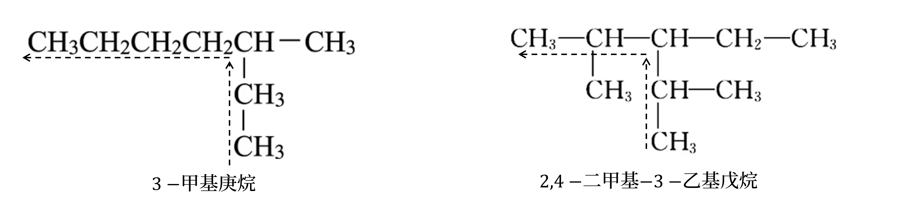
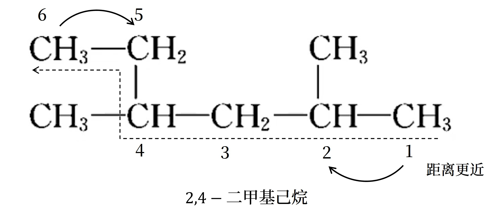
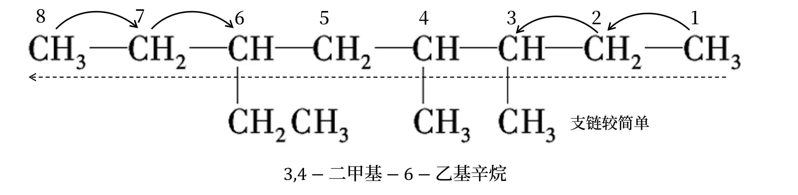
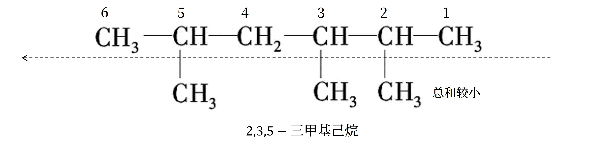
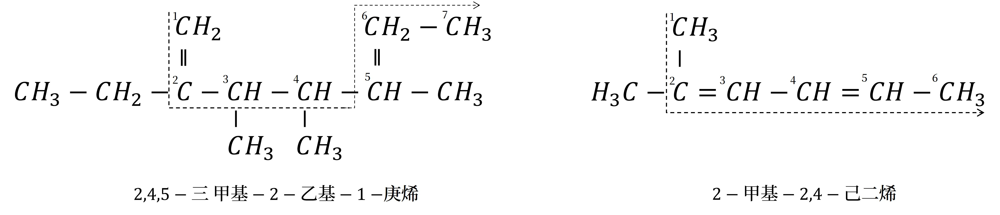
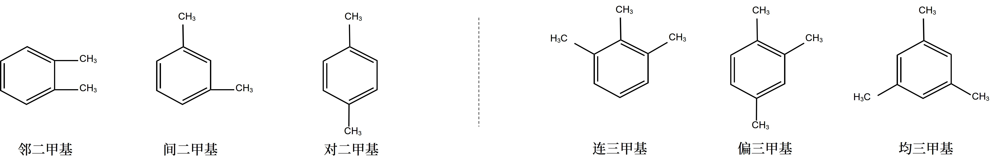
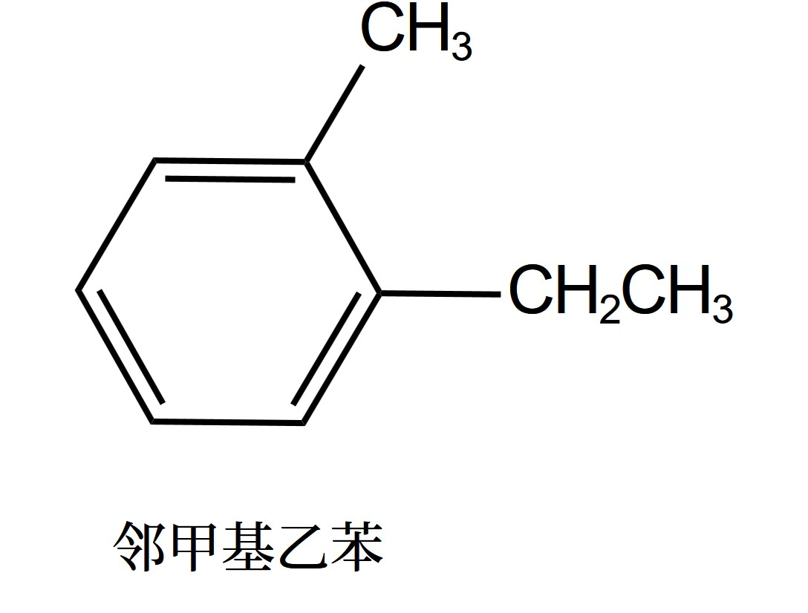

# 有机化学基础 · 三 · 「有机化合物的分类和命名」

## 有机化合物的分类
1. **官能团**
    反映一类有机化合物其同特性的原子或原子团叫做官能团

2. **同系物**
    结构相似，分子组成相差一个或若干个 $CH_2$ 原子团的有机化合物互相称为同系物。同系物一般可用通式表示
> | 类别         | 通式                                                     |
> | ------------ | -------------------------------------------------------- |
> | 链烷烃       | $\ce{C_{n}H_{2n+2}} \left( n \geqslant 1 \right)$ |
> | 单烯烃       | $\ce{C_{n}H_{2n}} \left( n \geqslant 2 \right)$     |
   > | 环烷烃       | $\ce{C_{n}H_{2n}} \left( n \geqslant 3 \right)$     |
> | 炔烃         | $\ce{C_{n}H_{2n-2}} \left( n \geqslant 2 \right)$ |
> | 二烯烃       | $\ce{C_{n}H_{2n-2}} \left( n \geqslant 4 \right)$ |
> | 苯及其同系物 | $\ce{C_{n}H_{3n-6}} \left( n \geqslant 6 \right)$ |
>
> 同系物因组成和结构相似，化学性质相似，而物理性质如熔沸点、密度，一般呈规律性变化
>
> 同系物定义中的「结构相似」是指碳链和成键方式相同、官能团相同、官能团数目相同、官能团与其他原子的连接
> 方式相同等。如 $\ce{CH3CH2OH}$ 与 $\ce{HOCH2CH2OH}$ 不属于同系物

<table>
    <tr>
        <th>类别</th>
        <th>官能团名称</th>
        <th>官能团结构</th>
    </tr>
    <tr>
        <td>烯烃</td>
        <td>碳碳双键</td>
        <td></td>
    </tr>
    <tr>
        <td>炔烃</td>
        <td>碳碳三键</td>
        <td></td>
    </tr>
    <tr>
        <td>卤代烃</td>
        <td>碳卤键</td>
        <td></td>
    </tr>
    <tr>
        <td>醇</td>
        <td>醇羟基</td>
        <td rowspan="2"></td>
    </tr>
    <tr>
        <td>酚</td>
        <td>酚羟基</td>
    </tr>
    <tr>
        <td>醚</td>
        <td>醚键</td>
        <td></td>
    </tr>
    <tr>
        <td>醛</td>
        <td>醛基</td>
        <td></td>
    </tr>
    <tr>
        <td>酮</td>
        <td>酮羰基</td>
        <td></td>
    </tr>
    <tr>
        <td>羧酸</td>
        <td>羧基</td>
        <td></td>
    </tr>
    <tr>
        <td>酯</td>
        <td>酯基</td>
        <td></td>
    </tr>
    <tr>
        <td>胺</td>
        <td>氨基</td>
        <td></td>
    </tr>
    <tr>
        <td>酰胺</td>
        <td>酰胺基</td>
        <td></td>
    </tr>
</table>

> 1. 酚和醇的官能团均为羟基( $\ce{-OH}$ )，但酚中羟基直接与苯环相连，而醇中羟基直接连在饱和碳原子上；但最好应区分醇羟基与酚羟基
> 2. 酯基中与 $\ce{O}$ 成键的一定是 $\ce{C}$ 
> 3. 含酯基、醛基，属于酯类
> 4. 醚键两端的 $\ce{C}$ 原子不一定要接三个单键

## 习惯命名法
$$
碳原子数 \begin{cases}
十以下 & 依次用 甲、乙、丙、丁、戊、己、庚、辛、壬、癸 表示\\
十以上 & 用 中文数字 表示\\
相同时 & 正、异、新\\
\end{cases}
$$

> 正：直链无支链的烷烃、异：带有一个支链的烷烃、新：带有两个支链的烷烃；正戊烷的主链是丁烷

## 系统命名法

### 烃基
*命名架构：位置编号-取代基-主碳链*
### 烷烃的系统命名步骤
1. 定主链要遵循 **「长」「多」** 原则
   以最长的连续碳链为主链，以此主链决定烷烃的基本名称   
   当有几个相同长度的不同碳链时，选择**含支链最多的一个作为主链**
2. 以阿拉伯数字（$1、2、3$）表示取代基或官能团的**位置编号**
   以中文数字（$一、二、三$）表示**取代基个数**
   阿拉伯数字与汉字间以短横线「$-$」分开，取代基则由**碳数少的小取代基**先写
> 
3. 编号位要遵循 **「近」「简」「小」** 原则
   1. **首先考虑「近」**：以**离支链较近**的一端给主链碳原子编号
   
   2. **同「近」考虑「简」**：有两个不同的支链，且分别处于距主链两端同近的位置则从**支链较简单的一端**开始编号
   
   3. **同「近」同「简」考虑「小」**：若有两个相同的支链，且分别处于距主链两端同近的位置，而中间还有其他支链，从主链的两个方向编号，可得到两种不同的编号序列，两序列中各支链**位次和最小者**即为正确的编号
   

### 单烯烃和单炔烃的命名
1. **选主链**：将**含有碳碳双键或碳碳三键**的**最长碳链**作为主链，称为「某烯」或「某炔」
2. **编序号**：从距离碳碳双键或碳碳三键**最近**的一端对主链上的碳原子进行编号定位
3. **写名称**：将支链作为取代基，写在「某烯」或「某炔」的前面，并用阿拉伯数字标明碳碳双键或碳碳三键的位置，写出有机物的名称
   从前到后的顺序依次为 **简单取代基位置** $-$ **简单取代基数目** $-$ **简单取代基名称** $-$ **复杂取代基位置** $-$ **复杂取代基数目** $-$ **复杂取代基名称** $-$ **碳碳双键或三键位置** $-$ **主链名**
   

> 烯烃、炔烃的命名与烷烃的命名的不同点
> 1. 主链的选取：必须是含有碳碳双键或碳碳三键的最长碳链
> 2. 主链的编号：从距离碳碳双键或碳碳三键最近的一端开始编号
> 3. 名称的书写：先写取代基的位置和名称，再写碳碳双键或碳碳三键的位置

### 多烯烃和多炔烃的命名

与单烯烃或单炔烃的命名主要区分点在于主链的选择与不饱和键序号的确定。

1. **选主链**：将**含有碳碳双键或碳碳三键**的**最多**的**最长碳链**作为主链，称为「某几烯」或「某几炔」
2. **编序号**：从距离碳碳双键或碳碳三键**最近**的一端开始，双键或三键的位号由小到大排列。
3. **写名称**：将支链作为取代基，写在「某几烯」或「某几炔」的前面，并用阿拉伯数字标明碳碳双键或碳碳三键的位置，写出有机物的名称。

     若分子中同时含有碳碳双键与碳碳三键，可用某烯炔作结尾，并给予双键、三键尽可能低的位号，如果位号有选择时，使双键位号比三键小，书写时先烯后炔。

      

### 芳香烃的命名
1. **基本原则**：环状化合物的命名通常选择环作为母体，从环上连有最简单取代基的碳原子开始编号
2. **苯的同系物的命名**：

   将苯环上的 $6$ 个碳原子按最小位次和原则进行编号（从 $1-6$ ），命名时要指出取代基的位置和名称

   1. 以苯环作为命名的母体，苯环上的侧链烷基为取代基进行命名，如苯环上的一个氢原子被甲基取代称为甲苯，苯环上的一个氢原子被乙基取代称为乙苯。
   
      当苯环上有两个取代基时，根据取代基在苯环上的相对位置，可分别用「邻」「间」「对」来表示，如“对二甲苯” “邻甲基苯酚” 等；当苯环上有三个**相同**取代基时，根据取代基在苯环上的相对位置，可分别用「连」「偏」「均」来表示。
   
       

   2. 采用习惯命名法命名，当苯环上有两个不同取代基时，以较大的取代基为母体来命名
   
      > 如图所示
      > 
   
   3. 当苯环上连接不饱和基团或虽为饱和基团，但体积较大或结构比较复杂时，可将苯作为取代基

### 单官能团烃衍生物的系统命名
1. 将官能团作为取代基，仍以烷烃为母体，按烷烃的命名原则来命名

    采用这种方法的官能团有：卤素原子、硝基、（亚硝基）

2. 将含有官能团的最长主链作为母体化合物，其命名步骤如下：

    ① **选主链**：将**含有母体官能团**的**最长碳链**作为主链
    ② **编序号**：按**最低系列原则**（即让官能团的位置号尽可能小）依次给主链碳原子编号。
    ③ **写名称**：将支链作为取代基，然后写全名。写全名时，根据主链的碳原子数称为某A（A= 醇、醛、酮、酸、酰卤、酰胺、腈等）
    从前到后的顺序依次为 **简单取代基位置** $-$ **简单取代基数目** $-$ **简单取代基名称** $-$ **复杂取代基位置** $-$ **复杂取代基数目** $-$ **复杂取代基名称** $-$ **母体官能团位置** $-$ **母体名称**

3. 酯的命名

    酯是羧酸与醇脱水缩合形成的产物，此处以乙酸苯甲酯为例：
    ① 命名时先把羧酸名称放在前面，即“乙酸”；
    ② 将醇的名称放在后面，先删去“醇”字，而后加上“酯”字，即“乙酸苯甲酯”。

### 含有多个相同官能团的烃衍生物的系统命名

可参照**单官能团烃衍生物的命名**与**烯烃和炔烃的命名**进行
<!-- 如果需要保证完整度，可进一步补充 -->

### 含多种官能团的烃衍生物的系统命名

1. 当分子中含有多种官能团时，首先要确定一个主官能团，确定主官能团的顺序是查看下表所列顺序：
<!-- 本表格尚不全 -->
<table>
    <tr>
        <th>母体名称</th>
        <th>官能团名称</th>
        <th>官能团结构</th>
    </tr>
    <tr>
        <td>羧酸</td>
        <td>羧基</td>
        <td></td>
    </tr>
    <tr>
        <td>酯</td>
        <td>酯基</td>
        <td></td>
    </tr>
    <tr>
        <td>酰胺</td>
        <td>酰胺基</td>
        <td></td>
    </tr>
        <td>腈</td>
        <td>氰基</td>
        <td>（图片待补充）</td>
    </tr>
    <tr>
        <td>醛</td>
        <td>醛基</td>
        <td></td>
    </tr>
    <tr>
        <td>酮</td>
        <td>酮羰基</td>
        <td></td>
    </tr>
    <tr>
        <td>醇</td>
        <td rowspan="2">羟基</td>
        <td rowspan="2"></td>
    </tr>
    <tr>
        <td>酚</td>
    </tr>
    <tr>
        <td>胺</td>
        <td>氨基</td>
        <td></td>
    </tr>
    <tr>
        <td>醚</td>
        <td>醚键</td>
        <td></td>
    </tr>
    <tr>
        <td>炔烃</td>
        <td>碳碳三键</td>
        <td></td>
    </tr>
    <tr>
        <td>烯烃</td>
        <td>碳碳双键</td>
        <td></td>
    </tr>
    <tr>
        <td>烷烃</td>
        <td>N/A</td>
        <td>N/A
    </tr>
    <tr>
        <td>（一般不做母体）</td>
        <td>碳卤键(卤素原子)</td>
        <td></td>
    </tr>
    <tr>
        <td>（一般不做母体）</td>
        <td>硝基</td>
        <td>（图片待补充）</td>
    </tr>
</table>
1. 然后，选择含有 **主官能团** 及尽可能含 **较多官能团** 的 **最长碳链** 为主链
2. 主链编号的原则是要让官能团的位号尽可能小。

下面来看一个简单的实例：

 

> 先确定母体为羧酸，因此该物质以“某酸”结尾
> 选择含有**主官能团**及尽可能含**较多官能团**的**最长碳链**为主链，该化合物较为简单，直接选取整条碳链，因此该物质为“某戊酸”。
> 进行主链编号：羧基的位置被锁定在1号位，此时氯原子处于3号位，羟基处于5号位，因此该物质为 **5-羟基-3-氯戊酸**。 

> 至于在编号已经完全正确时，“氯”和“羟基”在命名时究竟谁写在前面，也就是 3-氯-5-羟基戊酸 这个命名是否正确的问题，其实在高考中并无刻板要求.
> 只要官能团**编号正确**，就能拿到相应分数（目前此类复杂化合物的命名在真题中出现率相对较低）

    但是，若要刨根问底或追求精确，可以了解：
    	先写简单基团，与取代基相连的原子序数小的基团排在前面（常见原子为I>Br>Cl>S>O>N>C>H，如羟基中的氧与氯比较，氧序数较小，则氯排在前面）；而对于甲基、乙基、丙基等同为碳原子的基团，复杂度逐渐上升。该方法简便易用，且目前流传度尚广
