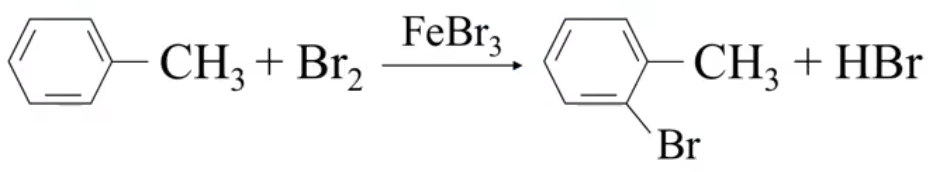

# 有机化学基础 · 五 · 「烃」

1. 按碳原子组成的 **分子骨架** 的不同，含苯环的烃称为 **芳香烃** ，不含苯环的烃称为 **脂肪烃**
2. 根据 **结构中是否含有不饱和键** ，可以将脂肪烃分为 **饱和烃** 和 **不饱和烃** ，烷烃为饱和烃，炔烃和烯烃为不饱和烃

## 脂肪烃

### 烷烃 $(\ce{C_{n}H_{2n+ 2}})$

1. **烷烃的存在形式**
    烷烃是一类最基础的有机化合物，广泛存在于自然界中。生活中的一些常见物质，如天然气、液化石油气、汽油、柴油、凡士林、石蜡等，主要成分都是烷烃
2. **烷烃的结构**
   烷烃分子中的碳原子都采取 $sp^3$ 杂化，形成四面体结构；碳原子以 $σ$ 键与其他碳原子或氢原子结合；每个碳原子形成 $4$ 个共价单键；除甲烷外，烷烃分子中既有极性键，又有非极性键
3. **烷烃的化学性质**
   烷烃的化学性质一般比较稳定，在通常状况下，烷烃不与强酸、强碱和强氧化剂（如溴水、$KMnO_4$ 溶液）反应，也难与其他物质化合，但在特定的条件下烷烃能发生下列反应
   
   1. **氧化反应**
      $$\ce{C_{n}H_{2n+2} +\frac{3n +1}{2}O2->[点燃]nCO2 + (n + 1)H2O}$$
   
      1. **卤代反应**
         卤代反应：在光照条件下，烷烃都能与卤素单质发生取代反应
      
      
      >
      > $$C H _ { 4 } + C l _ { 2 } \stackrel{ 光 }{\longrightarrow}  C H _ { 3 } C l + H C l $$
      
      > 和卤素的反应中，一般不直接用 $\ce{F2}$ 和 $\ce{I2}$，因为 $\ce{F2}$ 反应剧烈，而 $\ce{I2}$ 不易反应
      
   2. **高温分解**
      烷烃在一定条件(加热、加压,使用催化剂)下发生分解反应,可生成碳原子数较少的烷烃和烯烃,高温下还可能生成碳单质和氢气
      > $\ce{C_{16}H_{34} ->[加热、加压][催化剂] C_{8}H_{18} + C_{8}H_{16} (石油的裂化) \quad CH_{4}\xrightarrow{高温} C + 2H_{2} }$

### 烯烃 $($单烯烃 $\ce{C_{n}H_{2n}})$

1. **烯烃的结构**
   
   - 烯烃的官能团是**碳碳双键**。分子中含有一个碳碳双键的烯烃称为单烯烃
   - 烯烃分子中的碳碳双键上的碳原子均采取 $s p ^ { 2 }  $ 杂化，碳原子与氢原子间均形成**单键**（ $\sigma$ 键），碳原子与碳原子间以**双键**相连（ $1$ 个 $\sigma$ 键， $1$ 个 $\pi$ 键），键角约为 $120°$ ，分子中**所有原子都处于同一平面内**
   
2. **烯烃的化学性质**

   1. **加成反应**：烯烃能与 $H_2、X_2$(卤素单质)$、HX、H_2O$ 等发生加成反应

      1. 溴水

         $R-CH=CH_2+Br_2 \longrightarrow R-CHBr-CH_2Br$*（工业上制备二氯代烃）*

      2. $H_2$

         $R-CH=CH_2+H_2 \xrightarrow[\Delta]{催化剂} R-CH_2-CH_3$

         > $CH_3-CH=CH_2+H_2 \xrightarrow[\Delta]{催化剂} CH_3-CH_2-CH_3$ *（丙烯转化成丙烷）*

      3. $H_2O$

         $R-CH=CH_2+H-OH \xrightarrow[\Delta]{催化剂}$ 或 $R-CH_2-CH_2OH$ *（工业制备一元醇）*

         > $CH_2=CH_2+H_2O \xrightarrow[\Delta]{催化剂} CH_3-CH_2OH$ *（乙烯制乙醇）*

      4. $HCl$

         $R-CH=CH_2+HCl \xrightarrow[]{一定条件} $或 $R-CH_2-CH_2Cl$ *（工业制备单卤代烃）*

         > $CH_2=CH_2+HCl \xrightarrow[\Delta]{催化剂} CH_3-CH_2-CH_3$ *（乙烯制氯乙烷）*

      5. 氰化物 $HCN$

         $R-CH=CH_2+HCN \xrightarrow[]{一定条件} $或 $R-CH_2-CH_2CN$ *（实现碳链增长）*

      6. 烯烃的不对称加成-马氏规则

         
         
         当不对称烯烃与含氢的化合物（ $H B r  、H _ { 2 }$  等）加成时，氢原子主要加到连有较多氢原子的碳原子上（马氏规则），在过氧化物存在的情况下,氢原子主要加在连有较少氢原子的碳原子上（反马氏规则）

   2. **加聚反应**

      在适宜的温度、压强和催化剂存在的条件下，乙烯分子中碳碳双键中的一个键可以断裂，分子间通过碳原子的相互结合形成很长的碳链

      生成聚乙烯：$n C H _ { 2 } = C H _ { 2 } \xrightarrow[]{一定条件} [\!\!\!-C H _ { 2 } - C H _ { 2 }$ $]\!\!\!-_n$ （聚乙烯，$n$ 为聚合度，$-CH_2-CH_2-$ 是链节）

      

      二烯烃加聚：$n C H _ { 2 } = C H - C H = C H _ { 2 } \xrightarrow[]{一定条件} [\!\!\!-C H _ { 2 } - C H = C H - C H _ { 2 }$ $]\!\!\!-_n$

      烯烃共聚：$n C H _ { 2 } = C H _ { 2 } + n C H _ { 2 } = C H - C H _ { 3 } \xrightarrow[]{一定条件} [\!\!\!-C H _ 2 - C H _ 2 - C H (C H _ 3) -C H _ 2$ $]\!\!\!-_n$

   3. **氧化反应**

      1. 烯烃能使酸性高锰酸钾溶液**褪色**：$CH_2=CH_2 \xrightarrow[H^+]{KMnO_4} CO_2$
      
         >  用于催熟果实、鉴别烷烃和烯烃
      
      2. 可燃性，燃烧通式为 $C _ { n } H _ { 2 n } + \frac { 3 n } { 2 } O _ { 2 } \xrightarrow{点燃} n C O _ { 2 } + n  H _ { 2 } O$

3. **共轭二烯烃**

   1. 定义：分子中含有 $2$ 个碳碳双键的烯烃称为二烯烃；分子中有 $2$ 个碳碳双键且两个双键只相隔一个单键的烯烃叫作共轭二烯烃，如 $1,3-$丁二烯 （ $C=C-C=C$ ）

   2. $1,3-$丁二烯与氯单质发生加成反应时有两种情况：

      - $1,2-$加成（低温）

        $CH_2=CH-CH=CH_2+Br_2 \longrightarrow$

      - $1,4-$加成（高温）
      
        $CH_2=CH-CH=CH_2+Br_2 \longrightarrow$
        
      > 如果将低温转变为高温，$1,2-$加成的产物也会向 $1,4-$加成的方向转变
      
      > 

### 炔烃 $($单炔烃 $\ce{C_{n}H_{2n-2}})$

1. **炔烃的结构**

   - 分子中含有**碳碳三键**的一类脂肪烃称为炔烃。分子中含有一个碳碳三键的炔烃称为单炔烃

   - 分子中碳原子采取 $sp$ 杂化，碳原子和氢原子间均以**单键**（ $\sigma$ 键）相连接，碳原子和碳原子之间以**三键**（ $1$ 个 $σ$ 键和 $2$ 个 $π$ 键）相连接，相邻两个键之间的夹角为 $180°$，分子为**直线形**结构

2. **乙炔**

   - 乙炔（俗称电石气）是最简单的炔烃。乙炔是无色、无臭的气体，微溶于水，易溶于有机溶剂

   - 乙炔的实验室制法：

     ① 发生装置：用**饱和食盐水**代替水的作用是**减缓碳化钙 $(CaC_2)$ 与水反应的速率**，实验原理为：$CaC_2+2H_2O \longrightarrow C_2H_2\!↑ +Ca(OH)_2$。因反应剧烈且产生气泡，为防止产生的泡沫涌入导管，可以在装置①的导管口处塞入少量棉花（未画出）
     
     > 注意事项：制取乙炔**不能使用启普发生器**或具有启普发生器原理的装置，原因如下：
     > a.碳化钙与水反应剧烈，不能随时停止；
     > b.反应过程中放出大量的热，易使得启普发生器炸裂；
     > c.生成的 $\ce{Ca(OH)2}$ 呈糊状，易堵塞球形漏斗。

     ② **硫酸铜溶液**的作用是除去 $H_2S$ 等杂质气体，防止 $H_2S$ 等气体干扰乙炔性质的检验

     > 除去硫化氢： $\ce{H2S + CuSO4 = CuS\downarrow + H2SO4} $
     > 除去磷化氢： $\ce{12H2O + 11PH3 + 24CuSO4 = 8Cu3P + 3H3PO4 + 24H2SO4}$

     ③ 乙炔能使酸性高锰酸钾溶液褪色

     ④ 乙炔能使溴的四氯化碳溶液褪色
     
     ⑤ $E$ 处对乙炔点燃，产生的现象为**火焰明亮**，**伴有浓烈黑烟**（点燃前检验其纯度，防止爆炸）
   
      

   - **乙炔的化学性质**
   
     1. **加成反应**
   
        乙炔在一定条件下能与氢气、氯化氢和水等物质发生加成反应
   
        - $CH\equiv CH + H _ { 2 } \xrightarrow[\Delta]{催化剂} CH _ { 2 } = C H _ { 2 } \qquad CH\equiv CH + 2 H _ { 2 } \xrightarrow[\Delta]{催化剂} CH _ { 3 } C H _ { 3 }$
   
        - $CH\equiv CH + H C l \xrightarrow[\Delta]{催化剂} CH _ { 2 } = C H C l$
   
        - $CH\equiv CH + H _ { 2 } O \xrightarrow[\Delta]{催化剂} CH _ { 3 } - C H O$
   
          > 乙炔与水加成后的产物乙烯醇不稳定（ $CH_2=CH-OH$ ），很快转化为乙醛（醇的催化氧化）
   
     2. **加聚反应**
   
        乙炔可发生加聚反应，得到聚乙炔，聚乙炔可用于制备**导电高分子材料**
   
        $n C H \equiv C H \xrightarrow[]{一定条件} [\!\!\!-C H = C H $ $]\!\!\!-_n$
   
     3. **氧化反应**
   
        1. 燃烧：$2 C _ { 2 } H _ { 2  } + 5 O _ { 2 } \xrightarrow{点燃} 4 C O _ { 2 } + 2  H _ { 2 } O$   现象：火焰明显、冒出浓烈黑烟
   
           在氧气中燃烧时，氧炔焰的温度可达 $3000\ce{°\!C}$ 以上，因此常用它来焊接或切割金属
   
        2. 与强氧化剂反应：乙炔能被 $KMnO_4$ 氧化，使酸性 $KMnO_4$ 溶液褪色
   
           $2 K M n O _ { 4 } + C _ { 2 } H _ { 2 } + 3 H _ { 2 } S O _ { 4 } \longrightarrow K _ { 2 } S O _ { 4 } + 2 M n C O _ { 2 } + 2 C O _ { 2 } + 4 H _ { 2 } O$

### 烷烃、烯烃、炔烃的结构和性质的比较

1. **物理性质**

   烷烃、烯烃、炔烃的物理性质类似，性质的变化规律也类似，都随分子中碳原子数的增加而呈周期性变化

   | 物理性质 | 相似性                   | 递变性                 |
   | :------- | ------------------------ | ---------------------- |
   | 熔沸点   | 一般较低                 | 逐渐升高               |
   | 密度     | 均小于水                 | 逐渐增大               |
   | 溶解性   | 难溶于水，易溶于有机溶剂 | 在水中的溶解度逐渐降低 |

   > **相对分子质量增大**，范德华力增大，沸点升高 一般情况下，同种烷烃的不同同分异构体中，**支链越多**，分子间作用力越小，沸点越低 状态：常温下由气态逐渐过渡到液态、固态，碳原子小于等于 4 的炔烃是气态烃 
   >
   > 如沸点：正戊烷 > 异戊烷 > 新戊烷

2. **化学性质**

   | 名称     | 烷烃                                         | 烯烃                                               | 炔烃                                                       |
   | :------- | -------------------------------------------- | -------------------------------------------------- | ---------------------------------------------------------- |
   | 取代反应 | 光照卤代                                     | $-$                                                | $-$                                                        |
   | 加成反应 | $-$                                          | 能与 $\ce{H2、X2、HX、H2O、HCN}$                   | 能与 $\ce{H2、X2、HX、H2O、HCN}$                           |
   | 氧化反应 | 燃烧，火焰较明亮；不与 $\ce{KMnO4(H+)}$ 反应 | 燃烧，火焰明亮伴有黑烟；能使 $\ce{KMnO4}$ 溶液褪色 | 燃烧，火焰很明亮伴有浓烈的黑烟；能使 $\ce{KMnO4}$ 溶液褪色 |
   | 加聚反应 | $-$                                          | 能发生                                             | 能发生                                                     |
   | 鉴别     | 不能使溴水和酸性 $\ce{KMnO4}$ 溶液褪色       | 均能使溴水和酸性 $\ce{KMnO4}$ 溶液褪色             | 均能使溴水和酸性 $\ce{KMnO4}$ 溶液褪色                     |

### 脂肪烃与石油化工 

| 石油炼制方法     | 目的                                   | 原理                                                         | 原料               |
| ---------------- | -------------------------------------- | ------------------------------------------------------------ | ------------------ |
| 常压分馏（物理） | 获得以燃料油为常压主的不同石油分馏产品 | 用蒸发和冷凝的方法将原油分成不同沸点范围的馏分               | 原油               |
| 减压分馏（物理） | 获得以润滑油为主的不同石油产品         | 通过减压降低重油的沸点，从重油中分离出不同沸点范围的馏分     | 重油               |
| 催化裂化（化学） | 提高汽油的产量和质量                   | 在加热、加压和催化剂存在的条件下，将相对分子质量大、沸点高的烃断裂成相对分子质量小、沸点低的烃 | 重油、凡士林、石蜡 |
| 裂解（化学）     | 获得有机化工原料                       | 又称深度裂化，在更高温度下，深度裂化，使长链烃断裂成相对分子质量小的气态烃或液态烃 | 煤油和柴油         |
| 催化重整（化学） | 获得芳香烃和提高汽油的质量             | 在催化剂作用下，把汽油中的直链烃转化为芳香烃和具有支链的异构烷烃 | 汽油               |

- **催化裂化**

  $\ce{C16H34->[一定条件]C8H16 + C8H18}$

- **裂解**

  $\ce{C8H18->[催化剂][加热、加压]C4H10 + C4H8} \quad \ce{C4H10->[催化剂][加热、加压]C2H4 + C2H6}$

- **沸点顺序**

  $石油气<汽油<煤油<柴油<润滑油<重油$

## 芳香烃

在烃类化合物中，有很多分子里含有一个或多个苯环，这样的化合物属于芳香烃，苯是最简单的芳香烃

### 苯

1. **物理性质**

   苯是一种无色、有特殊气味的液体，有毒，不溶于水。苯易挥发。沸点为 $80.1\ce{°\!C}$，熔点 $5.5\ce{°\!C}$ ，常温下密度为 $0.88g/cm^3$ 。苯是一种重要的化工原料和有机溶剂，常用作萃取（用苯萃取碘水中的碘单质、萃取溴水中的溴单质）

2. **分子结构**

   苯不能使溴的四氯化碳溶液褪色，也不能被酸性高锰酸钾溶液氧化，这说明苯分子中**不存在碳碳双键**，也**不具有碳碳单键和碳碳双键交替出现的结构**。研究表明，**苯分子的碳碳键是一种介于碳碳单键和碳碳双键之间的特殊共价键**

   苯分子中 $6$ 个碳原子连接成平面正六边形，每个碳原子分别结合 $1$ 个氢原子，分子中 $6$ 个碳原子和 $6$ 个氢原子完全等价。人们称苯的这种特殊结构为苯环结构

   

3. **化学性质**

   1. **取代反应**

      1. 苯和溴在 $\ce{FeBr3}$ 催化下可以发生反应，生成溴苯

         

         > 1. 苯与溴发生取代反应时，试剂选用纯净的液溴（不得使用溴水，使用溴水发生萃取，而非取代，未形成溴苯）。该反应中催化剂是 $\ce{FeBr}$ ，实际操作中一般是加入铁粉与液溴，二者反应生成 $\ce{FeBr3}$
         > 2. 在催化剂作用下，苯也可以与其他纯净卤素单质发生取代反应，这类反应统称为卤代反应
         > 3. 纯净的溴苯是无色液体，不溶于水，密度比水大。溴苯常因溶有溴单质而显褐色

      2. 在浓硫酸作用下，苯在 $50-60\ce{°\!C}$ （水浴加热）与硝酸发生硝化反应，生成硝基苯

         

         > 纯净的硝基苯是无色、有苦杏仁味、密度比水大、不溶于水的油状液体，有毒，因溶有 $\ce{NO2}$ 而显黄色
         >
         > $\ce{H2SO4}$ 用作催化剂、吸水剂；水浴加热用于控制温度，受热均匀

      3. 苯与浓硫酸在 $70-80\ce{°\!C}$ 可以发生磺化反应，生成苯磺酸

         

         > 苯磺酸易溶于水，是一种强酸，可以看作是硫酸分子里的一个羟基被苯环取代的产物

   2. **加成反应**

      在以 $\ce{Pt、N}$ 等为催化剂并加热、加压的条件下，苯能与氢气发生加成反应，生成环己烷

      

      > 苯反应的特点：易取代，难加成（加成需要破坏苯的主体结构）
      >
      > 放出热量小于环己二烯，说明不存在三个双键
   
   3. **氧化反应**
   
      燃烧：苯具有可燃性，在空气里燃烧时火焰明亮，产生浓重的黑烟。
   
      $$\ce{2C6H6 + 15O2->[点燃] 12CO2 + 6H2O}$$
   
   4. **重要化学性质**
   
      1. 苯不能使酸性高锰酸钾溶液褪色
      2. 苯不能使溴的四氯化碳溶液褪色
      3. 苯使溴水褪色的原因是萃取而不是加成反应

### 苯的同系物

苯环上的氢原子被烷基取代所得到的一系列产物称为苯的同系物，其通式为 **$\ce{C_nH_{2n-6}}\qua(n>6)$**

1. **物理性质**

   苯的同系物一般是具有类似苯的气味的无色液体，不溶于水，易溶于有机溶剂，密度比水的小

   规律性：随着碳原子数的递增，苯的同系物的熔、沸点升高，密度增大，但都小于水的密度

2. **化学性质**

   苯的同系物与苯都含有苯环，在一定条件下发生**溴代、硝化和催化加氢反应**。但由于苯环与烷基的相互作用，苯的同系物的化学性质与苯又有所不同。

   1. **氧化反应**

      1. 燃烧反应：$\ce{C_{ n }H_{ 2 n - 6 } + \frac{ 3 n - 3 }{ 2 } O2 ->[点燃]nCO2 + (n-3)H2O}$

      2. **与强氧化剂反应：苯的同系物大多数能被酸性 $\ce{KMnO4}$ 溶液氧化而使其褪色**

         1. 烷基上**与苯环直接相连的碳原子上必须有氢原子**，才能被酸性高锰酸钾氧化

         2. 无论侧链烃基有多少个 $\ce{C}$ 原子，烃基均被氧化为 $\ce{-COOH}$ 

            
            
            
            
            

   2. **取代反应**

      1. **硝化反应**

         甲苯与浓硝酸和浓硫酸的混合物在加热条件下可以发生取代反应，生成一硝基取代物、二硝基取代物和三硝基取代物，硝基取代的位置均以甲基的邻、对位为主

         

         $2,4,6-$三硝基甲苯又叫梯恩梯(TNT)，是一种淡黄色晶体，不溶于水。它是一种烈性炸药，广泛用于国防、采矿、筑路、水利建设等

      2. **卤代反应**
   
         **在光照条件下**，甲苯与氯气发生取代反应时，氯原子取代甲基上的氢原子。反应后可能的有机产物是甲基上的氢原子分别被 $1$ 个、$2$ 个或 $3$ 个氯原子取代所生成的氯甲基苯
   
         
      
         在 $\ce{FeBr3}$ 的催化下，甲苯与溴发生取代反应生成的一溴代甲苯主要有两种：邻溴甲苯和对溴甲苯。**甲基的存在活化了苯环上处于甲基邻位和对位的氢原子**，使相应的 $\ce{C-H}$ 更容易断裂，发生取代反应。该反应对反应条件的要求更低。
   
         
   
   3. **加成反应**
      
      在 $\ce{Pt}$ 作催化剂和加热的条件下，甲苯可以与氢气发生加成反应
      
      
      
### 稠环芳香烃

由两个或两个以上的苯环共用相邻的两个碳原子的芳香烃是稠环芳香烃

<table>
        <tr>
            <th></th>
            <th>分子式</th>
            <th>结构简式</th>
            <th>物理性质</th>
            <th>用途</th>
        </tr>
        <tr>
            <th>萘</th>
            <td>C10H8</td>
            <td></td>
            <td>无色片状晶体，有特殊气味 
                熔点80℃，易升华，不溶于水</td>
            <td>
                ①曾用于杀菌、防蛀、驱虫 
                ②重要的化工原料，生产增塑剂、农药、染料等
            </td>
        </tr>
        <tr>
            <th>蒽</th>
            <td>C14H10</td>
            <td></td>
            <td>无色晶体，易升华 
                不溶于水，易溶于苯</td>
            <td>
                合成染料的重要原料
            </td>
        </tr>
    </table>