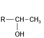
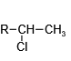

# 有机化学基础 · 五 · 「烃(Shirley Amika)」

## 脂肪烃
1. 按碳原子组成的 **分子骨架** 的不同，含苯环的烃称为 **芳香烃** ，不含苯环的烃称为 **脂肪烃**
2. 根据 **结构中是否含有不饱和键** ，可以将脂肪烃分为 **饱和烃** 和 **不饱和烃** ，烷烃为饱和烃，炔烃和烯烃为不饱和烃

## 烷烃 $(\ce{C_{n}H_{2n+ 2}})$

1. **烷烃的存在形式**
    烷烃是一类最基础的有机化合物，广泛存在于自然界中。生活中的一些常见物质，如天然气、液化石油气、汽油、柴油、凡士林、石蜡等，主要成分都是烷烃
2. **烷烃的结构**
   烷烃分子中的碳原子都采取 $sp^3$ 杂化，形成四面体结构；碳原子以 $σ$ 键与其他碳原子或氢原子结合；每个碳原子形成 $4$ 个共价单键；除甲烷外，烷烃分子中既有极性键，又有非极性键
3. **烷烃的化学性质**
   烷烃的化学性质一般比较稳定，在通常状况下，烷烃不与强酸、强碱和强氧化剂（如溴水、$KMnO_4$ 溶液）反应，也难与其他物质化合，但在特定的条件下烷烃能发生下列反应
   
   1. **氧化反应**
      $$C _ { n } H _ { 2 n + 2 } + \frac { 3 n + 1 } { 2 } O _ { 2 } \xrightarrow{光} n C O _ { 2 } + ( n + 1 ) H _ { 2 } O$$
   
   2. **卤代反应**
      卤代反应：在光照条件下，烷烃都能与卤素单质发生取代反应
      >
      > $$C H _ { 4 } + C l _ { 2 } \stackrel{ 光 }{\longrightarrow}  C H _ { 3 } C l + H C l $$
      
      > 和卤素的反应中，一般不直接用 $\ce{F2}$ 和 $\ce{I2}$
   
   3. **高温分解**
      烷烃在一定条件(加热、加压,使用催化剂)下发生分解反应,可生成碳原子数较少的烷烃和烯烃,高温下还可能生成碳单质和氢气。
      > $C _ { 16 } H _ { 34 }  \xrightarrow[加热、加压]{催化剂}  C _ { 8 } H _ { 18 } +C _ { 8 } H _ { 16 } \qquad C H _ { 4 } \xrightarrow{高温} C + 2 H _ { 2 } $

## 烯烃 $($单烯烃 $\ce{C_{n}H_{2n}})$

1. **烯烃的结构**
   
   - 烯烃的官能团是**碳碳双键**。分子中含有一个碳碳双键的烯烃称为单烯烃
   - 烯烃分子中的碳碳双键上的碳原子均采取 $s p ^ { 2 }  $ 杂化，碳原子与氢原子间均形成**单键**（ $\sigma$ 键），碳原子与碳原子间以**双键**相连（ $1$ 个 $\sigma$ 键， $1$ 个 $\pi$ 键），键角约为 $120°$ ，分子中**所有原子都处于同一平面内**
   
2. **烯烃的化学性质**

   1. **加成反应**：烯烃能与 $H_2、X_2$(卤素单质)$、HX、H_2O$ 等发生加成反应

      1. 溴水

         $R-CH=CH_2+Br_2 \longrightarrow R-CHBr-CH_2Br$*（工业上制备二氯代烃）*

      2. $H_2$

         $R-CH=CH_2+H_2 \xrightarrow[\Delta]{催化剂} R-CH_2-CH_3$

         > $CH_3-CH=CH_2+H_2 \xrightarrow[\Delta]{催化剂} CH_3-CH_2-CH_3$ *（丙烯转化成丙烷）*

      3. $H_2O$

         $R-CH=CH_2+H-OH \xrightarrow[\Delta]{催化剂}$ 或 $R-CH_2-CH_2OH$ *（工业制备一元醇)*

         > $CH_2=CH_2+H_2O \xrightarrow[\Delta]{催化剂} CH_3-CH_2OH$ *（乙烯制乙醇）*

      4. $HCl$

         $R-CH=CH_2+HCl \xrightarrow[]{一定条件} $或 $R-CH_2-CH_2Cl$ *（工业制备单卤代烃)*

         > $CH_2=CH_2+HCl \xrightarrow[\Delta]{催化剂} CH_3-CH_2-CH_3$ *（乙烯制氯乙烷）*

      5. 氰化物 $HCN$

         $R-CH=CH_2+HCN \xrightarrow[]{一定条件} $或 $R-CH_2-CH_2CN$ *（实现碳链增长)*

      6. 烯烃的不对称加成-马氏规则 （拓展）

         
         
         当不对称烯烃与含氢的化合物 $H B r  、H _ { 2 }$  等)加成时，氢原子主要加到连有较多氢原子的碳原子上（马氏规则），在过氧化物存在的情况下,氢原子主要加在连有较少氢原子的碳原子上（反马氏规则）

   2. **加聚反应**

      在适宜的温度、压强和催化剂存在的条件下，乙烯分子中碳碳双键中的一个键可以断裂，分子间通过碳原子的相互结合形成很长的碳链

      生成聚乙烯：$n C H _ { 2 } = C H _ { 2 } \xrightarrow[]{一定条件} [\!\!\!-C H _ { 2 } - C H _ { 2 }$ $]\!\!\!-_n$ （聚乙烯，$n$ 为聚合物，$-CH_2-CH_2-$ 是链节）

      

      二烯烃加聚：$n C H _ { 2 } = C H - C H = C H _ { 2 } \xrightarrow[]{一定条件} [\!\!\!-C H _ { 2 } - C H = C H - C H _ { 2 }$ $]\!\!\!-_n$

      烷烯共聚：$n C H _ { 2 } = C H _ { 2 } + C H _ { 2 } = C H - C H _ { 3 } \xrightarrow[]{一定条件} [\!\!\!-C H _ { 2 } - C H _ { 2 } - C H _ { 2 } - C H _ { 2 } - C H _ { 2 }$ $]\!\!\!-_n$

   3. **氧化反应**

      1. 烯烃能使酸性高锰酸钾溶液**褪色**：$CH_2=CH_2 \xrightarrow[H^+]{KMnO_4} CO_2$
      
         >  用于催熟果实、鉴别烷烃和烯烃
      
      2. 可燃性，燃烧通式为 $C _ { n } H _ { 2 n } + \frac { 3 n } { 2 } O _ { 2 } \xrightarrow{点燃} n C O _ { 2 } + n  H _ { 2 } O$

3. **共轭二烯烃**

   1. 定义：分子中含有 $2$ 个碳碳双键的烯烃称为二烯烃；分子中有 $2$ 个碳碳双键且两个双键只相隔一个单键的烯烃叫作共轭二烯烃，如 $1,3-$丁二烯 （ $C=C-C=C$ ）

   2. $1,3-$丁二烯与氯单质发生加成反应时有两种情况：

      - $1,2-$加成（低温）

        $CH_2=CH-CH=CH_2+Br_2 \longrightarrow$

      - $1,4-$加成（高温）
      
        $CH_2=CH-CH=CH_2+Br_2 \longrightarrow$
        
      > 如果将低温转变为高温，$1,2-$加成的产物也会向 $1,4-$加成的方向转变
      
      > 

## 炔烃 $($单炔烃 $\ce{C_{n}H_{2n-2}})$

1. **炔烃的结构**

   - 分子中含有**碳碳三键**的一类脂肪烃称为炔烃。分子中含有一个碳碳三键的炔烃称为单炔烃

   - 分子中碳原子采取 $sp$ 杂化，碳原子和氢原子间均以**单键**（ $\sigma$ 键）相连接，碳原子和碳原子之间以**三键**（ $1$ 个 $σ$ 键和 $2$ 个 $π$ 键）相连接，相邻两个键之间的夹角为 $180°$，分子为**直线形**结构

2. **乙炔**

   - 乙炔（俗称电石气）是最简单的炔烃。乙炔是无色、无臭的气体，微溶于水，易溶于有机溶剂

   - 乙炔的实验室制法：

     ① 发生装置：用**饱和食盐水**代替水的作用是**减缓碳化钙 $(CaC_2)$ 与水反应的速率**，实验原理为：$CaC_2+2H_2O \longrightarrow C_2H_2\!↑ +Ca(OH)_2$

     ② **硫酸铜溶液**的作用是除去 $H_2S$ 等杂质气体，防止 $H_2S$ 等气体干扰乙炔性质的检验

     > 除去硫化氢： $\ce{H2S + CuSO4 = CuS\downarrow + H2SO4} $
     > 除去磷化氢： $\ce{12H2O + 11PH3 + 24CuSO4 = 8Cu3P + 3H3PO4 + 24H2SO4}$
     
     ③ 乙炔能使酸性高锰酸钾溶液褪色
     
     ④ 乙炔能使溴的四氯化碳溶液褪色
     
     ⑤ $E$ 处对乙炔点燃，产生的现象为**火焰明亮**，**伴有浓烈黑烟**（点燃前检验其纯度，防止爆炸）
   
   
   
   - **乙炔的化学性质**
   
     1. **加成反应**
   
        乙炔在一定条件下能与氢气、氯化氢和水等物质发生加成反应
   
        - $CH\equiv CH + H _ { 2 } \xrightarrow[\Delta]{催化剂} CH _ { 2 } = C H _ { 2 } \qquad CH\equiv CH + 2 H _ { 2 } \xrightarrow[\Delta]{催化剂} CH _ { 3 } C H _ { 3 }$
   
        - $CH\equiv CH + H C l \xrightarrow[\Delta]{催化剂} CH _ { 2 } = C H C l$
   
        - $CH\equiv CH + H _ { 2 } O \xrightarrow[\Delta]{催化剂} CH _ { 3 } - C H O$
   
          > 乙炔与水加成后的产物乙烯醇不稳定（ $CH_2=CH-OH$ ），很快转化为乙醛
   
     2. **加聚反应**
   
        乙炔可发生加聚反应，得到聚乙炔，聚乙炔可用于制备**导电高分子材料**
   
        $n C H \equiv C H \xrightarrow[]{一定条件} [\!\!\!-C H = C H $ $]\!\!\!-_n$
   
     3. **氧化反应**
   
        1. 燃烧：$2 C _ { 2 } H _ { 2  } + 5 O _ { 2 } \xrightarrow{点燃} 4 C O _ { 2 } + 2  H _ { 2 } O$   现象：火焰明显、冒出浓烈黑烟
   
           在氧气中燃烧时，氧炔焰的温度可达 $3000\ce{°\!C}$ 以上，因此常用它来焊接或切割金属
   
        2. 与强氧化剂反应：乙炔能被 $KMnO_4$ 氧化，使酸性 $KMnO_4$ 溶液褪色
   
           $2 K M n O _ { 4 } + C _ { 2 } H _ { 2 } + 3 H _ { 2 } S O _ { 4 } \longrightarrow K _ { 2 } S O _ { 4 } + 2 M n C O _ { 2 } + 2 C O _ { 2 } + 4 H _ { 2 } O$

## 烷烃、烯烃、炔烃的结构和性质的比较

1. **物理性质**

   烷烃、烯烃、炔烃的物理性质类似，性质的变化规律也类似，都随分子中碳原子数的增加而呈周期性变化

   | 物理性质 | 相似性                   | 递变性                 |
   | :------- | ------------------------ | ---------------------- |
   | 熔沸点   | 一般较低                 | 逐渐升高               |
   | 密度     | 均小于水                 | 逐渐增大               |
   | 溶解性   | 难溶于水，易溶于有机溶剂 | 在水中的溶解度逐渐降低 |

   > 相对分子质量增大，范德华力增大，沸点升高 一般情况下，同种烷烃的不同同分异构体中，支链越多，分子间作用力越小，沸点越低 状态：常温下由气态逐渐过渡到液态、固态，碳原子小于等于 4 的炔烃是气态烃 
   >
   > 如沸点：正戊烷 > 异戊烷 > 新戊烷

2. **化学性质**

   | 名称     | 烷烃                                         | 烯烃                                               | 炔烃                                                       |
   | :------- | -------------------------------------------- | -------------------------------------------------- | ---------------------------------------------------------- |
   | 取代反应 | 光照卤代                                     | $-$                                                | $-$                                                        |
   | 加成反应 | $-$                                          | 能与 $\ce{H2、X2、HX、H2O、HCN}$                   | 能与 $\ce{H2、X2、HX、H2O、HCN}$                           |
   | 氧化反应 | 燃烧，火焰较明亮；不与 $\ce{KMnO4(H+)}$ 反应 | 燃烧，火焰明亮伴有黑烟；能使 $\ce{KMnO4}$ 溶液褪色 | 燃烧，火焰很明亮伴有浓烈的黑烟；能使 $\ce{KMnO4}$ 溶液褪色 |
   | 加聚反应 | $-$                                          | 能发生                                             | 能发生                                                     |
   | 鉴别     | 不能使溴水和酸性 $\ce{KMnO4}$ 溶液褪色       | 均能使溴水和酸性 $\ce{KMnO4}$ 溶液褪色             | 均能使溴水和酸性 $\ce{KMnO4}$ 溶液褪色                     |

   

## 芳香烃

①苯及其同系物

特征反应：**取代反应** 加成反应

> 苯的卤化取代反应，需要三溴化铁催化（也可以在液溴中加入铁粉）。

> 苯的硝化取代反应，需要浓硫酸催化。

> 新方案中有关苯的磺化反应，可以用于“占位”。

> 苯的加成反应（这个反应很浪费，没有太大意义）。
> 
如果苯环上取代了一个甲基，就成为**甲苯**。

甲基使邻对位**活化**（后续会讲解），使得反应的取代基团进入苯环的邻对位。

2,4,6-三硝基甲苯（TNT）是一种淡黄色晶体，不溶于水，是一种烈性炸药。

②稠环芳烃

稠环芳烃
事实上，还存在着其他芳香体系（在2020课标I卷可以窥见一斑）。