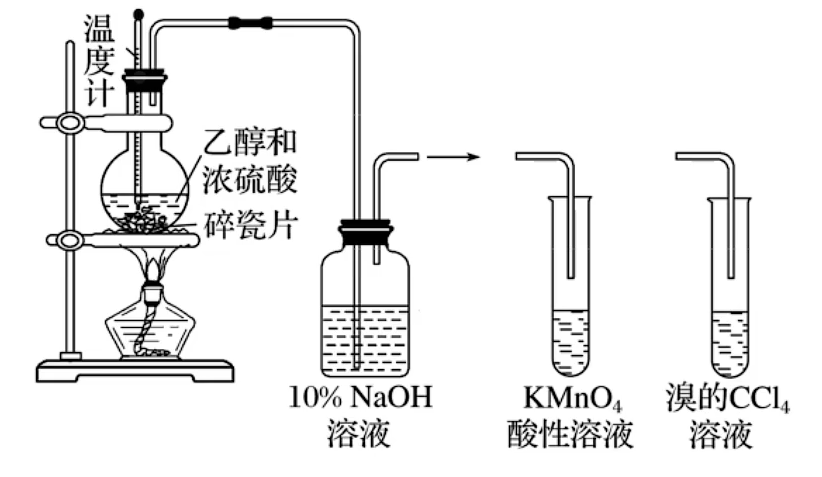

# 有机化学基础 · 六 · 「烃的衍生物(Shirley Amika)」

## 醇

1. **醇的分类**

   1. 根据醇分子中所含羟基的数目：一元醇、二元醇、多元醇
   2. 根据羟基所连烃基种类：
    $
       \begin{cases}
       脂肪醇 &\begin{cases}
       饱和醇(饱和一元醇\quad\!\!\ce{C_nH_{2n+1}OH}\quad n \ge 1) \\
       不饱和醇 \\
       \end{cases}\\
       脂环醇(环己醇\quad\!\!\ce{⌬\!-OH})\\
       芳香醇(苯甲醇\quad\!\!\ce{⌬\!-CH2OH})\\
       \end{cases}
       $

2. **生活中常见的醇**

   1. 甲醇( $\ce{CHOH}$ 木精)：无色、具有挥发性的掖体易溶于水，沸点为 $65\ce{°\!C}$。甲醇有毒，误服会损伤视神经，甚至致人死亡。甲醇广泛应用于化工生产也可作为车用燃料
   2. 乙二醇、丙三醇都是无色、粘稠、有甜味的液体，都易溶天水和乙醇，是重要的化工原料
      1. 乙二醇是汽车发动机防冻液的主要化学成分，也是合成涤纶等高分子化合物的主要原料
      2. 丙三醇具有很强的吸水能力，可用于制造日用化妆品

3. **物理性质**

   1. 沸点
      1. **饱和一元醇**的熔沸点随分子中**碳原子数**的递增而逐渐增大
      2. 相对分子质量相近的醇和烷烃相比，醇的沸点远远高于烷烃的沸点（**氢键的影响**）
      3. 碳原子数相同时，**羟基个数**越多，醇的沸点越高
        > ①丙醇 ②丙二醇 ③丙烷 ④乙醇 ⑤丙醇等物质的沸点排列顺序：
        > $⑤>②>①>④>③$

   2. 溶解性：
      醇在水中的溶解度一般随分子中**碳原子数的增加而降低**。**羟基越多，溶解度越大**

      > 理解：烷基是憎水基，接的烷基越多，使得羟基形成氢键导致溶解度增加的效果减弱，因此溶解性降低
      >
      > 甲醇、乙醇、丙醇、乙二醇、丙三醇等低级醇(碳数比较少的醇)可与水以任意比例混溶

   3. 密度：醇的密度比水的密度小

4. **化学性质**

   醇的化学性质主要由**羟基**官能团所决定。在醇分子中，由于氧原子吸引电子的能力比氢原子和碳原子的强(氧的电负性更大，吸引电子的能力更强)，使 $\ce{O-H}$ 和 $\ce{C-O}$ 的电子都向氧原子偏移。因此，醇在发生反应时， $\ce{O-H}$ 容易断裂，使羟基中的氢原子被取代，同样， $\ce{C-O}$也易断裂，使羟基被取代或脱去，从而发生取代反应或消去反应

   1. **与活泼金属单质的置换反应**

      $\ce{2CH3CH2OH +2Na -> 2CH3CH2ONa + H2 ^}$

      1. 现象：钠沉于无水乙醇的底部，表面有气泡产生，慢慢消失；放出的气体可在空气中安静地燃烧，火焰呈淡蓝色（ $\ce{H2}$ ）；烧杯壁上有水珠生成；澄清石灰水未变浑浊（无 $\ce{CO2}$ ）

         1. **乙醇羟基的 $\ce{H}$ 原子活泼性较水的 $\ce{H}$ 原子弱**（醇分子中的烷基具有**推电子作用**）

            > 推电子作用：$\vec{\ce{CH3CH2}}\ce{-O-H}$
            >
            > 由于烷基具有推电子作用，使得 $\ce{O-H}$ 键极性变弱，因此反应不会很剧烈

         2. 其它活泼金属如钾、钙等也可与乙醇反应产生  $\ce{H2}$

         3. 产物乙醇钠在水中强烈水解：$\ce{CH3CH2ONa + H2O→CH3CH2OH + NaOH}$

      2. **取代反应**（以乙醇为例）

         1. **醇与浓的氢卤酸**（ $\ce{HCl、HBr、HI}$ ）

            分子的碳氧键发生断裂，羟基被卤素原子取代，生成相应的卤代烃和水
      
            $\ce{CH3CH2-\!\!\!⁞\enspace OH + H-\!\!\!⁞\enspace Br ->[\Delta] CH3CH2\mathbf{Br} + H2O}$
      
         2. **酯化反应**（酸脱羟基醇脱氢）
      
            
      
            >对乙醇上的氧原子进行 $^{18}\ce{O}$ 进行追踪，发现出现在乙酸乙酯中，证明不是乙醇的碳氧键断裂（但一部分 $^{18}\ce{O}$ 还会留着乙醇中，因为是可逆反应）
      
         3. **醇分子间脱水成醚**
      
            如果把乙醇与浓硫酸的混合物的温度控制在 **$140\ce{°C}$** 左右，每两个乙醇分子间会脱去一个水分子而生成乙醚
      
            
      
            乙醚是一种无色、易挥发的液体，有特殊气味，有麻醉作用，易溶于有机溶剂。像乙醚这样由**两个烃基通过一个氧原子连接起来的化合物叫做醚**，**醚的结构可用 $\ce{R-O-R'}$ 来表示**， $\ce{R}$ 和 $\ce{R'}$ 都是烃基，可以相同，也可不同
      
            醚类物质在化工生产中被广泛用作溶剂，有的醚可被用作麻醉剂
      
         4. **消去反应**
      
            - 将**浓硫酸与乙醇按体积比 $3:1$**混合，即将 $15mL$ 浓硫酸緩缓加入到盛有 $5mL\enspace95\%$ 乙醇的烧杯中混合均匀（**浓硫酸加入乙醇中**），冷却后再倒入长颈圆底烧瓶中，并加入碎瓷片防止暴沸
      
              加热混合溶液，**迅速升温到$170\ce{°C}$**，将生成的气体**先通入 $\ce{NaOH}$ 溶液除去杂质**再分别通入 $\ce{KMnO4}$ ,酸性溶液和溴的四氯化碳溶液中，观察现象
      
              > 硫酸酒精3:1：浓硫酸作催化剂与脱水剂
              >
              > 温度迅速170：由于在 $140\ce{°C}$ 会发生脱水成醚，为避免产生杂质，应迅速升温
              >
              >  $\ce{NaOH}$ 溶液除杂：通过导管的不仅有乙烯，还有挥发出来的乙醇，同时浓硫酸发生碳化，碳与浓硫酸再次反应，产生二氧化硫杂质，浓硫酸有强氧化性，生成 $\ce{CO2}$ 杂质
      
              
      
              实验现象：产生了气体，该气体使酸性高锰酸钾溶液褪色，使溴的四氯化碳溶液褪色，烧瓶内有黑色固体生成
      
            - 原理
      
            
      
            - 发生消去反应的反应条件：邻位 $\ce{C}$ 原子上有 $\ce{H}$
      

> 新方案课本中对学习《烃的衍生物》一章的引言。

1.卤代烃

CHCl3:氯仿 过去曾经作麻醉剂，能够与空气中的氧气作用生成“光气“。

CCl2F2：一种氟氯烃（氟利昂）造成臭氧层空洞。

CCl4（四氯化碳）一种常用的有机溶剂。

CH3CH2Br(氯乙烷）汽化时大量吸热，具有麻醉镇痛作用。

官能团：卤原子（新方案课本称“碳卤键”）

书写时要写出具体的卤素名称，例如：溴原子（碳溴键）

特征反应：

①取代反应（水解反应）

> 溴乙烷与在氢氧化钠的水溶液中发生取代反应。

②消去反应（新方案将“消除反应“的称呼带入课本中）

> 溴乙烷在强碱的醇溶液中发生消去反应。

·生成卤代烃的实验：（CH4与Cl2的反应）

> 实验

实验过程：均通过排饱和食盐水的方法收集半试管甲烷和半试管氯气，分别固定在铁架台上，将其中一支放在光亮处（不要日光直射！容易发生爆炸！）另一支用铝箔套上，静置观察现象。

现象：光亮处的试管内壁出现油状液滴、水面上有少量白雾、试管中气体颜色变浅，饱和食盐水倒吸。

2 .醇（以乙醇为例）

官能团：（醇）羟基

根据实验现象，密度：Na>乙醇

> 醇分子间可形成氢键，使得醇的沸点升高，也因为氢键的原因，乙醇与水互溶。

特征反应：**置换反应 消去反应 取代反应 氧化反应**

·乙醇与Na的反应（置换反应）
$\ce{2CH3CH2OH +2Na = 2CH3CH2ONa + H2}$

·乙醇的氧化反应

乙醇可以和酸性重铬酸钾反应，溶液由橙黄色变为灰绿色，该反应广泛运用在查酒驾中。

乙醇也可以与酸性高锰酸钾反应使其褪色，而且乙醇容易挥发，因而检验还原性气体时，如果有乙醇的干扰，应该先想方设法除去乙醇。
$\ce {2CH3CH2OH + O2\xlongequal{Cu/Ag, △}2CH3CHO + 2H2O}$

乙醇在铜或银的催化下，可以与氧气一同发生氧化反应。

还可以进一步在其他催化剂（比如酶）的作用下生成乙酸，写出其反应方程式，试试看！

> 有机化学中的氧化、还原反应。需要注意的是，氧化和还原应当针对结构或者官能团发生改变的那个有机物，而不应当笼统地把整个反应称之为“氧化还原反应”。

> 乙醇的取代反应（生成溴乙烷）

> 乙醇的取代反应（生成乙醚）

> 乙醚的作用

> 乙醇的消去反应（需要迅速升温）

乙醇具有消毒作用，一般使用70-75%的医用酒精来消毒（不能使用95%浓度的酒精，效果会变差）

3.酚（羟基与苯环直接相连）

官能团：（酚）羟基

纯净的苯酚是无色晶体，但放置时间较长往往变为粉红色，这是因为苯酚在空气中发生了氧化反应（苯酚被氧化为苯醌）。

苯酚具有弱酸性，俗称石炭酸。苯酚可以消毒。如果沾到手上，要用乙醇冲洗（不能用清水，因为苯酚常温下不溶于水），再用水冲洗。

【不要执着地说用热水甚至是开水洗，老老实实用乙醇，靴靴。】

> 苯酚具有消毒作用

酚的化学性质：

由于苯环与羟基之间的**相互作用**，酚羟基在性质上与醇羟基有着显著的差异。

> 醇羟基不能和氢氧化钠反应，但是酚羟基可以。

> 强制弱

> 强制弱，这个反应说明，苯酚的酸性比碳酸弱，比碳酸氢根强，反应产物与通入CO2的量无关。

苯酚酸性太弱，不能使紫色石蕊试纸变红。

> 苯酚与溴的取代反应，可用于苯酚的定性检验与定量测定。

但是注意，由于相似相容原理（2，4，6-三溴苯酚溶于苯）该反应不能用于苯中苯酚的除杂。

> 苯能和三氯化铁发生显色反应，呈紫色（生成的是配合物，不需要掌握其反应）

4.醛和酮

醛（R-CHO）

官能团：醛基（即甲酰基）

醛的化学性质（以乙醛为例）：

特征反应：**氧化反应 加成反应**

银氨溶液的配制：
$\ce{AgNO3 + NH3·H2O = AgOH ↓ + NH4NO3} $
$\ce{AgOH + 2NH3·H2O = Ag(NH3)2OH + 2H2O}$

银镜反应：
$\ce{CH3CHO +2Ag(NH3)2OH  ->[△]CH3COONH4 + 2Ag\downarrow + 3NH3·H2O}$

(配平上该方程式中的产物表现为一盐二银三氨水，实际上氢氧化二氨合银是一个强碱，该反应其实是“强制弱”的反应。)

工业上曾用银镜反应制镜或保温瓶胆。

和新制氢氧化铜的反应：
$\ce{CH3CHO +2Cu(OH)2 + NaOH  ->[△]CH3COONa + Cu2O\downarrow + 3H2O}$

(为了严谨起见，我们不将其表述为《普通高中教科书：生物学》中的斐林试剂相关反应。)

*·其他STSE内容*

甲醛的水溶液称福尔马林，可杀菌防腐，甲醛等可以合成黏合剂。

自然界中的醛：

> 桂皮中含有肉桂醛，杏仁中含有苯甲醛。

·酮（R-CO-R’）

官能团：（酮）羰基

特征反应：加成反应

最简单的酮是丙酮，常温下为无色透明液体。

丙酮不能被弱氧化剂氧化，可以被加成生成醇。

> 丙酮的催化加氢反应

5.羧酸及其衍生物 油脂

·羧酸（烃基和羧基直接相连构成的有机化合物）

官能团：羧基

特征反应：取代反应（酯化反应）

酯化反应机理：酸脱羟基醇脱氢

> 同位素示踪技术：“酸脱羟基醇脱氢”

乙酸：乙酸是具有强烈刺激性气味的液体，纯净的乙酸又称为冰醋酸。

自然界中的羧酸：

蚁酸（HCOOH）安息香酸（C6H6-COOH）草酸（乙二酸）

> 乳酸和柠檬酸也属于羧酸

·酯

官能团：酯基

特征反应：取代反应（水解反应）

典型有机物：乙酸乙酯

乙酸乙酯的制备实验：

> 由于该装置只是插了一根导管，因此被裴成环公开批判。该装置简单可用，但为了高产率，可以进行改进，比如增加冷凝回流装置，详见各种有机实验题。

实验器材：铁架台 试管 导管 酒精灯

试剂加入顺序：乙醇 3mL 乙酸 2mL 浓硫酸 2mL （可以集成“醇，硫，酸”）

反应过程中右侧试管内液体上层有无色透明的油状液体产生，并且可以闻到香味。

饱和碳酸钠的作用：①吸收乙醇 ②中和乙酸 ③降低酯的溶解度

浓硫酸的作用：①催化剂 ②吸收反应生成的水，使酯化反应平衡正向移动。

酯的水解反应：

酸性条件下水解： 
$\ce{CH3COOCH2CH3 + H2O <=>[稀硫酸][△]CH3COOH + CH3CH2OH}$

碱性条件下水解： 
$\ce{CH3COOCH2CH3 + NaOH ->[△] CH3COONa + CH3CH2OH}$

注意酚酯的水解反应：(有苯环都不错了，凑合着看吧）

酸性条件下水解： 
$\ce{⌬-O-CO-CH3 + H2O <=>[稀H2SO4][△ ]⌬-OH + CH3COOH} $

碱性条件下水解：

$\ce{⌬-O-CO-CH3 + 2NaOH <=>[△] ⌬-ONa + CH3COONa + H2O} $（易错）

注意：酚酯在碱性条件下的水解反应需要注意产物的问题（因为酚羟基与氢氧根反应）

酯化反应的产物最好先书写小分子（比如水和羧酸钠等），在多官能团存在（比如卤原子、酚羟基）时，注意消耗NaOH的物质的量关系。可以带入两边氧的数量验证。

·STSE:生活中的酯

苹果：戊酸戊酯 菠萝：丁酸乙酯 香蕉：乙酸异戊酯 草莓：乙酸异戊酯、乙酸乙酯

低价酯有一定的挥发性，难溶于水，可用作饮料、糖果、化妆品中的香料和有机溶剂。还可以用于指甲油和胶水的制造。

·油脂（化学本质为高级脂肪酸甘油酯）

油：常温下呈液态（如花生油），脂肪：常温下呈固态（比如牛油，也称牛脂）

植物油为含较多不饱和脂肪酸成分的甘油酯，在常温下一般呈液态；动物油为含较多饱和脂肪酸成分的甘油酯，在常温下一般呈固态。

饱和：硬脂酸（十八酸）C17H35-COOH 软脂酸（棕榈酸，十六酸）C15H31-COOH

不饱和：油酸（9-十八碳烯酸）C17H33COOH 亚油酸（9,12-十八碳烯酸）C17H31COOH

记忆：软硬饱和，软的十五碳，油油不饱和（该考点目前未见出现）

天然的油脂都是混合物，没有恒定的溶沸点。

简单甘油酯：R,R',R''相同

混合甘油酯：R,R',R''不同

（注意：混合甘油酯仍然是纯净物）

特征反应：

取代反应（水解反应，同“酯”章节）

加成反应（仅不饱和脂肪酸甘油酯，兼有烯的性质）

·STSE：

油脂在碱性溶液中水解，称为“皂化反应”，可用于清洗油污。

钠肥皂：硬肥皂 钾肥皂：软肥皂（理发店、医院常用）

其他相关：鱼油（含有EPA、DHA）

油脂的氢化：将不饱和脂肪酸甘油酯，比如液态植物油，在一定条件下与氢气发生加成反应，提高其饱和程度，生成固态的氢化植物油，也称油酯的硬化。

油脂的氧化：不饱和脂肪酸甘油酯中含有碳碳双键，在空气中放置久了会被氧化，产生过氧化物与醛类物质等，变质油脂有一种难闻的“哈喇”味，不能食用。

（STSE挺多的，欢迎补充）

·酰胺*

*注：“酰胺”一章为新方案教材中加入的内容，在这里仅引用加以介绍。

> ①：或取代的氨基（-NRR&amp;#39;）R和R&amp;#39;可以是氢原子或者烃基

> ①：或取代的氨基（-NRR&amp;#39;）R和R&amp;#39;可以是氢原子或者烃基

①：或取代的氨基（-NRR'）R和R'可以是氢原子或者烃基

事实上，-NH-CO-在化学上被称为酰胺键，也叫肽键，是酰胺的官能团。