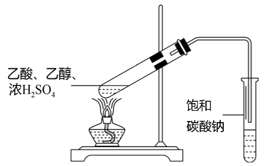
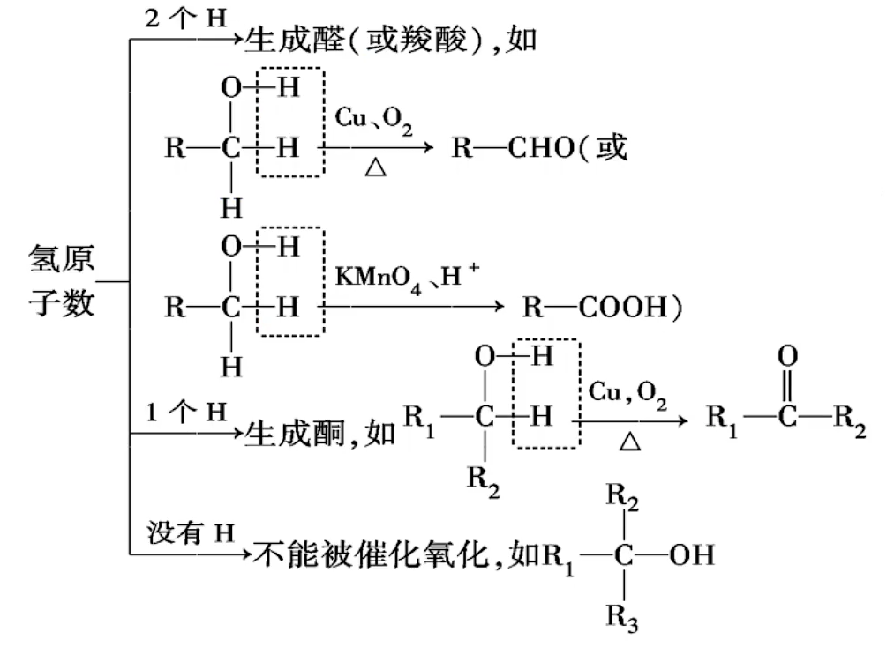
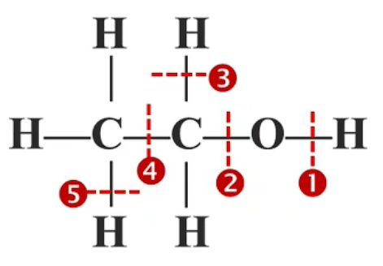
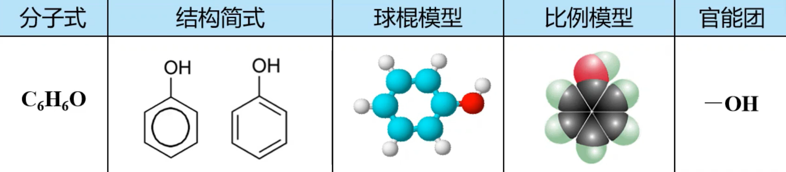
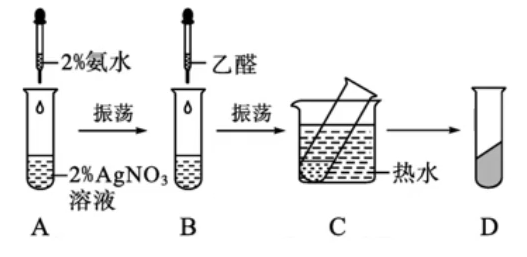
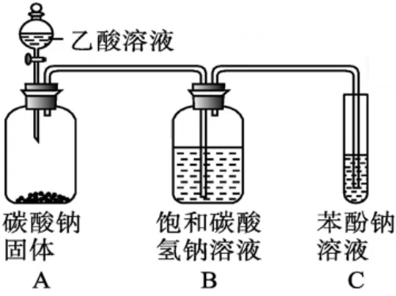
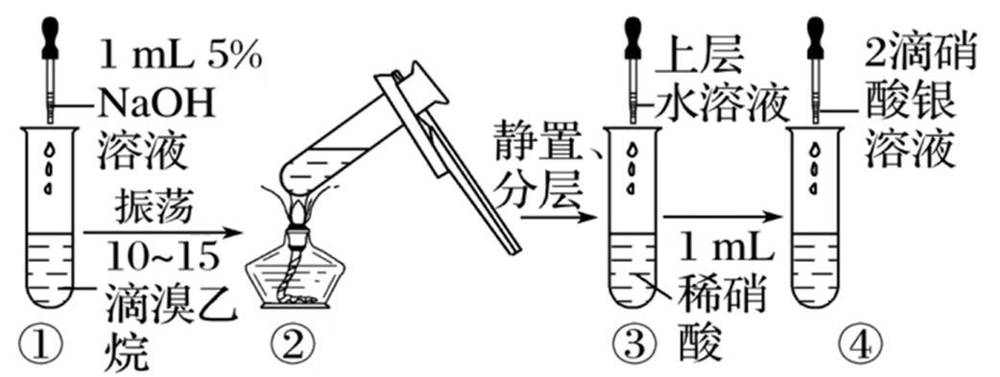
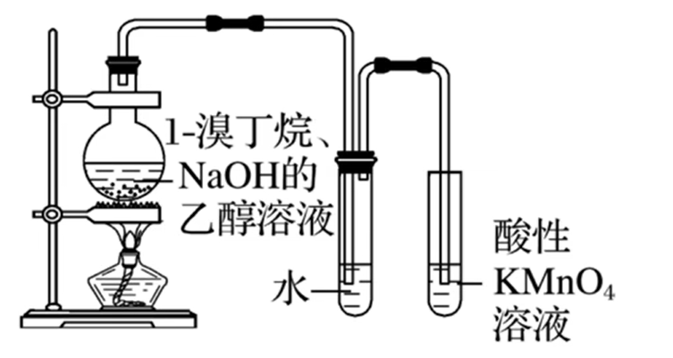

#  有机化学基础 · 五 · 「烃的衍生物(Shirley Amika)」

根据官能团对有机化合物进行分类，是有机化学中常用的分类方法。用这种分类方法 可以将烃的衍生物分为 **卤代烃、醇、酚、醚、 醛、酮、羧酸、酯、胺、酰胺** 等

## 醇

### 醇的分类

1. 根据醇分子中所含羟基的数目：一元醇、二元醇、多元醇
2. 根据羟基所连烃基种类：
   $
   \begin{cases}
   脂肪醇 \begin{cases}
   饱和醇(饱和一元醇\quad\!\!\ce{C_nH_{2n+1}OH}\quad n \ge 1) \\
   不饱和醇 \\
   \end{cases}\\
   脂环醇(环己醇\quad\!\!\ce{⌬\!-OH})\\
   芳香醇(苯甲醇\quad\!\!\ce{⌬\!-CH2OH})\\
   \end{cases}
   $

### 生活中常见的醇

   1. 甲醇( $\ce{CHOH}$ 木精)：无色、具有挥发性的液体易溶于水，沸点为 $65\ce{°\!C}$。甲醇有毒，误服会损伤视神经，甚至致人死亡。甲醇广泛应用于化工生产也可作为车用燃料
   2. 乙二醇、丙三醇都是无色、粘稠、有甜味的液体，都易溶于水和乙醇，是重要的化工原料
      1. 乙二醇是汽车发动机防冻液的主要化学成分，也是合成涤纶等高分子化合物的主要原料
      2. 丙三醇具有很强的吸水能力，可用于制造日用化妆品

### 物理性质

1. 沸点
   1. **饱和一元醇**的熔沸点随分子中**碳原子数**的递增而逐渐增大
   2. 相对分子质量相近的醇和烷烃相比，**醇的沸点远远高于烷烃的沸点**（**氢键的影响**）
   3. 碳原子数相同时，**羟基个数**越多，醇的沸点越高；羟基的个数不限，但由于不稳定不存在一个 $\ce{C}$ 原子上连有2个羟基的醇
      > ①丙醇 ②丙二醇 ③丙烷 ④乙醇 ⑤丙三醇 等物质的沸点排列顺序：
      > $⑤>②>①>④>③$

2. 溶解性：
   醇在水中的溶解度一般随分子中**碳原子数的增加而降低**。**羟基越多，溶解度越大**

   > 理解：烷基是憎水基，接的烷基越多，使得羟基形成氢键导致溶解度增加的效果减弱，因此溶解性降低
   >
   > 甲醇、乙醇、丙醇、乙二醇、丙三醇等低级醇(碳数比较少的醇)可与水以任意比例混溶

3. 密度：醇的密度比水的密度小

### 化学性质

醇的化学性质主要由**羟基**官能团所决定。在醇分子中，由于氧原子吸引电子的能力比氢原子和碳原子的强(氧的电负性更大，吸引电子的能力更强)，使 $\ce{O-H}$ 和 $\ce{C-O}$ 的电子都向氧原子偏移。因此，醇在发生反应时， $\ce{O-H}$ 容易断裂，使羟基中的氢原子被取代，同样， $\ce{C-O}$也易断裂，使羟基被取代或脱去，从而发生取代反应或消去反应

####  与活泼金属单质的置换反应

$\ce{2CH3CH2OH +2Na -> 2CH3CH2ONa + H2 ^}$

现象：钠沉于无水乙醇的底部，表面有气泡产生，慢慢消失；放出的气体可在空气中安静地燃烧，火焰呈淡蓝色（ $\ce{H2}$ ）；烧杯壁上有水珠生成；澄清石灰水未变浑浊（无 $\ce{CO2}$ ）

   1. **乙醇羟基的 $\ce{H}$ 原子活泼性较水的 $\ce{H}$ 原子弱**（醇分子中的烷基具有**推电子作用**）

      > 推电子作用：$\vec{\ce{CH3CH2}}\ce{-O-H}$
      >
      > 由于烷基具有推电子作用，使得 $\ce{O-H}$ 键极性变弱，因此反应不会很剧烈

   2. 其它活泼金属如钾、钙等也可与乙醇反应产生  $\ce{H2}$

   3. 产物乙醇钠在水中强烈水解：$\ce{CH3CH2ONa + H2O→CH3CH2OH + NaOH}$

> 与 $\ce{Na}$ 反应生成 $\ce{H2}$ 的官能团：$\ce{-COOH、-OH}$ (醇、酚)

####  取代反应（以乙醇为例）

1. **醇与浓的氢卤酸**（ $\ce{HCl、HBr、HI}$ ）

   分子的碳氧键发生断裂，羟基被卤素原子取代，生成相应的卤代烃和水

   $\ce{CH3CH2-\!\!\!⁞\enspace OH + H-\!\!\!⁞\enspace Br -> CH3CH2\mathbf{Br} + H2O}$

   > 加热是为了蒸发为气体进入反应装置，加热并不是反应条件

2. **酯化反应**

   

   >**口诀：酸脱羟基醇脱氢**
   >
   >对乙醇上的氧原子进行 $^{18}\ce{O}$ 进行追踪，发现出现在乙酸乙酯中，证明不是乙醇的碳氧键断裂（但一部分 $^{18}\ce{O}$ 还会留着乙醇中，因为是可逆反应）

   

   - 实验器材：铁架台 试管 导管 酒精灯
   - 试剂加入顺序：乙醇 3mL 乙酸 2mL 浓硫酸 2mL （可以集成“醇，硫，酸”）
   - 反应过程中右侧试管内液体上层有无色透明的油状液体产生，并且可以闻到香味
   - 饱和碳酸钠的作用：①吸收乙醇 ②中和乙酸 ③降低酯的溶解度
   - 浓硫酸的作用：①催化剂 ②吸收反应生成的水，使酯化反应平衡正向移动

3. **醇分子间脱水成醚**

   如果把乙醇与浓硫酸的混合物的温度控制在 **$140\ce{°C}$** 左右，每两个乙醇分子间会脱去一个水分子而生成乙醚

   

   乙醚是一种无色、易挥发的液体，有特殊气味，有麻醉作用，易溶于有机溶剂。像乙醚这样由**两个烃基通过一个氧原子连接起来的化合物叫做醚**，**醚的结构可用 $\ce{R-O-R'}$ 来表示**， $\ce{R}$ 和 $\ce{R'}$ 都是烃基，可以相同，也可不同

   醚类物质在化工生产中被广泛用作溶剂，有的醚可被用作麻醉剂

#### 消去反应

- 将 **浓硫酸与乙醇按体积比 $3:1$** 混合，即将 $15mL$ 浓硫酸緩缓加入到盛有 $5mL\enspace95\%$ 乙醇的烧杯中混合均匀（**浓硫酸加入乙醇中**），冷却后再倒入长颈圆底烧瓶中，并加入碎瓷片防止暴沸

- 加热混合溶液，**迅速升温到 $170\ce{°C}$**，将生成的气体**先通入 $\ce{NaOH}$ 溶液除去杂质**再分别通入 $\ce{KMnO4}$ ,酸性溶液和溴的四氯化碳溶液中，观察现象

> 硫酸酒精 $3:1$：浓硫酸作催化剂与脱水剂
>
> 温度迅速 $170$ ：由于在 $140\ce{°C}$ 会发生脱水成醚，为避免产生杂质，应迅速升温
>
>  $\ce{NaOH}$ 溶液除杂：通过导管的不仅有乙烯，还有挥发出来的乙醇，同时浓硫酸发生碳化，碳与浓硫酸再次反应，产生二氧化硫杂质，浓硫酸有强氧化性，生成 $\ce{CO2}$ 杂质

实验现象：产生了气体，该气体使酸性高锰酸钾溶液褪色，使溴的四氯化碳溶液褪色，烧瓶内有黑色固体生成

- 原理：

- **反应条件：邻位 $\ce{C}$ 原子上有 $\ce{H}$**

  > 若邻位碳原子上有多种化学环境的氢原子，则有多种可能的消去方式

####  氧化反应

1. **乙醇的燃烧**：火焰呈淡蓝色，放出大量的热

   $\ce{CH3CH2OH + 3O2->[点燃]2CO2 + 3H2O}$

2. **醇的催化氧化**
   
   
   
   **条件：与$\ce{-OH}$相连的碳必须有 $\ce{H}$，才能发生催化氧化反应**

   **氧化反应**：有机物分子中失去氢原子或加入氧原子的反应(**去$\ce{H}$加$\ce{O}$**)
   **还原反应**：有机物分子中加入氢原子或失去氧原子的反应(**加$\ce{H}$去$\ce{O}$**)
   
   
   
   - **乙醇的催化氧化** 
      $$
      {\mathop{\ce{CH3CH2OH}}\limits_{乙醇}\ce{->[氧化][2e-]} \mathop{\ce{CH3CHO}}\limits_{乙醛}\ce{->[氧化][2e-]}\mathop{\ce{CH3COOH}}\limits_{乙酸}}
      $$
   	$\ce{}$$\ce {2CH3CH2OH + O2 ->[Cu/Ag][△]2CH3CHO + 2H2O}$

   	$\ce{铜丝->[\Delta]变黑->[插入乙醇溶液]变红,有刺激性气味产生}$
      
   	分析：$\ce{2Cu + O2\xlongequal{\Delta}2CuO}$
      
   	​		   	$\ce{2CuO + 2CH3CH2OH->[\Delta]2Cu + 2CH3CHO + 2H2O}$
      
      ​			   $\ce {2CH3CH2OH + O2 ->[Cu][△]2CH3CHO + 2H2O}$
   
3. **醇与酸性重铬酸钾**
   
      $\ce{K2Cr2O7(橙红色) + C2H5OH + H2SO4->Cr2(SO4)3(绿色) + CH3COOH + K2SO4 + H}$
      
      > 交警利用乙醇能使橙色的酸性重铬酸钾变绿，检查司机是否酒后驾车

####  乙醇的反应与断键位置总结

<table>
    <thead>
        <tr>
            <td colspan="2">反应类型</td>
            <td>反应物</td>
            <td>反应条件</td>
            <td>断键位置</td>
            <td rowspan="8"></td>
        </tr>
        <tr>
            <td colspan="2">置换反应</td>
            <td>乙醇、活泼金属</td>
            <td>-</td>
            <td>①</td>
        </tr>
        <tr>
            <td rowspan="3">取代反应</td>
            <td>卤代</td>
            <td>乙醇、浓HX</td>
            <td>△</td>
            <td>②</td>
        </tr>
        <tr>
            <td>分子间脱水</td>
            <td>乙醇</td>
            <td>浓硫酸，140℃</td>
            <td>①/②</td>
        </tr>
        <tr>
            <td>酯化</td>
            <td>乙醇、羧酸</td>
            <td>浓硫酸，△</td>
            <td>①</td>
        </tr>
        <tr>
            <td colspan="2">消去反应</td>
            <td>乙醇</td>
            <td>浓硫酸，170℃</td>
            <td>②⑤</td>
        </tr>
        <tr>
            <td rowspan="2">氧化反应</td>
            <td>催化氧化</td>
            <td>乙醇、O2</td>
            <td>Cu或Ag,△</td>
            <td>①③</td>
        </tr>
        <tr>
            <td>燃烧</td>
            <td>乙醇、O2</td>
            <td>点燃</td>
            <td>全部</td>
        </tr>
    </thead>
</table>

### 醇的同分异构体

饱和一元醇的通式为$\ce{C_nH_{2n+1}OH}$，分子式满足$\ce{C_H_{2n+2}O}$的有机物，可能是醇，也可能是醚，在醇醚里再分别考虑碳链异构、官能团位置异构。因此，$\ce{C3H8O}$、$\ce{C4H10O}$、$\ce{C5H12O}$ 不一定为同系物

## 酚

- 定义：(酚)羟基( $\ce{-OH}$ )与苯环直接相连的化合物称为酚

  > 与 $\ce{-OH}$ 相连的苯环可以是单环，也可以是稠环

- 苯酚结构

  

  > 至少有 12 个原子共平面，最多有 13 个原子共平面
  >

### 苯酚的物理性质

| 颜色 | 味道     | 状态 | 熔点        | 溶解度                                                       |
| ---- | -------- | ---- | ----------- | ------------------------------------------------------------ |
| 无色 | 特殊气味 | 晶体 | $43\ce{°C}$ | 室温下在水中的溶解度是$9.2g$ 当温度高于$65\ce{°C}$时能与水混溶； 苯酚易溶于酒精、苯等有机溶剂 |

- 苯酚有毒，也具有消毒作用，对皮肤有腐蚀性。如不慎沾到皮肤上，应立即用酒精冲洗，再用水冲洗（苯酚对酒精的溶解度比较大）
- 放置时间较长的苯酚往往是粉红色的，这是部分苯酚被空气中的氧气氧化所致（苯醌）。因此，苯酚应密封保存

### 苯酚的化学性质

#### 弱酸性

由于苯酚中的羟基和苯环直接相连，苯环与羟基之间的相互作用使酚羟基在性质上与醇羟基有显著差异。
酚羟基中的氢原子比醇羟基中的氢原子更活泼，**苯酚的羟基在水溶液中能够发生部分电离，显示弱酸性**，故苯酚俗称石炭酸

**苯酚水溶液不能使酸碱指示剂变色**

<table>
    <thead>
        <tr>
            <th></th>
            <th>实验操作及现象</th>
            <th>结论</th>
        </tr>
    </thead>
    <tbody>
        <tr>
            <td>1</td>
            <td>向盛有0.3g苯酚晶体的试管中加入2毫升蒸馏水 振荡试管震荡后，液体呈乳白色沉淀</td>
            <td></td>
        </tr>
        <tr>
            <td>2</td>
            <td>滴加5%氢氧化钠溶液并振荡试管 液体由浑浊变澄清</td>
            <td></td>
        </tr>
        <tr>
            <td>3</td>
            <td>向试管中继续滴加稀盐酸后 溶液由澄清又重新变浑浊</td>
            <td></td>
        </tr>
        <tr>
            <td>4</td>
            <td>向苯酚钠溶液中通入二氧化碳</td>
            <td></td>
        </tr>
    </tbody>
</table>

> 结论与说明：
>
> 1. 常温下苯酚在水中的溶解度不大
> 2. 苯酚有酪酸性；苯酚钠易溶于水；醇羟基不能和氢氧化钠反应，但是酚羟基可以
> 3. 常温下苯酚在水中的溶解度不大，生成的苯酚不能完全溶于水
> 4. 酸性：碳酸 &gt; 苯酚 &gt; 碳酸根；反应产物与通入 $\ce{CO2}$ 的量无关

#### 取代反应

向盛有少量苯酚稀溶液的试管里逐滴加入过量饱和的溴水，边加边振荡

实验现象：立即产生**白色沉淀**（该反应很灵敏，可用于苯酚的定性检验和定量测定）

羟基对苯环的影响，**使苯环上羟基邻、对位氢原子更活泼，易被取代**

酚与浓溴水发生取代反应时，只取代羟基的邻，对位氢原子，间位氢原子不取代

> 由于相似相容原理（2，4，6-三溴苯酚溶于苯）该反应不能用于苯中苯酚的除杂

> 苯酚与苯取代反应的不同
>
> <table>
>     <thead>
>         <tr>
>             <th></th>
>             <th>苯酚</th>
>             <th>苯</th>
>         </tr>
>     </thead>
>     <tbody>
>         <tr>
>             <td>反应物</td>
>             <td>浓溴水与苯酚反应</td>
>             <td>液溴与苯</td>
>         </tr>
>         <tr>
>             <td>反应条件</td>
>             <td>不用催化剂</td>
>             <td>FeBr作催化剂</td>
>         </tr>
>         <tr>
>             <td>反应速率</td>
>             <td>反应灵敏，速率快</td>
>             <td>反应速率较慢</td>
>         </tr>
>         <tr>
>             <td>取代苯环上氢原子数</td>
>             <td>一次取代苯环上3个氢原子</td>
>             <td>一次取代苯环上1个氢原子</td>
>         </tr>
>         <tr>
>             <td>结论</td>
>             <td colspan="2">苯酚与溴取代反应比苯容易</td>
>         </tr>
>         <tr>
>             <td>原因</td>
>             <td colspan="2">酚羟基对苯环影响，使苯环上（邻、对位）氢原子变得活泼</td>
>         </tr>
>     </tbody>
> </table>

#### 显色反应

实验：向盛有少量苯酚的稀溶液的试管中，滴入几滴  $\ce{FeCl3}$ 溶液，振荡，观察现象
现象：溶液显紫色（利用这一反应也可以检验苯酚的存在）

原理：

$$\ce{6C6H5OH + Fe^{3+} -> [Fe(C6H5O)6]^{3-} + 6H+}$$

酚类物质一般都可以与 $\ce{FeCl3}$ 作用显色，可用于检验其存在

#### 氧化反应

苯酚晶体在常温下易被空气中的氧气氧化生成粉红色物质
**苯酚可以被酸性高锰酸钾溶液等强氧化剂氧化，使高锰酸钾溶液褪色**（与醇羟基类似）

#### 加成反应

苯酚中含有苯环，可以与氢气发生加成：

## 醛

### 醛的定义

- **定义**：由烃基（或氢原子）与醛基相连而构成的化合物，简写为 $\ce{RCHO}$

- **官能团**：醛基，结构式为，可简写为 $\ce{-CHO}$

- **通式**：饱和一元醛的通式为 $\ce{C_nH_{2n}O}( n\geq1 )$ 或 $\ce{C_nH_{2n+1}CHO}( n\geq0 )$

  > 前者可能存在同分异构体，后者直接指向饱和一元醛

### 物理性质

1. **熔、沸点**：通常情况下，醛类除甲醛是气体外，其他醛都是无色液体或固体。醛类的熔、沸点随着分子内碳原子数的增加而呈增大趋势

2. 溶解性：醛类物质在水中的溶解度随分子内碳原子数的增加而呈减小趋势，这是由于属于极性基团的 $\ce{-CHO}$ 在分子中所占的比例减小

3.  乙醇的物理性质

   乙醛( $\ce{CH3CHO}$ )是无色、具有刺激性气味的液体，密度比水小，沸点为$\ce{20.8°\!C}$，易挥发，易燃烧，能与水$^1$、乙醇等互溶
   
   > $^1$本身不形成氢键，与水形成氢键

### 化学性质

#### 加成反应

1. **催化加氢**

   乙醛蒸气和氢气的混合气体通过热的镍催化剂，发生催化加氢反应，得到乙醇

   

   >1. 醛基催化加氢一定生成端醇
   >2. 醛的催化加氢反应也是**还原反应**

   > $\ce{}$乙醇氧化成乙醛：$\ce {2CH3CH2OH + O2 ->[Cu/Ag][△]2CH3CHO + 2H2O}$

2. **与 $\ce{HCN}$ 加成**

   > 在醛基的碳氧双键中，由于氧原子的电负性较大，碳氧双键中的电子偏向氧原子，**使氧原子带部分负电荷，碳原子带部分正电荷**，从而使醛基具有较强的极性

   醛基与极性分子加成时，极性分子中带正电荷的原子或原子团连接在醛基的氧原子上，带负电荷的原子或原子团连接在碳原子（此类加成反应可用于增长碳链）

   

3. **羟醛缩合反应**（常用的增长碳链的方法）
   醛分子中在醛基邻位碳原子上的氢原子 ( $α-\ce{H}$ ) 受羰基吸引电子作用的影响，具有一定的活泼性，分子内含有 $α-\ce{H}$ 的醛在一定条件下可以发生加成反应，生成 $\beta-$羟基醛，该产物易失水，得到 $\alpha,\beta-$不饱和醛

   
   
#### 氧化反应

1. **银镜反应**

   - 银氨溶液的配制：
     取 $1mL\space 2\%$ 的 $\ce{AgNO3}$ ，溶液于 **洁净** 试管中，然后边振荡试管边 **逐滴** 滴入 $2\%$ 的稀氨水，至产生的 **沉淀恰好完全溶解**，制得银氨溶液，化学反应方程式为：

     $\ce{AgNO3 + NH3*H2O=AgOH v + NH4NO3 \qquad AgOH + 2NH3*H2O=[Ag(NH3)2]OH + 2H2O}$

   - 向银氨溶液中滴入3滴乙醛，振荡后将试管放在热水浴中温热。观察实验现象

     

     化学方程式：$\ce{CH3CHO + 2[Ag(NH3)2]OH ->[\Delta]H2O + 2Ag v + 3NH3 + CH3COONH4}$

     离子方程式：$\ce{CH3CHO + 2[Ag(NH3)2]+ + OH- ->[\Delta] H2O + 2Ag v + 3NH3 + CH3COO- + NH+4}$

     > 记忆：水银铵，$123$，再加一个羧酸铵

     > 甲醛：
     >
     > $\ce{HCHO + 2[Ag(NH3)2]OH ->[\Delta]H2O + 2Ag v + 3NH3 + HCOONH4}$
     >
     > $\ce{HCOONH4 + 2[Ag(NH3)2]OH ->[\Delta]H2O + 2Ag v + 3NH3 + (NH4)2CO3}$
     >
     > 总：$\ce{HCHO + 4[Ag(NH3)2]OH ->[\Delta]2H2O + 4Ag v + 6NH3 + (NH4)2CO3}$

   - 该反应可以用来检验分子中是否存在醛基并可以确定醛基个数

     工业上可用银镜反应对玻璃涂银制镜和制保温瓶瓶胆

2. **与新制 $\ce{Cu(OH)2}$ 反应**

   $$\ce{2NaOH +CuSO4=Cu(OH)2 v +Na2SO4}$$

   $$\ce{CH3CHO + 2Cu(OH)2 + NaOH->[\Delta] CH3COONa + CuO v +3H2O}$$

   > $\ce{Cu(OH)2}$：蓝色$\quad\ce{Cu2O}$：砖红色

   该反应可以用来检验分子中是否存在醛基并可以确定醛基个数
   医院里，利用这一反应原理检查尿糖是否正常：斐林试剂检验葡萄糖（**检验葡萄糖的醛基**）

- **醛类的两个特征反应及 $\ce{-CHO}$ 的检验**

   | 特征反应 | 银镜反应                                                     | 与新制的 $\ce{Cu(OH)2}$ 反应                                 |
   | :------- | :----------------------------------------------------------- | :----------------------------------------------------------- |
   | 现象     | 产生光亮的银镜                                               | 产生砖红色沉淀                                               |
   | 注意事项 | 1. 试管内壁必须洁净 2. 银氨溶液现用现配 3. 水浴加热，不可用酒精灯直接加热 4. 醛用量不宜太多，如乙醛一般滴3滴 5. 银镜可用稀硝酸浸泡洗涤除去 | 1. 新制的 $\ce{Cu(OH)2}$ 要现用现配 2. 配制新制的 $\ce{Cu(OH)2}$ 时，所用 $\ce{NaOH}$ 溶液必须过量 3. 该反应必须加热到沸腾，才有明显的红色沉淀产生，但不能太久，否则会有黑色的沉淀$\ce{CuO}$生成 |

   > 可以检验含醛基的物质：醛类、甲酸、甲酸酯、葡萄糖等还原糖

3. **被强氧化剂氧化**

   - 酸性 $\ce{KMnO4}$ 溶液 $\ce{->[醛]}$ **紫红色**变为**无色**
   - 酸性 $\ce{K2Cr2O7}$ 溶液 $\ce{->[醛]}$**橙色**变为**绿色**
   - 可以使溴水褪色，但不能使溴的 $\ce{CCl4}$ 溶液褪色

4. **燃烧**（具有可燃性）

   $\ce{2C2H4O + 5O2->[点燃] 4CO2 + 4H2O}$

#### 缩聚反应

**酚醛树脂的合成**

### 常见的醛类

#### 甲醛

俗名蚁醛，最简单的醛类物质，是一种无色、有强烈刺激性气味的**气体**，易溶于水，质量分数为35%~40%的水溶液叫做**福尔马林**，具有防腐和杀菌能力，常作防腐杀菌剂（消毒、浸制标本）；制药（农药、消毒剂），香料，染料；制造酚醛树脂、脲醛树脂、维纶等

- 氧化

  

- 银镜反应：$\ce{HCHO + 4[Ag(NH3)2]OH ->[\Delta]2H2O + 4Ag v + 6NH3 + (NH4)2CO3}$

- 与新制 $\ce{Cu(OH)2}$ 反应：$\ce{HCHO + 4Cu(OH)2 + 2NaOH->[\Delta] Na2CO3 + 2Cu2O v + 6H2O}$

- 加成反应：$\ce{HCHO +H2->[催化剂][\Delta]CH3OH}$

#### 苯甲醛

- 物理性质：**苯甲醛是最简单的芳香醛**，俗称苦杏仁油，是一种有苦杏仁味的无色液体
- 用途：苯甲醛是制造染料、香料及药物的重要原料

## 酮

### 酮的定义

1. 概念：羰基与两个烃基相连的化合物
2. 官能团：酮羰基（羰基，）
3. 酮结构可以表示为：
4. 饱和一元酮的通式为：$\ce{C_nH_{2n}O}\quad (n>3)$
5. 分子中含相同碳原子数的**饱和一元醛**与**饱和一元酮**的分子式相同，结构不同，互为同分异构体

### 丙酮

1. 结构简式：$\ce{CH3COCH3}$

2. 丙酮的性质：无色透明的液体，沸点$56.2\ce{°C}$，易挥发，能与水、乙醇等互溶

3. 丙酮**不能**被银氨溶液、新制的氢氧化铜等弱氧化剂氧化

   在催化剂存在的条件下，**丙酮可以发生催化加氢反应，也能与氰化氢加成**

   $\ce{CH3COCH3 +H2->[催化剂][\Delta]CH3CH(OH)CH3}$

4. 酮是重要的有机溶剂和化工原料。例如，丙酮可用作化学纤维、钢瓶储存乙炔等的溶剂，还用于生产有机玻璃、农药和涂料等

### 醛与酮的区别与联系

<table id="tg-5070X">
<tbody>
  <tr>
    <td colspan="2"></td>
    <td>醛</td>
    <td>酮</td>
  </tr>
  <tr>
    <td colspan="2">官能团</td>
    <td>醛基</td>
    <td>酮羰基</td>
  </tr>
  <tr>
    <td colspan="2">官能团位置</td>
    <td>碳链末端（最简单的醛是甲醛）</td>
    <td>碳链中间（最简单的酮是丙酮）</td>
  </tr>
  <tr>
    <td rowspan="2">化学性质</td>
    <td>加成反应</td>
      <td colspan="2">均可与H2、HCN加成</td>
  </tr>
  <tr>
    <td>氧化反应</td>
    <td>能被银氨溶液、新制氢氧化铜等弱氧化剂氧化</td>
    <td>不能被银氨溶液、新制氢氧化铜等弱氧化剂氧化</td>
  </tr>
  <tr>
    <td colspan="2">联系</td>
    <td colspan="2">碳原子数相同的饱和一元脂肪醛和饱和一元脂肪酮 互为同分异构体</td>
  </tr>
</tbody>
</table>

## 羧酸

1. **定义**：由烃基（或氢原子）与羧基相连而构成的化合物

2. **官能团：$\ce{-COOH}$**

3. **饱和一元脂肪酸的通式**：**$\ce{C_{n}H_{2n}O2}\quad (n\geq1)\quad$** 或 **$\quad\ce{C_{n}H_{2n+1}COOH}\quad (n\geq0)$**

4. **分类**：
   $$
   羧酸\begin{cases}
   根据烃基\begin{cases}
   低级脂肪酸\quad\ce{CH3COOH}\\
   高级脂肪酸\begin{cases}
   硬脂酸&\ce{C17H35COOH}\\
   软脂酸&\ce{C15H31COOH}\\
   油酸&\ce{C17H33COOH}\\
   \end{cases}\\
   \end{cases}\\
   根据羟基数目\begin{cases}
   一元羧酸&\ce{CH3COOH}\\
   二元羧酸&\ce{HOOC-COOH}\\
   多元羧酸&柠檬酸\\
   \end{cases}\\
   根据羟基是否饱和\begin{cases}
   饱和羧酸&\ce{CH3COOH}\\
   不饱和羧酸&\ce{CH2=COOH}\\
   \end{cases}\\
   \end{cases}
   $$

### 物理性质

1. **溶解性**：**分子中碳原子数在 4 以下的羧酸能与水氨溶**。随着分子中碳原子数的增加，一元羧酸在水中的溶解度迅速减小，甚至不溶于水（高级脂防酸是不溶于水的蜡状固体）
2. **沸点**：羧酸分子间可以形成**氢键**，由于羧酸分子形成氢键的机会比相对分子质量相近的醇多，**羧酸的沸点比相应的醇的沸点高**，并且**随着分子中碳原子数的增加，一元羧酸的沸点逐渐升高**

### 常见羧酸

- **甲酸**（最简单的羧酸）

  俗称蚁酸，是一种无色、有刺激性气味的液体，有腐蚀性，能与水、乙醇等互溶。甲酸在工业上可用作还原剂，在医疗上可用作消毒剂。甲酸中**既有醛基**，**又有羧基**，所以甲酸既具有醛的性质（银镜反应、与氢氧化铜反应、与高锰酸钾反应），又具有羧酸的性质（酸的通性、酯化反应）

- **乙酸**

  是具有强烈刺激性气味的液体，纯净的乙酸又称为**冰醋酸**

- **苯甲酸**
  
  俗称安息香酸，是一种无色晶体，易升华，微溶于水，易溶于乙醇。其钠盐是常用的**食品防腐剂**

- **乙二酸**
  
  俗称**草酸**，是无色透明晶体，通常含有结晶水，可溶于水和乙醇，以钠盐或钙盐形式广泛存在于植物中。草酸钙($\ce{CaC2O4}$)难溶于水，是人体肾结石和膀胱结石的主要成分。乙二酸是化学分析中常用的还原剂

### 化学性质

羧酸的化学性质主要取决于羧基官能团。由于受氧原子电负性较大等因素的影响，$\ce{O-H}$ 键、$\ce{C-O}$ 键容易断裂：
**当$\ce{O-H}$ 键断裂时**：会解离出 $\ce{H+}$，使羧酸表现出酸性
**当$\ce{C-O}$ 键断裂时**：$\ce{-OH}$ 可以被其他基团取代，生成酯、酰胺等羧酸衍生物

#### 弱酸性

1. 一元羧酸的电离方程式：$\ce{R-COOH<=>R-COO- +H+}$
2. 能使酸碱指示剂变色：使得紫红色石蕊试纸变红
3. 与活泼金属发生置换反应：$\ce{2CH3COOH + Mg=Mg(CH3COO)2 +H2 ^}$
4. 与碱性氧化物反应：$\ce{2CH3COOH + CuO=Cu(CH3COO)2 +H2O}$
5. 中和反应：$\ce{CH3COOH + NaOH=CH3COONa +H2O}$
6. 与某些盐反应：$\ce{2CH3COOH + CaCO3=Ca(CH3COO)2 +H2O + CO2 ^}$

**乙酸、碳酸 和 苯酚 的酸性比较**

1. A 装置：有无色气体产生，说明酸性：乙酸 $>$ 碳酸;
   方程式：$\ce{2CH3COOH +Na2CO3→2CH3COONa +CO2 ^ +H2O}$
2. C 装置：溶液变浑浊，说明酸性：碳酸 $>$ 苯酚
   方程式：$\ce{CO2 +H2O +C6H5ONa->C6H5OH +NaHCO3} $
3. B 装置：
   除去 $\ce{CO2}$ 中的乙酸蒸气，防止对碳酸酸性大于苯酚的检验产生干扰
4. 实验结论：酸性乙酸 $>$ 碳酸 $>$ 苯酚

> 常见物质的酸性强弱：乙二酸 $>$ 甲酸 $>$ 苯甲酸 $>$ 乙酸 $>$ 丙酸 $>$ 碳酸 $>$ 苯酚 $>$ $\ce{HCO^-_3}$

#### 取代反应

#### 还原反应

与醛、酮的联基相比，羧基中的羰基较难发生加成反应，只有在特定条件或催化剂作用下，反应才能进行。羧酸很难通过催化加氢的方法被还原，**用氢化铝锂能将羧酸还原为相应的醇**

$\ce{R-COOH->[LiAlH4]R-CH2OH}$

#### $\alpha-\ce{H}$ 被取代的反应

羧酸分子中的 $\alpha-\ce{H}$ 较活泼，易被取代。通过羧酸 $\alpha-\ce{H}$ 的取代反应，可以合成卤代酸，进而制得氨基酸、羟基酸等

$\ce{RCH2COOH +Cl2->[催化剂][\Delta] R-CHClCOOH +HCl}$

## 酯

1. **定义**：酯是羧酸分子羧基中的 $\ce{-OH}$ 被 $\ce{-OR'}$ 取代后的产物，结构简写为 $\ce{RCOOR'}$ 其中 $\ce{R}$ 和 $\ce{R'}$ 可以相同，也可以不同，但 $\ce{R'}$ 
   不能接氢
2. **官能团**： （酯基）
3. **通式**：饱和一元脂肪羧酸酯的分子通式为 $\ce{C_nH_{2n}O_2\quad(n\geq2)}$
4. **命名**：依据水解后生成的酸和醇的名称来命名：命名时，羧酸的名称写在前面，醇的名称写在后面，去掉「醇」换成「酯」，即命名为「**某酸某酯**」
5. **存在**：酯类广泛存在于自然界中，很多鲜花和水果的香味都来自酯。如苹果里含有戊酸戊酯，菠萝里含有丁酸乙酯，香蕉里含有乙酸异戊酯等
6. **用途**：日常生活中的饮料、糖果和糕点等常使用酯类香料

### 物理性质

1. 低级酯是具有芳香气味的液体
2. 难溶于水，密度一般比水小
3. 易溶于苯、$\ce{CCl4}$、乙醇等有机溶剂中

### 化学性质

**水解反应（取代反应）：**

​	在酸或碱催化的条件下，酯可以发生水解反应生成相应的酸和醇。酯的水解反应是酯化反应的逆反应。在碱性条件下，酯水解产生的羧酸可以与碱发生反应，使羧酸浓度减小，即减小了生成物的浓度，化学平衡正向移动，使酯的水解程度加大

​	酸性条件：$\ce{RCOOR' +H2O <=>[稀H2SO4][\Delta] RCOOH +R'OH}$

​	碱性条件：$\ce{RCOOR' +NaOH ->[\Delta] RCOONa +R'OH}$

> **$\ce{C_nH_{2n}O_2}$ 的同分异构体（羧酸、酯、羟基醛）**
>
> 例如：$\ce{C4H8O2}$（11种）
>
> - 羧酸：$\ce{C3H7-COOH}$（丙基有2种不同结构）
>
> - 酯（4种）
>
>   $\ce{H-COO-C3H7}$（2种）、$\ce{CH3-COO-C2H5}$（1种）、$\ce{CH3CH2-COO-CH3}$（1种）
>
> - 羟基醛（5种）
>
>   $\ce{C^1 - C^2 - C^3 - CHO}$（3种）、$\ce{C^1 - C^2(C^ 1) - CHO}$（2种）
>
> 例如：$\ce{C5H10O2}$（25种）
>
> - 羧酸：$\ce{C4H9-COOH}$（丁基有4种不同结构）
>
> - 酯（9种）
>
>   $\ce{H-COO-C4H9}$（4种）、$\ce{CH3-COO-C3H7}$（2种）、$\ce{C2H5-COO-C2H5}$（1种）、$\ce{CH3CH7-COO-CH3}$（2种）
>
> - 羟基醛（12种）
>
>   $\ce{C^1 - C^2 - C^3 - C^4 - CHO}$（4种）、$\ce{C^4 - C^3 - C^2(C^ 1) - CHO}$（4种）、$\ce{C^1 - C^2(C^ 1) - C^3 - CHO}$（3种）、$\ce{C^1(C^ 2)3 - CHO}$（1种）
>   
>   > - 能与 $\ce{NaOH(aq)}$ 反应：4（中和）+9（水解）= 13
>   > - 能发生银镜反应：12（醛基）+4（甲酸酯）= 16
>   > - 既能与 $\ce{NaOH(aq)}$ 反应，又能发生银镜反应：4 种（甲酸酯）

## 油脂

1. **定义**：高级脂肪酸与甘油（丙三醇、）形成的酯

2. **结构**：

   

   其中 $\ce{R、R'、R''}$ 可以表示**饱和烃基**或**不饱和烃基**

   - 简单甘油酯： $\ce{R、R'、R''}$ 相同
   - 混合甘油酯： $\ce{R、R'、R''}$ 不同

   天然油脂大都为**混甘油酯**，且动、植物体内的油脂大都为多种混甘油酯的**混合物**，**无固定熔沸点**

   > 注意：油脂不是高分子化合物

3. **分类**：

   1. 油：常温下呈液态，含有较多不饱和脂肪酸成分（含有碳碳双键）的甘油酯，如花生油、芝麻油、大豆油
   2. 脂肪：常温下呈固态，含较多饱和脂肪酸成分的甘油酯，如牛油、羊油

4. **常见高级脂肪酸**：

   饱和脂肪酸：

   - 软脂酸：$\ce{C15H31COOH}$

   - 硬脂酸：$\ce{C17H35COOH}$

   不饱和脂肪酸

   - 油酸：$\ce{C17H33COOH}$

   - 亚油酸：$\ce{C17H31COOH}$
   
   > 口诀：软15、硬17、油酸不饱17烯；亚油酸再多一个烯；最后均含一羧基

### 化学性质

油脂是高级脂肪酸的甘油酯，其化学性质与乙酸乙酯的相似，能够发生水解反应而高级脂肪酸中又有不饱和的，因此许多油脂又兼有烯烃的化学性质，可以发生加成反应

#### 水解反应

1. **酸性水解**：油脂在酸性条件下水解生成高级脂肪酸和甘油

2. **碱性水解**：油脂在碱性溶液(如$\ce{KOH}$或$\ce{NaOH}$溶液)中水解，生成甘油和高级脂肪酸盐。高级脂肪酸盐常用于生产肥皂，所以油脂在碱性溶液中水解反应又称**皂化反应**

   

   > 产物甘油与硬脂酸钠称为皂化液
   >
   > $\ce{皂化液->[饱和NaCl(aq)][盐析]析出C17H35COONa(s)->[过滤]...->肥皂}$

#### 油脂的氢化

不饱和程度较高、熔点较低的液态油，通过催化加氢可提高饱和程度，转化为半固态脂肪这个过程称为油脂的氢化，也称油脂的硬化。制得的油脂叫人造脂肪，通常又称为硬化油。硬化油不易被空气氧化变质，便于储存和运输，可以制造肥皂和人造奶油的原料

## 卤代烃

1. 烃分子中的**氢原子**被**卤素原子**取代后生成的化合物
2. 官能团：碳卤键（）
3. 一元卤代烃可表示为：$\ce{R-X}$
4. 按卤素原子种类分：氟代烃、氯代烃、溴代烃、碘代烃 
5. 根据烃基的不同分为 饱和卤代烃 、不饱和卤代烃 和 芳香卤代烃 等
6. 常见卤代烃
   1. $\ce{CHCl3}$：氯仿 过去曾经作麻醉剂，能够与空气中的氧气作用生成“光气“
   2. $\ce{CCl2F2}$：一种氟氯烃（氟利昂）造成臭氧层空洞
   3. $\ce{CCl4}$：一种常用的有机溶剂
   4. $\ce{CH3CH2Br}$：汽化时大量吸热，具有麻醉镇痛作用

### 物理性质

1. **状态**：常温下卤代烃除 $\ce{CH3Cl、CH3CH2Cl、CH2=CHCl}$ 等少数是气体外，大多数为液体或固体
2. **溶解度**：**卤代烃不溶于水**，可溶于有机溶剂。某些卤代烃本身是很好的有机溶剂
3. **密度**：高于同碳原子数的烃，**除脂肪烃的一氟代物和一氯代物密度比水小**，其余的密度都比水大。密度随着烃基中碳原子数目的增加而减小。卤代烃的密度随碳原子数目的增加而减小

4. **熔沸点**：

   熔沸点大于同碳个数的烃，随碳原子数增多，沸点依次升高（碳原子数相同时，支链越多沸点越低）

### 溴乙烷

1. 物理性质：
   溴乙烷是无色液体，沸点为38.4℃，密度比水的大，难溶于水，可溶于多种有机溶剂
2. 溴乙烷的结构：
   分子式：$\ce{C2H5Br}$   结构简式：$\ce{CH3CH2Br}$   官能团：碳溴键
3. 在溴乙烷分子中，由于**溴原子的电负性比碳原子的大**，使 $\ce{C-Br}$ 的电子向 $\ce{Br}$ 原子偏移，进而使碳原子带部分正电荷( **$\ce{\delta+}$** )， $\ce{Br}$ 原子带部分负电荷( **$\ce{\delta-}$** )，这样就形成一个极性较强的共价键： **$\ce{C^{\delta+}-Br^{\delta-}}$** ，其键长大而键能较小。因此在化学反应中， **$\ce{C-Br}$ 较易断裂**，使碳原子与带负电荷的基团结合， $\ce{Br}$ 原子被其他原子或原子团所取代，生成负离子离去

### 化学性质（以溴乙烷为例）

#### 水解反应（取代反应）

现象：①中溶液**分层**；②中有机层厚度减小；④中有**淡黄色沉淀**生成

解释：溴乙烷与 $\ce{NaOH}$ 溶液共热产生了 $\ce{Br}$ 

条件： $\ce{NaOH}$ 水溶液、加热

原理：羟基取代溴原子

​	$\ce{C2H5-Br + H-OH->[\Delta]C2H5-OH + HBr}$

​	$\ce{NaOH + HBr=NaBr +H2O}$

​	**总反应：$\ce{C2H5Br + NaOH->[H2O][\Delta]C2H5OH + NaBr}$**

> **用实验的方法证明溴乙烷中含有溴元素**
>
> 取溴乙烷，先加氢氧化钠溶液，加热，冷却后，取上层清液体，**先加过量的稀硝酸酸化（中和溶液中的 $\ce{NaOH}$，$\ce{Ag+ +OH- =AgOH v ->Ag2O v}$）**，再加硝酸银溶液。结果产生浅黄色沉淀（$\ce{AgBr v}$），说明有溴原子
>
> $\ce{AgCl(白)->C2H5Cl\quad AgBr(浅黄)->C2H5Br\quad AgI(黄)->C2H5I}$

#### 消去反应（消除反应）

有机化合物在一定条件下，从一个分子中脱去一个或几个小分子(如 $\ce{H2O}$、$\ce{HX}$ 等)，而生成含不饱和键的化合物的反应

$\ce{CH3CH2Br<=>[消去][加成]CH2=CH2 ^}$

1. **反应条件**：

   1. 至少有**两个碳**的卤代烃，否则不能发生消去反应

   2. $\beta$ 碳原子上必须有 $\ce{H}$ 原子存在，否则不能发生消去反应

      > 接卤素原子的为 $\alpha-\ce{C}$ 原子
      >
      > 

   3. 直接连接在苯环上的卤原子不能消去

2. 当卤素原子所在碳原子有两个邻位碳原子，且邻位碳原子上均有氢原子时，发主消去反应可能生成不同的产物

   > 如：2-氯丁烷发生消去反应的产物为1-丁烯和2-丁烯
   >
   > $\ce{CH3-CH2Cl-CH2-CH3->CH2=CH-CH2-CH3 or CH3-CH=CH-CH3}$

3. 二元卤代烃发生消去反应后可以在有机物中引入碳碳三键或两个碳碳双键

   > $\ce{CH3-CH2-CCl2 + 2NaCl->[醇][\Delta]CH3-C\equiv CH + 2NaCl +2H2O}$

**如果将溴乙烷与强碱（如 $\ce{NaOH}$ 或 $\ce{KOH}$ ）的乙醇溶液共热，溴乙烷可以从分子中脱去 $\ce{HBr}$，生成乙烯**

$\ce{CH3-CH2Br + NaOH->[乙醇][\Delta]CH2=CH2 ^ +NaBr + H2O}$

现象：反应产生的气体经水洗后，**使酸性$\ce{KMnO4}$溶液褪色**
解释：生成的气体分子中含有**碳碳不饱和键**

> 水洗气的目的：除去挥发出来的乙醇

#### 卤代烃的水解反应和消去反应对比

| 反应类型           | 水解（取代）反应                                             | 消去（消除）反应                                             |
| ------------------ | ------------------------------------------------------------ | ------------------------------------------------------------ |
| 反应条件           | $\ce{NaOH}$ 水溶液、加热                                     | $\ce{NaOH}$ 醇溶液、加热                                     |
| 有机反应物结构特点 | 含 $\ce{C-X}$ 键即可                                         | 与$\ce{-X}$ 相连的 $\ce{C}$ 原子的邻位  $\ce{C}$ 原子上有 $\ce{H}$ 原子 |
| 产物特征           | 在碳原子上引入 $\ce{-OH}$ ，生成含 $\ce{-OH}$ 的有机物（醇） | 消去 $\ce{HX}$ ，引入碳碳双键或三键                          |

## 酰胺

### 酰胺

1. **结构**

   酰胺可看作是羧酸分子中羧基中的羟基被氨基或烃氨基（ $\ce{-NHR}$ 或 $\ce{-NR2}$ ）取代而成的化合物，也可看作是氨或胺分子中氨氮原子上的氢被酰基取代而成的化合物

   如：乙酰胺的结构

2. **官能团**：

3. **分类**

   根据氮原子上取代基的多少，酰胺可分为伯酰胺（$\ce{-CONH2}$）、仲酰胺（$\ce{-CONHR}$）、叔酰胺（$\ce{-CONR2}$）

4. **化学性质**

   - 酰胺在酸或碱存在并加热的条件下可以发生水解反应。在酸性条件下生成对应的羧酸和铵盐，在碱性条件下生成对应的羧酸盐并放出氨气
     $$
     \ce{&RCONH2 +H2O +HCl->[\Delta]RCOOH +NH4Cl}\quad \\
     or\quad \ce{&RCONH2 +H2O +H2SO4->[\Delta]RCOOH +(NH4)2SO4} \\
     &\ce{RCONH2 +NaOH->[\Delta]RCOONa +NH3 ^}
     $$
   
   - 酰胺可以通过氨气（或胺）与羧酸在加热条件下反应得到，或用羧酸的铵盐加热脱水 得到。例如乙酰胺可以通过以下反应合成
     $$
     \ce{CH3COOH + NH3->[\Delta]CH3CONH2 + H2O}
     $$
     
   - 胺可以转化成酰胺，酰胺又可以水解变成胺，常利用这种转化关系来保护氨基
   
     
   
     

5. **应用**

   酰胺常被用作溶剂和化工原料。如 $\ce{N,N -}$二甲基甲酰胺是生产多种化学纤维的良好溶剂，也用作合成农药、医药的原料等
