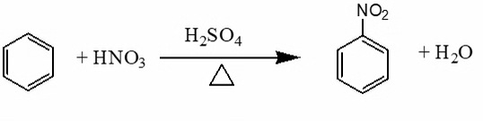
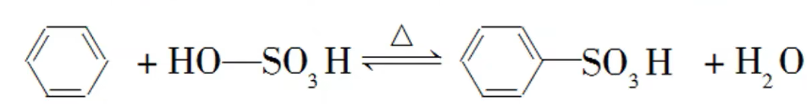
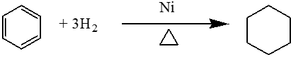
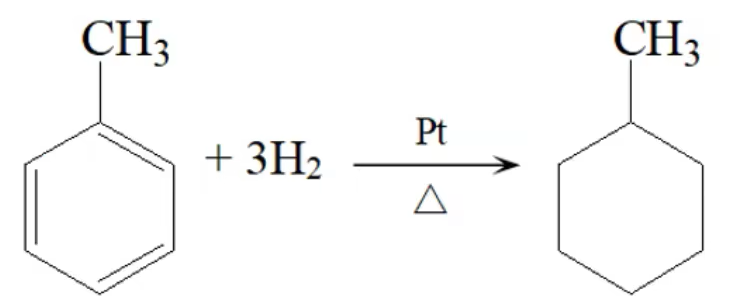
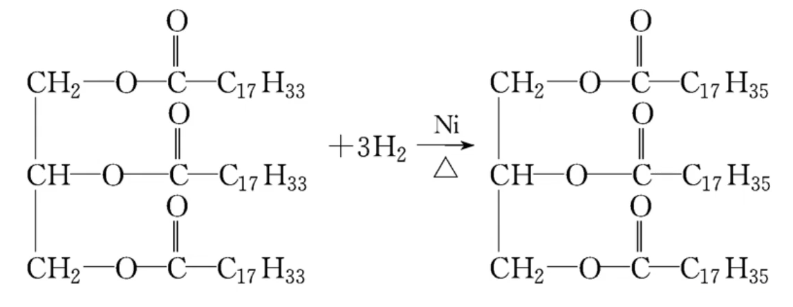

# 有机化学基础 · 考点 · 「有机反应类型梳理」

|        | 取代 | 加成   | 加聚 | 缩聚 | 水解 | 消去 | 与活泼金属 | 酸性 | 硝化 | 磺化 | 银镜         | 强氧化       |
| ------ | ---- | ------ | ---- | ---- | ---- | ---- | ---------- | ---- | ---- | ---- | ------------ | ------------ |
| 烷     | $√$  |        |      |      |      |      |            |      |      |      |              |              |
| 稀、炔 | $√$  | $√$    | $√$  |      |      |      |            |      |      |      |              | $√$          |
| 苯     | $√$  | $√$    |      |      |      |      |            |      | $√$  | $√$  |              |              |
| 甲苯   | $√$  | $√$    |      |      |      |      |            |      | $√$  | $√$  |              | $√$          |
| 苯酚   | $√$  | $√$    |      |      |      |      | $√$        | 弱   | $√$  | $√$  |              | $√$          |
| 卤代烃 | $√$  |        |      |      | $√$  | $√$  |            |      |      |      |              |              |
| 醇     | $√$  |        |      | 二元 |      | $√$  | $√$        |      |      |      |              | $√$          |
| 羧酸   | $√$  |        |      | 二元 |      |      | $√$        | $√$  |      |      | $\ce{HCOOH}$ | $\ce{HCOOH}$ |
| 羟基酸 |      |        |      | $√$  |      | $√$  | $√$        | $√$  |      |      |              | $√$          |
| 醛     | $√$  | $√$    | $√$  |      |      |      |            |      |      |      | $√$          | $√$          |
| 酯     |      |        |      |      | $√$  |      |            |      |      |      | $\ce{HCOOR}$ | $\ce{HCOOR}$ |
| 油脂   |      | 植物油 |      |      | $√$  |      |            |      |      |      |              |              |
| 单糖   |      | $√$    |      | $√$  |      |      |            |      |      |      | $√$          | $√$          |
| 二糖   |      |        |      | $√$  | $√$  |      |            |      |      |      | 还原糖       | $√$          |
| 多糖   |      |        |      |      | $√$  |      |            |      |      |      | 还原糖       | $√$          |
| 蛋白质 |      |        |      |      | $√$  |      |            |      |      |      |              |              |

## 取代反应

有机物分子里的某些原子或原子团被其他原子或原子团所替代的反应

$\ce{A1-B1 +A2-B2->A1-B2 +A2-B1}$

### 卤代

1. 在光照条件下，烷烃都能与卤素单质发生取代反应

   $\ce{CH4 +Cl2->[光]CH3Cl + HCl}\qquad \ce{CH3Cl +Cl2->[光]CH2Cl2 + HCl}$

   $\ce{CH2Cl +Cl2->[光]CHCl3 + HCl}\qquad \ce{CHCl3 +Cl2->[光]CCl4 + HCl}$

   > 标况下，只有 $\ce{CH3Cl}$ 是气态，其余均为液态

2. 苯和溴在 $\ce{FeBr3}$ 催化下可以发生反应，生成溴苯

    

   使用纯净的液溴，不得使用溴水（发生萃取，使溴水因萃取而褪色）

3. **在光照条件下**，甲苯与氯气发生取代反应时，氯原子取代甲基上的氢原子。反应后可能的有机产物是甲基上的氢原子分别被 $1$ 个、$2$ 个或 $3$ 个氯原子取代所生成的氯甲基苯

  **在 $\ce{FeBr3}$ 的催化下**，甲苯与氯发生取代反应生成的一氯代甲苯主要有两种：邻氯甲苯和对氯甲苯

   

4. 苯酚稀溶液的试管里逐滴加入过量饱和的溴水，产生白色沉淀

     

5. 醇与浓的氢卤酸（ $\ce{HCl、HBr、HI}$ ）

   $\ce{C2H5OH +HBr->[\Delta]C2H5Br + H2O}$

6. $\alpha-\ce{H}$ 被取代的反应

   与官能团直接相连接的碳被称为 $\alpha-\ce{C}$ ，其连接的氢离子易被取代 

   $\ce{CH3-CH=CH2 + Cl2->[\Delta]Cl-CH2-CH=CH2 +HCl}$

### 硝化

1. 在浓硫酸作用下，苯在 $50-60\ce{°\!C}$ （水浴加热）与硝酸发生硝化反应，生成硝基苯

      

2. 甲苯与浓硝酸和浓硫酸的混合物在加热条件下可以发生取代反应，生成一硝基取代物、二硝基取代物和三硝基取代物，硝基取代的位置均以甲基的邻、对位为主

      

### 磺化

苯与浓硫酸在 $70-80\ce{°\!C}$ 可以发生磺化反应，生成苯磺酸苯与浓硫酸在 $70-80\ce{°\!C}$ 可以发生磺化反应，生成苯磺酸

### 醇分子间脱水成醚

如果把乙醇与浓硫酸的混合物的温度控制在 $140\ce{°C}$ 左右，每两个乙醇分子间会脱去一个水分子而生成乙醚

### 酯化

> 口诀：酸脱羟基醇脱氢

### 合成酰胺

### 水解

1. 酯类

   在酸或碱催化的条件下，酯可以发生水解反应生成相应的酸和醇。酯的水解反应是酯化反应的逆反应。在碱性条件下，酯水解产生的羧酸可以与碱发生反应，使羧酸浓度减小，即减小了生成物的浓度，化学平衡正向移动，使酯的水解程度加大

   酸性条件：$\ce{RCOOR' +H2O <=>[稀H2SO4][\Delta] RCOOH +R'OH}\qquad$ 碱性条件：$\ce{RCOOR' +NaOH ->[\Delta] RCOONa +R'OH}$

2. 油脂

   1. **酸性水解**：油脂在酸性条件下水解生成高级脂肪酸和甘油

       

   2. **碱性水解**：油脂在碱性溶液(如 $\ce{KOH}$ 或 $\ce{NaOH}$ 溶液)中水解，生成甘油和高级脂肪酸盐。高级脂肪酸盐常用于生产肥皂，所以油脂在碱性溶液中水解反应又称 **皂化反应**

       

3. 卤代烃

   $\ce{C2H5-Br + H-OH->[\Delta]C2H5-OH + HBr}$

   $\ce{NaOH + HBr=NaBr +H2O}$

   总反应：$\ce{C2H5Br + NaOH->[H2O][\Delta]C2H5OH + NaBr}$

4. 酰胺

   酰胺在酸或碱存在并加热的条件下可以发生水解反应。如果水解时加入碱，生成的酸就会变成盐，同时有氨气逸出。

   酸性水解：$\ce{R-CONH2 +H-OH +HCl->[\Delta]R-COOH +NH4Cl}$

   碱性水解：$\ce{R-CONH2 +NaOH->[\Delta]R-COONa +NH3 ^}$

## 加成反应

有机物分子中的 **不饱和键** 两端的两个原子与其他原子或原子团直接结合，生成新的化合物的反应叫做加成反应

### 烯烃的加成

1. $\ce{CH3-CH=CH2 +H2 \xrightarrow[\Delta]{催化剂} CH3-CH2-CH3}$

2. $\ce{CH2=CH2 +HCl \xrightarrow[\Delta]{催化剂} CH3-CH2-Cl}$

3. $\ce{CH2=CH2 +H2O ->[\Delta][催化剂] CH3-CH2OH}$

4. $\ce{CH2=CH2 +Br2->CH2Br-CH2Br}$

   > 1,2-二溴乙烷是无色，且溶于四氯化碳，乙烯通到溴的四氯化碳，且溴的四氯化碳褪色且溶液不会分层，证明 1,2-二溴乙烷是无色且溶于四氯化碳的

5. $\ce{CH3-CH=CH2 +HCl->CH3-CHCl-CH3(主要) \& CH3CH2CH2Cl}$

   > 当不对称烯烃与含氢的化合物（ $\ce{HBr、H_{2}}$  等）加成时，氢原子主要加到连有较多氢原子的碳原子上（马氏规则），在过氧化物存在的情况下, 氢原子主要加在连有较少氢原子的碳原子上（反马氏规则）

6. $1,2-$ 加成（低温）：$\ce{CH2=CH-CH=CH2 +Br2 ->}$ 

   $1,4-$ 加成（高温）：$\ce{CH2=CH-CH=CH2 +Br2 ->}$ 

### 炔烃的加成

1. $\ce{CH#CH + H2 ->[\Delta][催化剂] CH2=CH2}\quad\ce{CH#CH + 2H2 ->[\Delta][催化剂] CH3CH3}$

2. $\ce{CH#CH + HCl ->[\Delta][催化剂] CH2=CHCl}$

3. $\ce{CH#CH + H2O ->[\Delta][催化剂] CH3-CHO}$

   > 乙炔与水加成后的产物乙烯醇不稳定（ $CH_2=CH-OH$ ），很快转化为乙醛（醇的催化氧化）

4. $\ce{HC#CH->[HCN][催化剂]CH2=CH-CN(丙烯晴)->[H2O、H+][\Delta]CH2=CH-COOH}(丙烯酸)$

   > 用于增加碳链长度

### 苯的加成

### 醛与酮的加成

1. $\ce{CH3-CHO +H2->[催化剂][\Delta]CH3CH2OH}$

   > 乙醛与 $\ce{H2}$ 加成变成乙醇，既是加成，也是还原反应

2. 
   
3. $\ce{CH3-CO-CH3 +H2->[催化剂][\Delta]CH3-CHOH-CH3}$

### 油脂的氢化或硬化

## 缩聚反应

1. 含义
   由有机化合物分子间脱去小分子获得高分子化合物的反应称为缩合聚合反应，简称缩聚反应
2. 缩聚反应的特点
   1. 缩聚反应生成聚合物的同时，还有小分子副产物（如 $\ce{H2O}$ 等）生成
   2. 缩聚反应的单体通常是具有两个或多个官能团（如 $\ce{-OH、-COOH、-NH2、-X}$ 等）的小分子
   3. 所得聚合物链节的化学组成与单体的化学组成不同

### 甲醛的缩聚反应

酚醛树脂的合成

### 羟基酸缩聚

### 醇酸缩聚

### 氨基酸缩聚

> 由 $\ce{n mol}$ 一种单体进行缩聚反应，生成小分子的物质的量应为 $\ce{n-1 mol}$ ；由物质的 $\ce{n mol}$ 的两种单体进行缩聚反小分子的物质的量应为 $\ce{2n-1 mol}$ 