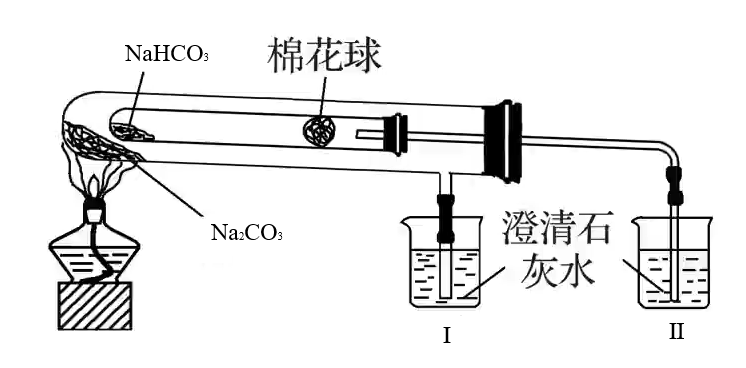

# 01 · 钠及其化合物

## 钠单质

### 化学性质

1. $\ce{Na}$ 与 氧气 反应：$\begin{cases}\ce{4Na +O2 \xlongequal{常温} 2Na2O\\2Na +O2 \xlongequal{\Delta/加热} Na2O2}\end{cases}\\$

2. $\ce{Na}$ 与 氯气 反应：$\ce{2Na +Cl2 \xlongequal{\Delta} 2NaCl}$

3. $\ce{Na}$ 与 水 反应：$\ce{2Na +2H2O = 2NaOH +H2 ^}$

    > 现象：「浮熔游响红」
    >
    > 钠的密度比水小，会 **浮** 在水面上；反应时，钠迅速 **熔** 化成小球（说明反应剧烈、大量放热、钠熔点偏低）；产生的氢气推动钠在水面上 **游** 动；发出 **响** 声；滴加酚酞后变 **红**

4. $\ce{Na}$ 与 $\ce{CuSO4}$ 水溶液 反应：$\begin{cases}\text{First}&\ce{2Na +2H2O \xlongequal{} 2NaOH +H2 ^}\\\text{Second}&\ce{2NaOH +CuSO4 \xlongequal{} Cu(OH)2 v + Na2SO4}\end{cases}\\$

5. $\ce{Na}$ 与 乙醇 反应：$\ce{2C2H5OH +2Na->2C2H5ONa +H2 ^}$

   > 现象：钠沉于无水乙醇的底部（或因产生的氢气使得钠上下跳动），表面有气泡产生，慢慢消失；放出的气体可在空气中安静地燃烧，火焰呈淡蓝色（$\ce{H2}$）；烧杯壁上有水珠生成；澄清石灰水未变浑浊（无 $\ce{CO2}$ ）
   >
   > 解释：由于烷基具有推电子作用（$\vec{\ce{CH3CH2}}\ce{-O-H}$），使得 $\ce{O-H}$ 键极性变弱，因此反应不会很剧烈

### 知识点

1. 制取：$\ce{2\ce{NaCl}(熔融) \xlongequal{通电} 2\ce{Na}^+\ce{Cl}2 ^}$

2. 用途：钠、钾合金（液态）可用于原子反应堆的导热剂；冶炼某些金属（如钛金属）；用作电光源，制作高压钠灯

3. 密度：$\rho(\ce{H}_{2}\ce{O})>\rho(\ce{Na})>\rho($ 煤油 $)$（密封保存，通常保存在石蜡油或煤油中）

4. 金属钠着火时用细沙覆盖灭火，不得使用水或二氧化碳灭火器

## 氧化钠与过氧化钠

|                    |                       氧化钠（$\ce{Na2O}$）                        |                            过氧化钠（ $\ce{Na2O2}$ ）                            |
| :----------------: | :----------------------------------------------------------------: | :------------------------------------------------------------------------------: |
|       电子式       |  （仅含有离子键） |   （含有离子键和非极性共价键）   |
|  离子个数比 $^4$   |                      $\ce{Na+:O^{2-} = 2:1}$                       |                     $\ce{Na+:}$ **$\ce{O^{2-}2}$** $ = 2:1$                      |
|  化合物类型 $^1$   |                      离子化合物（碱性氧化物）                      |                      离子化合物（非碱性氧化物，为过氧化物）                      |
|     颜色、状态     |                             白色、固体      |              淡黄色、固体        |
|      主要性质      |                        具有碱性氧化物的通性                        |                                具有强氧化性 $^2$                                 |
|       稳定性       |                 不稳定，加热生成 $\ce{Na2O2}$ $^3$                 |                                      较稳定                                      |
|     与 水 反应     |                 $\ce{Na2O +H2O\xlongequal{}2NaOH}$                 |  $\ce{2Na2\overset{-1}{O}_2 +2H2O\xlongequal{2e^-}4NaOH +\overset{0}{O}_2 ^}^5$  |
| 与 $\ce{CO2}$ 反应 |                $\ce{Na2O +CO2\xlongequal{}Na2CO3}$                 | $\ce{2Na2\overset{-1}{O}_2 +2CO2\xlongequal{2e^-}2Na2CO3 +\overset{0}{O}_2 ^}^5$ |
|        用途        |                      制取烧碱（$\ce{NaOH}$）                       |                              漂白剂、消毒剂、供氧剂                              |

> 1. 碱性氧化物与酸反应生成盐和水：$\ce{Na2O +2HCl\xlongequal{}2NaCl +H2O}$
>    （$\ce{Na2O2}$ 不是碱性氧化物：$\ce{2Na2O2 +4HCl\xlongequal{}4NaCl +2H2O +O2 ^}$）
>
> 2. $\ce{Na2O2}$ 具有强氧化性
>
>    - $\ce{Na2O2}$ 加入品红溶液中，在水中生成 $\ce{H2O2}$ ，利用其氧化性，使得品红溶液褪色
> 
>    - 如将其加入滴加酚酞的水中，$\ce{Na2O2}$ 会先变红，后褪色
> 
>    - 与 $\ce{SO2}$ 反应：$\ce{Na2O2 + SO2 → Na2SO4}$
> 
>    - 投入 $\ce{FeCl2}$ 溶液中生成 $\ce{Fe(OH)3}$ 沉淀
> 
>    -  投入氢硫酸，氧化硫化氢成硫单质，溶液浑浊
> 
>    -  氧化 $\ce{SO^2–_3}$ 成 $\ce{SO^2–_4}$ 
>
> 3. $\ce{Na->[O2]Na2O->[O2]Na2O2->[H2O]NaOH}$
>
> 4. 考点：$1 mol\space\ce{Na2O +Na2O2}$ 混合物的离子数为 $3N_A$
>
> 5. 考点：$\ce{Na2O_2 +H2O}(g)\ce{ +CO2}(g)$ 反应产生 $1 mol\space\ce{O2}$，即转移了 $2mol\space e^-$
>
> 6. $\ce{Na2O2}$ 与某水溶液反应与 $\ce{Na}$ 类似
>     
>     例如：$\ce{NaHCO3}$ 与 $\ce{Na2O2}$ 反应 $\begin{cases}\text{First}&\ce{2Na2O2 +2H2O\xlongequal{}4NaOH +O2 ^}\\\text{Second}&\ce{NaOH +NaHCO3\xlongequal{}Na2CO3 +H2O}\end{cases}\\$
>    
>     总方程式：$\ce{4NaHCO3 +2Na2O2\xlongequal{}4Na2CO3 +2H2O +O2↑}$

## 碳酸钠与碳酸氢钠

|                            | 碳酸钠（ $\ce{Na2CO3}$ ）                   | 碳酸氢钠（ $\ce{NaHCO3}$ ）                                                                                   |
| -------------------------- | ------------------------------------------- | ------------------------------------------------------------------------------------------------------------------------------------------------------------------ |
| 俗名                       | 纯碱、苏打                                  | 小苏打                                                                                                                                                             |
| 溶解度                     | 易溶于水                                    | 在水中溶解度比 $\ce{Na2CO3}$ 小 $^1$                                                                                                                               |
| 热稳定性 $^2$              | 稳定，受热难分解                            | 受热易分解：$\ce{2NaHCO3\xlongequal{\Delta}Na2CO3 +CO2 ^ +H2O}$                                                                                                    |
| 与酸反应                   | $\ce{Na2CO3->[H+]NaHCO^-3->[H+]CO2 ^}^3$    | $\ce{NaHCO^-3->[H+]CO2 ^}$                                                                                                                                         |
| 与 $\ce{CO2}$ 反应         | $\ce{Na2CO3 +CO2  +H2O\xlongequal{}NaHCO3}$ | 不反应 $^4$                                                                                                                                                        |
| 与 $\ce{Ca(OH)2}$ 反应     | $\ce{Ca^2+ +CO^2-_3 \xlongequal{} CaCO3 v}$ | $\ce{NaHCO3}$ 少量：$\ce{HCO^-3 +OH- +Ca^2+ \xlongequal{} CaCO3 v +H2O}$ $\ce{Ca(OH)2}$ 少量：$\ce{2HCO^-3 +2OH- +Ca^2+ \xlongequal{} CaCO3 v + CO^2-_3 +2H2O}$ |
| 与 $\ce{CaCl2/BaCl2}$ 反应 | $\ce{Ca^2+ +CO^2-_3 \xlongequal{} CaCO3 v}$ | 不沉淀                                                                                                                                                             |

> 1. 碳酸钠的热稳定性比碳酸氢钠更大
>   
>     > 使得向饱和 $\ce{Na2CO3}$ 溶液中通入 $\ce{CO2}$ ，会析出白色晶体
>   
>     > 侯氏制碱法中，向饱和 $\ce{NaCl(aq)}$ 中依次通入 $\ce{NH3}$ 和 $\ce{CO2}$，溶液中存在 $\ce{NH+4 、Na+ 、Cl- 、CO^{2-}3 、HCO^-_3}$ ，其中 $\ce{HCO^-_3}$ 最先析出，加热析出的 $\ce{NaHCO}$ ，得到 $\ce{Na2CO3}$
>     >
>     > $\ce{NH3}$ 和 $\ce{CO2}$ 的顺序不能调换，因为 $\ce{CO2}$ 在 $\ce{NaCl(aq)}$ 的溶解度较低，通入  $\ce{NH3}$ 会使食盐水呈碱性，从而大量吸收 $\ce{CO2}$ ，产生 $\ce{HCO^-3}$ 
>
> 2. 碳酸钠是白色粉末，碳酸氢钠是细小的白色晶体。实验表明，向碳酸钠中加入少量水后，碳酸钠结块变成晶体，并伴随着**放热**现象。向碳酸氢钠中加入少量水后，碳酸氢钠能溶解，并伴随着**吸热**现象
>
> 3. 碳酸钠和碳酸氢钠的溶液均显碱性，可用作食用碱或工业用碱。
>
> 4. 实验：比较碳酸钠与碳酸氢钠的热稳定性
>     
>     
>     
>     碳酸钠在外层，温度高，碳酸氢钠在内层，温度低，$Ⅱ$ 的澄清石灰水变浑浊，证明碳酸钠的热稳定性更强
>
> 5. 实验：辨别 $\ce{HCl}$ 和 $\ce{Na2CO3}$
>   
>     互滴。如 $\ce{HCl}$ 逐滴滴入 $\ce{Na2CO3}$ 溶液中，开始时没有气泡，后来有；如 $\ce{Na2CO3}$ 逐滴滴入 $\ce{HCl}$ 溶液中，一开始就有气泡
>
> 6. 考点：除去 $\ce{CO2}$ 中的 $\ce{HCl}$

相互转化：$\ce{Na2CO3 \xrightleftharpoons[加入\ce{NaOH/NaHCO3(s)}可用加热]{适量\ce{H+}/通入\ce{CO2}}  NaHCO3}$

除杂：

1. 固体 $\ce{Na2CO3(NaHCO3)}:$ 加热至恒重
2. 水溶液 $\ce{Na2CO3(NaHCO3)}:$ 加 $\ce{NaOH}$
3. 水溶液 $\ce{NaHCO3(Na2CO3)}:$ 加足量 $\ce{CO2}$

### 鉴别

$$
物质\begin{cases}
液体&
\begin{cases}
沉淀法：加入\ce{BaCl2}溶液或\ce{CaCl2}溶液产生沉淀的是\ce{Na2CO3}\\
气体法：滴入稀盐酸，立即产生气泡的是 \ce{NaHCO3}\\
测 pH 法：用 pH 试纸测其相同浓度的稀溶液，pH 大的是 \ce{Na2CO3} 溶液
\end{cases}\\
固体&加热法: 产生使澄清石灰水变浑浊的气体的是\ce{NaHCO3}固体\\
\end{cases}
$$

## 焰色反应

物理反应，进行焰色反应应使用 **铂丝**（镍丝、无锈铁丝）。把嵌在玻璃棒上的金属丝在 **稀盐酸** 里蘸洗后，放在酒精灯的火焰里灼烧，不同金属元素会使火焰变为各种颜色，这便是焰色反应。焰色反应的形成与原子光谱有关

| 离子  | $\ce{Li+}$ | $\ce{Na+}$ | $\ce{K+}$ | $\ce{Rb+}$ | $\ce{Cs+}$ | $\ce{Ca^{2+} }$ | $\ce{Sr^{2+} }$ | $\ce{Ba^{2+} }$ | $\ce{Cu^{2+} }$ |
| :---: | :--------: | :--------: | :-------: | :--------: | :--------: | :-------------: | :-------------: | :-------------: | :-------------: |
| 焰色  |     红     |     黄     |    紫     |    紫红    |    蓝紫    |      橙红       |      洋红       |      黄绿       |       绿        |

> 1. 灼烧白色粉末，火焰呈黄色，证明原粉末中有 $\ce{Na+}$ ，无 $\ce{K+}$ $\quad(×)$ 
>
>    解析：能证明有 $\ce{Na+}$ ，但无法确定是否有 $\ce{K+}$，因为 $\ce{Na+}$ 的黄光会遮盖 $\ce{K+}$ 的微弱紫光，因此必须透过蓝色钴玻璃过滤黄光，观察是否有紫光
>
> 2. 在火焰上灼烧搅拌过某无色溶液的玻璃棒，火焰出现黄色，说明溶液中含有 $\ce{Na+}$ $\quad(×)$ 
>
>    解析：不能用玻璃棒做焰色实验，因为玻璃棒中含有 $\ce{Na2SiO3}$ ，其焰色会干扰实验
