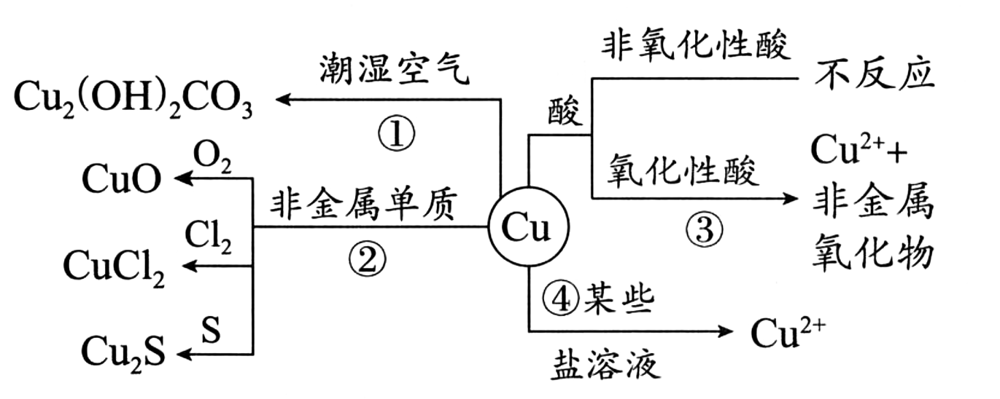

# 03 · 铜 $(\ce{Cu})$ 及其化合物

## 铜单质

### 物理性质

- 紫红色金属，有良好的延展性、导电性和热导性(导电性仅次于$\ce{Ag}$)

### 化学性质

铜元素在化学性质上相对稳定，主要化合价为+1 价和+2 价

1. 与潮湿空气反应：$\ce{2Cu + O2 + H2O + CO2\xlongequal{} Cu2(OH)2CO3}$
2. 与非金属单质反应
   * $\ce{2Cu + O2 \xlongequal{\Delta}2CuO }$
   - $\ce{2Cu + O2 \xlongequal{\Delta} 2Cu2O}$
   - $\ce{Cu + Cl2 \xlongequal{\Delta} CuCl2}$
   - $\ce{Cu + S \xlongequal{\Delta} Cu2S}$
3. 与酸反应
   - 与非还原性酸（盐酸 $\ce{HCl}$ ）：不反应
   - 与浓硫酸反应：$\ce{Cu + 2H2SO4(浓) \xlongequal{\Delta} CuSO4 + SO2 ^ + 2H2O}$
   - 与稀硝酸：$\ce{3Cu + 8HNO3(稀) \xlongequal{} 3Cu(NO3)2 + 2NO ^ + 4H2O}$ 
   - 与浓硝酸：$\ce{Cu + 4HNO3(浓) \xlongequal{} Cu(NO3)2 + 2NO2 ^ + 2H2O}$
4. 与部分盐反应
   - $\ce{Cu +2Ag+ \xlongequal{} 2Ag +Cu^2+}$
   - $\ce{Cu +2Fe^3+ \xlongequal{} 2Fe^2+ +Cu^2+}$

## 铜的氧化物

### 物理性质

| 名称  | 亚氧化铜 $\ce{Cu2O}$ | 氧化铜 $\ce{CuO}$ |
| --- | ---------------- | -------------- |
| 颜色  | 砖红色              | 黑色             |
| 化合价 | +1               | +2             |

### 化学性质

1. 亚氧化铜 $\ce{Cu2O}$ 的性质
   
   - 与酸反应歧化：$\ce{Cu2O + 2H+ \xlongequal{} Cu^2+ +Cu + H2O}$
   - 与 $\ce{H2}$ 反应：$\ce{Cu2O + H2 \xlongequal{\Delta} 2Cu +H2O}$

2. 氧化铜 $\ce{CuO}$ 的性质
   
   - 与酸反应：$\ce{CuO + 2H+ \xlongequal{} Cu^2+ + H2O}$
   - 与 $\ce{H2}$ 反应：$\ce{CuO + H2 \xlongequal{\Delta} Cu +H2O}$

3. 相互转化
   
    $\ce{4CuO\xlongequal{高温}2Cu2O +O2 ^}$

## 氢氧化铜

含有 $\ce{Cu^2+}$ 的溶液呈蓝绿色

1. 不稳定性
   
    $\ce{Cu(OH)2\xlongequal{\Delta}CuO +H2O}$

2. 弱氧化性
   
    检验醛基：$\ce{CH3CHO + 2Cu(OH)2 + NaOH->[\Delta] CH3COONa + Cu_2O v +3H2O}$

3. 弱碱性
   
    与氨水反应：$\ce{Cu(OH)2 + 4NH3 \xlongequal{} [Cu(NH3)4]^{2+} + 2OH^-}$

## 铜盐

1. 碱式碳酸铜 $\ce{Cu2(OH)2CO3}$，也写作$\ce{CuCO3·Cu(OH)2}$ ：铜绿、孔雀石的主要成分。受热分解（$\ce{Cu2(OH)2CO3\xlongequal{\Delta}2CuO +CO2 ^ +H2O}$），可溶于稀硫酸（$\ce{Cu2(OH)2CO3 +4H+\xlongequal{}Cu^2+ +CO2 ^ +3H2O}$）

2. 硫酸铜 $\ce{CuSO4·5H2O}$：俗称蓝矾、胆矾，蓝色晶体。受热分解（$\ce{CuSO4·5H2O\xlongequal{\Delta}CuSO4 +5H2O}$），转换为白色粉末。无水硫酸铜遇水变蓝，可用作水的检测试剂。高温会分解：$\ce{CuSO4 \xlongequal{高温} CuS + SO3}$，古代用此反应制硫酸；**需注意的是，$\ce{FeSO4}$的分解不同于此**：$\ce{2FeSO4 \xlongequal{680℃} Fe2O3 + SO2 + SO3}$

3. 铜盐溶液有毒，主要是因为 $\ce{Cu^2+}$ 作为一种重金属离子能与蛋白质作用，使蛋白质空间结构发生改变从而变性，因此人们利用了它的这一性质用胆矾、生石灰、水配成了波尔多液，用来杀灭植物的病菌

