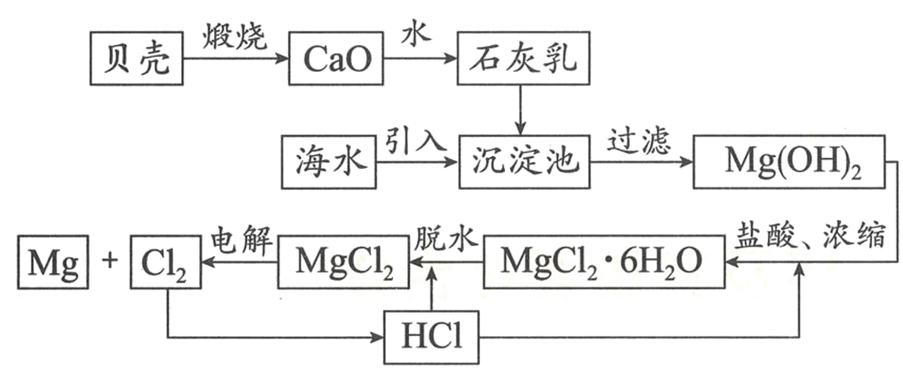

# 04 · 镁 $(\ce{Mg})$ 及其化合物

## 镁的性质

1. 物理性质：具有银白色金属光泽的固体，密度、硬度均较小，熔点较低，有良好的导电、传热和延展性

2. 化学性质
    - 与非金属单质反应

     - 与 $\ce{N2}$ 反应：$\ce{N2 +3Mg \xlongequal{点燃}Mg3N2}$
     - 与 $\ce{Cl2}$ 反应：$\ce{Cl2 +Mg \xlongequal{\Delta}MgCl2}$
     - 与 $\ce{S}$ 反应：$\ce{Mg + S \xlongequal{\Delta} MgS}$
     - 与 $\ce{O2}$ 反应：$\ce{O2 +2Mg \xlongequal{点燃}2MgO}$（产生强烈白光）
     
    - 与 $\ce{CO2}$ 反应：$\ce{2Mg + CO2 \xlongequal{点燃} 2MgO + C}$（耀眼白光，黑色固体生成）

    - 与 $\ce{H2O}$ 反应：$\ce{Mg + H2O\xlongequal{\Delta} Mg(OH)2 + H2 ^}$

    - 与 $\ce{H+}$ 反应：$\ce{Mg + 2H+\xlongequal{} Mg^2+ + H2 ^}$
  
    - 特别要注意，很少有金属能与$\ce{NaHCO3}$溶液发生反应，而镁可以：\ce{4Mg + 8NaHCO3 + 4H2O -> 3MgCO3 \cdot Mg(OH)2 \cdot 3H2O + 4Na2CO3 + 4H2 ^ + CO2 ^}

     > 镁在空气中燃烧时会同时与 $\ce{CO2、N2、O2}$ 反应

3. 工业制备 $\left\{\begin{array}{lr}\ce{Mg^2+ + 2OH- \xlongequal{} Mg(OH)2 v}\\\ce{Mg(OH)2 + 2HCl \xlongequal{} MgCl2 + H2O}\\\ce{MgCl2(l) \xlongequal{电解} Mg + Cl2 ^}\\\end{array}\right.$
   
4. 用途：生产合金，冶金工业上用作还原剂和脱氧剂

## 镁的重要化合物

1. 氧化镁 $\ce{MgO}$ ，重要氧化物：$\ce{MgO +6H+\xlongequal{} Mg^2+ +H2O}$
2. 氢氧化镁 $\ce{Mg(OH)2}$
    1. 中强酸：$\ce{Mg(OH)2 +2H+\xlongequal{} Mg^2+ +2H2O}$
    2. 难溶于水：$\ce{Mg^2+ +2OH- \xlongequal{}Mg(OH)2 v}$
    3. 溶解度小于碳酸镁：$\ce{MgCO3 +H2O\xlongequal{\Delta} Mg(OH)2 +CO2 ^}$

> 1.  $\ce{MgO}$ 熔点很高，可作耐火材料
> 2.  $\ce{Mg(OH)2}$ 为难溶于水的白色沉淀，常用 $\ce{NaOH}$ 溶液检验 $\ce{Mg^2+}$
> 3. 由于 $\ce{Mg(OH)2}$ 的溶解度比 $\ce{MgCO3}$ 的小，故水垢的主要成分是 $\ce{Mg(OH)2}$

## 海水中镁的提取

 

1. 制熟石灰：$\ce{CaCO3\xlongequal{高温}CaO +CO2 ^;CaO +H2O\xlongequal{}Ca(OH)2}$

2. 沉淀：$\ce{MgCl2 + Ca(OH)2\xlongequal{}Mg(OH)2 v + CaCl2}$ （有时候不写沉淀标也行…）

3. 酸化：$\ce{Mg(OH)2 + 2HCl=MgCl2 + 2H2O}$

4. 蒸发浓缩，冷却结晶：析出 $\ce{MgCl2·6H2O}$

5. 脱水：在 $\ce{HCl}$ 气流中使 $\ce{MgCl2·6H2O}$ 脱水制得无水氯化镁

    >  $\ce{HCl}$ 气流用于抑制 $\ce{MgCl}$ 的水解

6. 电解：电解熔融氯化镁制得镁：$\ce{MgCl2(熔融)\xlongequal{电解}Mg + Cl2 ^}$
