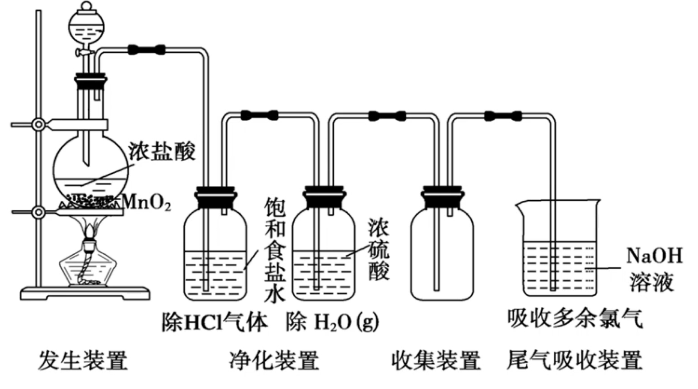

# 元素及其化合物 · 六 · 「氯 $(\ce{Cl})$ 与卤族元素」

## 氯 $\ce{Cl}$

### 氯气

#### 物理性质

**黄绿色** 气体，有刺激性气味，可溶于水，密度大于空气，沸点比气体高，易液化，有毒

闻氯气气味的方法：抽去盛氯气的集气瓶口处的毛玻璃片，用手掌在瓶口上方轻轻扇动，使少量氯气飘进鼻孔

#### 化学性质
1. 氯气与氢气反应： $\ce{H2 + Cl2 \xlongequal{点燃} 2HCl}$
    > 氢气在氯气中安静地燃烧，发出苍白色的火焰，瓶口出现白雾
    >
    > 工业制 $\ce{HCl}$ 时采用点燃法，工业浓 $\ce{HCl}$ 常显黄色，是因为含 $\ce{Fe^3+}$

2. 氯气与金属单质反应
    1. $\ce{2Fe + 3Cl2 \xlongequal{点燃} 2FeCl3}$

      > 产生黄色火焰，棕褐色烟雾
      >
      > 与反应物的量无关（$\ce{Fe^3+->[Fe]Fe^2+}$ 只发生在氯化铁溶液中）
      >
      > 氧化性从高到低排列为：$\ce{Cl2}$ > $\ce{O2}$ > $\ce{S}$
      >
      > 1. $\ce{Cl2}$ 与 $\ce{Fe}$ 反应生成 $\ce{FeCl3}$
      > 2. $\ce{O2}$ 与 $\ce{Fe}$ 反应可以生成 $\ce{Fe3O4}$
      > 3. $\ce{S}$ 与 $\ce{Fe}$ 反应生成 $\ce{FeS}$

    2. $\ce{Cu + Cl2 \xlongequal{点燃} CuCl2}$

      > 产生棕黄色固体

    3. $\ce{2Na + Cl2 \xlongequal{点燃} 2NaCl}$
   
3. 氯气与水反应：$\ce{Cl2 +H2O <=> HCl +HClO}$

    > 注意：该反应为可逆反应，且由于 $\ce{HClO}$ 为弱酸，**离子反应中不可拆**

4. 氯气与碱反应

    1. $\ce{Cl2}$ 与常温下的 $\ce{NaOH}$ 溶液

      $\ce{2NaOH + Cl2 \xlongequal{} NaCl + NaClO + H2O}$

      > 应用：
      >
      > 1. 实验室吸收多余的 $\ce{Cl2}$
      > 2. 工业制漂白液、84 消毒液，有效成分为 $\ce{NaClO}$

    2. $\ce{Cl2}$ 与冷的石灰乳 $\ce{Ca(OH)2}$

      $\ce{2Ca(OH)2 + 2Cl2 \xlongequal{} CaCl2 + Ca(ClO)2 + 2H2O}$

      > 如果书写离子方程式，$\ce{Ca(OH)2}$ 不要拆开，其是以悬浊液存在的
      >
      > $\ce{Ca(ClO)2}$ 是漂白粉、漂白精的有效成分
      >
      > 起效：$\ce{Ca(ClO)2 + CO2 +H2O \xlongequal{} CaCO3 + 2HClO}$
      >
      > 失效：$\ce{2HClO\xlongequal{光照}2HCl +O2 ^}$

5. 氯气与还原性无机化合物反应

    1. $\ce{Cl2 + 2FeCl2 \xlongequal{} 2FeCl3}$（除去 $\ce{FeCl3}$ 中的 $\ce{FeCl2}$）
    2. $\ce{Cl2 + H2S \xlongequal{} 2HCl + S}$（氧化性：$\ce{Cl2}$ > $\ce{S}$）
    3. $\ce{Cl2 + 2NaBr \xlongequal{} 2NaCl + Br2}$（用于海水提取溴）
    4. $\ce{Cl2 + 2KI \xlongequal{} 2KCl + I2}$（用于用 $\ce{KI -}$ 淀粉试纸检验 $\ce{Cl2}$）
    5. $\ce{Cl2 + SO2 + 2H2O \xlongequal{} 2HCl + H2SO4}$（失去漂白作用）
    6. $\ce{3Cl2 + 8NH3 \xlongequal{} 6NH4Cl + N2 ^}$（用浓氨水检查氯气管道是否漏气）

#### 实验室制备

 

1. 原理：$\ce{MnO2 +4HCl(浓)\xlongequal{\Delta}MnCl2 +Cl2 ^ +2H2O}$（**不浓不热不反应**）
2. 装置：
    1. 分液漏斗：固液加热生成气体所需，用于调节浓盐酸滴入速率
    2. 饱和食盐水：降低 $\ce{Cl2}$ 对水的溶解性，减少损耗（$\ce{Cl2 +H2O <=>H+ +Cl- +HClO}$，氯化钠促进平衡逆移）；用于除 $\ce{HCl}$ 气体（氯化氢极易溶于水）
    3. 浓硫酸：用于除 $\ce{H2O}$ 蒸汽
    4. 向上排空气法：氯气密度比空气大（或排饱和食盐水法）
    5. $\ce{NaOH}$ 水溶液：$\ce{2NaOH + Cl2 \xlongequal{} NaCl + NaClO + H2O}$
3. 验满：将湿润的 $\ce{KI -}$ 淀粉试纸靠近瓶口，若试纸立即变蓝，则证明氯气已经收集满

> 其他制备方法：
>
> 1. 直接将酸性高锰酸钾溶液加入盐酸中制备，无需加热，无需浓盐酸
>    反应原理：$\ce{2KMnO4 +16HCl \xlongequal{} 2KCl +2MnCl2 +5Cl2 ^ +8H2O}$
> 2. $\ce{KClO3 +6HCl \xlongequal{} KCl +3Cl2 ^ +3H2O}$
> 3. 84 消毒液与洁厕灵混用：$\ce{ClO- +Cl- +2H^+ \xlongequal{} Cl2 ^ +H2O}$

### 氯水

#### 新制氯水

1. 新制氯水的成分（由大到小）

    - 分子：$\ce{H2O、Cl2、HClO}$

    - 离子：$\ce{H+、Cl- 、ClO- 、OH-}$

2. 性质

    |    成分     | 表现性质                | 实例                                                                                                                                                                                                                                                                                                         |
    | :---------: | ----------------------- | ------------------------------------------------------------------------------------------------------------------------------------------------------------------------------------------------------------------------------------------------------------------------------------------------------------ |
    | $\ce{Cl2}$  | 黄绿色  强氧化性     | $\ce{(\overset{-2}{S})H2S、HS- 、S^2-->[Cl2]S v}$ $\ce{(\overset{+4}{S})SO2、H2SO3 、HSO^-_3 、SO^2-_3->[Cl2]SO^2-_4 v}$   $\ce{SO2 +Cl2 +2H2O\xlongequal{}H2SO4 +2HCl}$ $\ce{2I- +Cl2\xlongequal{}I2 +2Cl- \quad 2Br- +Cl2\xlongequal{}Br2 +2Cl-}$ $\ce{2Fe^2+ +Cl2\xlongequal{}2Fe^3+ +2Cl-}$ |
    |  $\ce{H+}$  | 弱酸性                  | 与镁反应放出 $\ce{H2}$ 与 $\ce{CaCO3}$ 反应放出 $\ce{CO2}$                                                                                                                                                                                                                                                |
    | $\ce{HClO}$ | 弱酸性  **强氧化性** | 1. 漂白、杀菌、消毒   2. $\ce{Cl2}$ 使湿润的有色布条褪色，不能使干燥的有色布条褪色，说明 $\ce{Cl2}$ 没有漂白性，而是 $\ce{HClO}$ 起漂白作用 3. 使紫色石蕊试剂先变红（$\ce{H+}$ 酸性作用），后褪色（$\ce{HClO}$ 氧化性作用）                                                                           |
    | $\ce{Cl-}$  | 沉淀反应                | $\ce{Ag+ +Cl- \xlongequal{}AgCl v}$                                                                                                                                                                                                                                                                          |

#### 旧置氯水

1. 反应方程式：$\ce{2HClO \xlongequal{光照}2HCl +O2 ^}$
2. 成分：$\ce{HCl}$ 水溶液
3. 性质：有酸性（比新制氯水强），无氧化性、无漂白性
4. 实验室中氯水需 **现用现配**，且避光、密封保存在 **棕色试剂瓶** 中

> 液氯、新制氯水、旧置氯水的比较
>
> |          | 液氯       | 新制氯水                                    | 久置氯水                  |
> | -------- | ---------- | ------------------------------------------- | ------------------------- |
> | 分类     | 纯净物     | 混合物                                      | 混合物                    |
> | 颜色     | 黄绿色     | 浅黄绿色                                    | 无色                      |
> | 性质     | 氧化性     | 酸性、氧化性、漂白性                        | 酸性                      |
> | 粒子种类 | $\ce{Cl2}$ | $\ce{Cl2、HClO、H2O、H+、Cl- 、ClO- 、OH-}$ | $\ce{H2O、H+、Cl- 、OH-}$ |
> | 保存     | 钢瓶       | 棕色试剂瓶                                  |                           |

### 氯离子的检验

> 借助 $\ce{AgCl}$ 沉淀来检验氯离子的存在，但需要排除碳酸根离子的干扰

1. 实验过程：在三支试管中分别加入 2~3mL 稀盐酸、$\ce{NaCl}$ 溶液、$\ce{Na2CO3}$ 溶液，然后各滴入几滴 $\ce{AgNO3}$ 溶液，观察现象。再分别加入少量稀硝酸，观察现象

2. 实验现象：

    | 物质               | 加入 $\ce{AgNO3}$ 溶液后  | 加入稀硝酸后   | 解释或离子方程式                                                                             |
    | :----------------- | :------------------------ | :------------- | :------------------------------------------------------------------------------------------- |
    | 稀盐酸             | 白色沉淀（$\ce{AgCl}$）   | 不溶解         | $\ce{Ag+ +Cl- \xlongequal{}AgCl v}$                                                          |
    | $\ce{NaCl}$ 溶液   | 白色沉淀（$\ce{AgCl}$）   | 不溶解         | $\ce{Ag+ +Cl- \xlongequal{}AgCl v}$                                                          |
    | $\ce{Na2CO3}$ 溶液 | 白色沉淀（$\ce{Ag2CO3}$） | 溶解并产生气泡 | $\ce{2Ag+ +CO^2-_3\xlongequal{}Ag2CO3 v}$ $\ce{Ag2CO3 +2H+\xlongequal{}2Ag+ +H2O +CO2 ^}$ |

3. 结论：

    待测液 $\ce{->[HNO3][酸化]}$ （排除 $\ce{CO^2-_3}$ 的干扰） $\ce{->[AgNO3]}$ 白色沉淀 $\ce{AgCl}$

## 卤族元素

### 相似性

1. 都能与大多数金属反应：$\ce{Fe->[F2/Cl2/Br2]Fe^3+;Fe->[I2]Fe^2+}$
2. 都能与 $\ce{H2}$ 反应：$\ce{H2 +X2\xlongequal{}2HX}$
3. 都能与水反应：$\ce{H2O +Cl2/Br2/I2<=>HX +HXO;2H2O +2F2<=>4HF +O2}$
4. 都能与碱液反应：$\ce{2NaOH +Cl2/Br2/I2\xlongequal{}NaX +NaXO +H2O;2F2 +4NaOH\xlongequal{}4NaF +2H2O +O2}$

### 递变性

颜色：$\ce{F2(浅黄绿色)->Cl2(黄绿色)->Br2(深红棕色)->I2(紫黑色)}$ 颜色加深

熔沸点：$\ce{F2(气体)->Cl2(气体)->Br2(液体)->I2(固体)}$ 逐渐升高

密度：$\ce{F2->Cl2->Br2->I2}$ 逐渐升高

水溶性：$\ce{F2(反应)->Cl2(溶解)->Br2(溶解)->I2(微溶)}$ 逐渐降低

氧化性：$\ce{->[F2、Cl2、Br2、I2][与氢化合由易到难]}$ 逐渐减小

还原性：$\ce{->[F- 、Cl- 、Br- 、I-]}$ 逐渐增强

> 比较氧化性的方法：
> ①与氢气化合难易程度；②氢化物的稳定性；③最高价氧化物对应水化物的酸性；④置换反应

### 特殊性

1. 氟  $\ce{F2}$
    1. 氟没有正价，是非金属性最强，$\ce{F-}$ 的还原性最弱
    2. $\ce{F2}$ 与 $\ce{H2O}$ 反应生成 $\ce{HF}$ 和 $\ce{O2}$，$\ce{F2}$ 与 $\ce{H2}$ 在暗处即可爆炸反应
    3. $\ce{HF}$ 是弱酸，能腐蚀玻璃，应保存在铅制器皿或塑料瓶中；有毒；在卤素氢化物中，$\ce{HF}$ 的沸点最高（分子间存在氢键）

2. 溴  $\ce{Br2}$
    1. $\ce{Br2}$ 是深红棕色液体，易挥发
    2. $\ce{Br2}$ 易溶于有机溶剂
    3. 盛放液态溴时，试剂瓶需加水封，保存时不能用橡胶塞封口

3. 碘  $\ce{I2}$
    1. $\ce{I2}$ 遇淀粉变蓝色
    2. $\ce{I2}$ 加热时易升华（用于分离提纯 $\ce{I2}$）
    3. $\ce{I2}$ 易溶于有机溶剂
    4. 食盐中添加 $\ce{KIO3}$ 可预防和治疗甲状腺肿大

### 卤素离子的检验

1.  $\ce{AgNO3}$ 溶液——沉淀法

    未知液 $\ce{->[稀硝酸]->[$\ce{AgNO3}$ 溶液]}$ $\ce{\begin{cases}白色沉淀&Cl- \\淡黄色沉淀&Br- \\黄色沉淀&I- \end{cases}}$

2.  置换——萃取法

    未知液 $\ce{->[适量新制饱和氯水][振荡]->[$\ce{CCl4}$ 或 汽油][振荡]}$ 有机层 $\ce{\begin{cases}橙色或橙红色&Br- \\紫色、浅紫色或紫红色&I- \end{cases}}$

3.  氧化——淀粉法检验 $\ce{I-}$

    未知液（无色）$\ce{->[适量新制饱和氯水][振荡]->[淀粉溶液][振荡]}$ 蓝色溶液 $\ce{\quad I-}$

### 海水资源的开发和利用

1. 海水淡化：蒸馏法、电渗析法、离子交换法

2. 海水制盐：氯碱工业

    $\ce{2NaCl +2H2O\xlongequal{电解}2NaOH +H2↑+Cl2↑}$

    $\ce{海水→粗盐->[制取]饱和食盐水->[电解]\ce{\begin{cases}阴极产物&Cl2 \\阳极产物&H2、NaOH \end{cases}}}$

3. 海水提溴

    

4. 海水提碘

    
