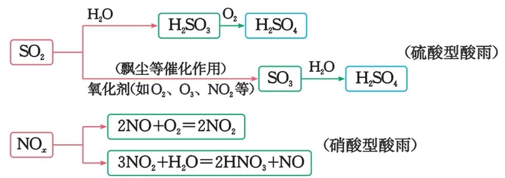
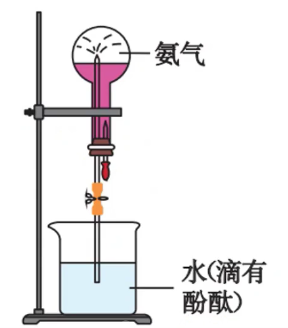
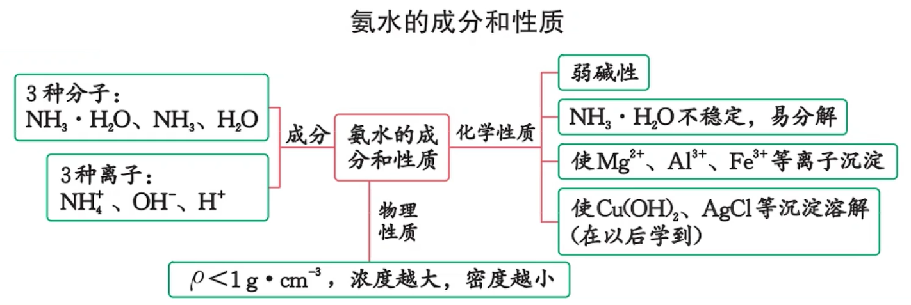
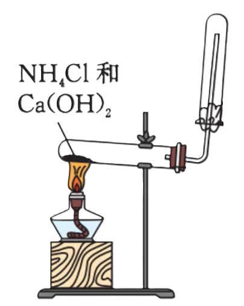
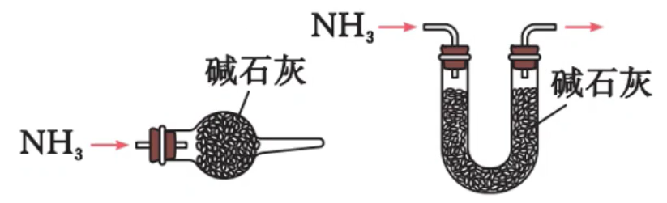
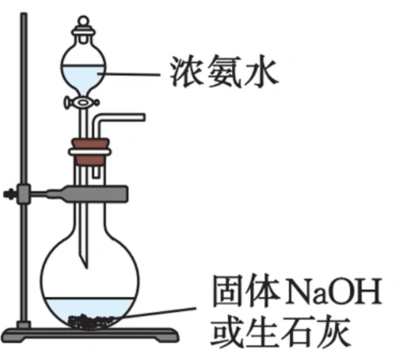

# 07 · 氮 $(\ce{N})$ 及其化合物

## 氮气

氮分子内两个氮原子间以 **共价三键**（$\ce{N\equiv N}$）结合，断开该化学键需要较多的能量，所以氮气的化学性质很稳定，通常情况下难以与其他物质发生化学反应，无法被大多数生物体直接吸收

但在高温、放电条件下，氮分子获得了足够的能量，使断裂，氮气能够与镁、氧气、氢气等物质发生化合反应

### 物理性质

1. 无色、无味气体
2. 密度与空气相近
3. 不易溶于水
4. 在高压下可液化

### 化学性质

1. 与 $\ce{O2}$ 反应：  $\ce{N2 + O2 \xlongequal{放电} 2NO}$

2. 与 $\ce{Mg}$ 反应：
   
   $$
   \ce{N2 + 3Mg \xlongequal{点燃} \underset{\text{淡黄色}}{Mg3N2}}
   $$

    > 镁在空气中燃烧，同时还生成了氧化镁

### 氮的固定

氮的固定：将大气中 **游离态** 的氮转化为氮的 **化合物** 的过程，包括 **自然固氮** 和 **人工固氮**。

1. 自然固氮：

    - 高能固氮：大自然通过闪电释放的能量将空气中的氮气转化为含氮的化合物（雷雨发庄稼） 

        - $\ce{N2 + O2 \xlongequal{放电} 2NO}$

        - $\ce{2NO + O2 \xlongequal{} 2NO2}$

        - $\ce{3NO2 + H2O \xlongequal{} 2HNO3 + NO}$

    - 生物固氮：豆科植物的根瘤菌将氮气转化成氨

2. 人工固氮：工业合成氨

    原理：$\ce{N2 + 3H2 \xrightleftharpoons[铁基催化剂]{高温、高压} 2NH3}$ （哈伯法）

    > 1. 合成氨工业化，对人类社会的影响极为深远。以合成氨为基础的化肥工业对粮食增产的贡献率占 $50\%$ 左右，使人类免受饥荒之苦
    >
    > 2. **化学氮肥主要包括铵态氮肥（主要成分 $\ce{NH+4}$）、硝态氮肥（主要成分 $\ce{NO^-_3}$）和有机氮肥（尿素 $\ce{CO(NH2)2}$）**
    >
    >    工业上用氨气和二氧化碳在一定条件下合成尿素，肥效高、易保存、使用方便，是目前使用量很大的一种氨肥

## 一氧化氮 与 二氧化氮

| 物理性质 | 一氧化氮 $\ce{NO}$ | 二氧化氮 $\ce{NO2}$ |
| :------- | ------------------ | ------------------- |
| 状态     | 无色、无味         | 红棕色、刺激性气味  |
| 毒性     | 有毒               | 有毒                |
| 溶解性   | 不溶于水           | 溶于水并与水反应    |

转化：$\ce{NO \xrightleftharpoons[H2O]{O2}NO2}$

> 因此，除去一氧化氮中的二氧化氮只需通过水的洗气瓶即可

### 一氧化氮 $\ce{NO}$

1. 化学性质

    - $\ce{2NO + O2 \xlongequal{} 2NO2}$

    - $\ce{4NO + 2H2O + 3O2 \xlongequal{} 4HNO3}$

        > $\ce{NO}$ 既有氧化性又有还原性
    
    - 尾气处理：混合 $\ce{O2}$ 通入 $\ce{NaOH}$ 溶液（先化为二氧化氮再处理）

2. 制备

    - 实验室制备：$\ce{3Cu +8HNO3(稀) \xlongequal{} 3Cu(NO3)2 +4H2O +2NO ^}$ *38324*

    - 工业制备：$\ce{4NH3 +5O2 \xlongequal [\Delta]{催化剂} 4NO +6H2O}$

        > $\ce{NO}$ 的密度与空气接近，且易与空气中的氧气反应，因此只能用排水法收集 $\ce{NO}$

3. 用途

    制硝酸、人造丝漂白剂，具有改善心脑血管的作用

### 二氧化氮 $\ce{NO2}$

1. 化学性质：

    - 与水反应生成硝酸 

        $\ce{3NO2 + H2O \xlongequal{} 2HNO3 + NO}$

        > 与水反应生成硝酸的实验：
        >
        > - 实验步骤：将充满 $\ce{NO2}$ 的试管倒立于盛有水的水槽中。当液面在试管中不再上升时，通过导气管通入少量 $\ce{O2}$，并停一会儿，等待液面上升；当液面停止上升时，仍有气体剩余，可再通入少量 $\ce{O2}$，这样反复操作几次，直到液体充满整个试管
        >
        > - 实验现象：
        >
        >   充满 $\ce{NO2}$ 的试管，倒立于盛有水的水槽中，液体进入试管中，并慢慢上升到试管高度的 $2/3$；试管内气体由红棕色慢慢变为无色，剩余气体的体积为原气体体积的 $1/3$
        >
        >   当通入 $\ce{O2}$ 时，气体迅速由无色变为红棕色
        >
        >   液面继续上升，气体又变为无色
        >
        >   这样反复几次，最终几乎没有气体剩余，液体充满整个试管
        >
        > - 解释及结论：
        >   $\ce{3NO2 + H2O \xlongequal{} 2HNO3 + NO}$
        >
        >   $\ce{2NO + O2 \xlongequal{} 2NO2}$
        >
        >   总反应：$\ce{4NO + 2H2O + 3O2 \xlongequal{} 4HNO3}$

    - 与碱反应

        $\ce{3NO2 + H2O \xlongequal{} 2HNO3 + NO}$

        $\ce{NaOH +HNO3 \xlongequal{} NaNO3 +H2O}$

        $\ce{NO + NO2 + 2NaOH \xlongequal{} 2NaNO3 + H2O}$

        总反应：$\ce{2NO2 + 2NaOH \xlongequal{} NaNO2 + NaNO3 + H2O}$

    - 氧化性

     $\ce{NO2 +SO2 +H2O \xlongequal{} H2SO4 +NO}$

    - $\ce{NO2}$ 与 $\ce{N2O4}$ 相互转化

     $\ce{2\underset{红棕色}{NO2} \xrightleftharpoons{} \underset{无色}{N2O4}}$
    
     > 阿伏伽德罗常数题型常考
    
    - 尾气处理：$\ce{2NO2 +2NaOH \xlongequal{} NaNO3 +NaNO2 +H2O}$

2. 用途

    $\ce{NO2}$ 在化学反应和火箭燃料中作氧化剂，在工业上可以用来制取硝酸

3. 制备

    常用 $\ce{NO}$ 氧化或用浓 $\ce{HNO3}$ 与  $\ce{Cu}$  作用来制取 $\ce{NO2}$ ，使用向上排空气法收集，也可用加热分解重金属硝酸盐来制得

    $\ce{2Pb(NO3)2 \xlongequal{\Delta} 2PbO +4NO2 ^ +O2 ^}$

    工业：$\ce{N2->[H2]NH3->[O2]NO->[O2]NO2}$

### 酸雨

1. 正常雨水由于溶解了二氧化碳，其 $\text{pH}$ 约为 5.6，而酸雨的 $\text{pH}\textless5.6$ 

2. 成因：主要是大气中的 $\ce{SO2}$ 和 $\ce{NO_x}$ 以及它们在大气中发生反应后的生成物溶于水形成的

    

3. 危害
    1. 直接损伤农作物，破坏森林和草原，使土壤、湖泊酸化
    2. 加速建筑物、桥梁、工业设备、运输工具及电缆的腐蚀
4. 人类活动对氮循环和环境的影响
    - 以一氧化氮和二氧化氮为主的氮氧化物是形成光化学烟零、雾霾及酸雨的一个重要原因。汽车尾气中的氮氧化物与碳氢化合物经紫外线照射发生反应形成的有毒烟雾，成为光化学烟雾
    - 为了预防和控制氮氧化物的污染，具体措施为安装汽车尾气净化装置。净化装置含有钯等金属元素催化剂，尾气通过净化装置后，其中的有害气体 $\ce{NO、CO}$ 转化为无害气体 $\ce{N2}$ 与 $\ce{CO2}$

## 氨

### 物理性质

1. 氨是无色、有刺激性气味的气体，密度比空气小

2. 氨很容易液化，液化时放热。液氨汽化时要吸收大量的热，使周围温度急剧降低，可用作制冷剂

3. 氨极易溶于水，在常温常压下，1 体积水大约可溶解 700 体积氨

### 喷泉实验

在干燥的圆底烧瓶里充满 $\ce{NH3}$ 用带有玻璃管和胶头滴管（预先吸入水）的橡胶塞塞紧瓶口。倒置烧瓶，使玻璃管插入盛有水的烧杯中（预先在水里滴入少量酚酞溶液）。打开弹簧夹，挤压胶头滴管，使水进入烧瓶

> - 酚酞用于验证：①氨气极易溶于水；②氨气溶于水呈碱性
>
> - 其他喷泉实验：
> 
> | 气体 | 液体 |
> | --- | --- |
> | $\ce{NH3}$ | 水或稀 $\ce{H2SO4}$ |
> | $\ce{HCl}$ | 水或 $\ce{NaOH}$ 溶液 |
> | $\ce{Cl2}$ | $\ce{NaOH}$ 溶液 |
> | $\ce{CO2}$ | $\ce{NaOH}$ 溶液 |
> | $\ce{SO2}$ | $\ce{NaOH}$ 溶液 |
> | $\ce{H2S}$ | $\ce{NaOH}$ 溶液 |
>   

### 化学性质

1.  可燃性

    $\ce{4NH_3 + 3O_2 \xlongequal{\Delta{或点燃}} 2N_2 + 6H_2O}$

2. 碱性（唯一的碱性气体）

    - $\ce{NH_3(g) + HCl(g) \xlongequal{} \underset{\text{白烟}}{NH_4Cl}(s)}$

    - $\ce{NH_3 + HNO3 \xlongequal{} NH_4NO3}$

     > 元素推断：某元素的气态氢化物与最高价氧化物对应水化物化合生成盐

    - $\ce{NH_3 + H_2O \xrightleftharpoons{} NH_3*H_2O \xrightleftharpoons{} NH_4^+ + OH^-}$

     > 

3. 还原性

    - 催化氧化：$\ce{4NH_3 + 5O_2 \xlongequal [\Delta]{Pt} 4NO + 6H_2O}$

    - $$\left\{\begin{array}{lr} \ce{2NH_3 + 3Cl_2 \xlongequal{} N_2 + 6HCl}\\ \ce{8NH_3 + 3Cl_2 \xlongequal{} N_2 + 6NH_4Cl}\\ \end{array}\right.$$

    - $\ce{2NH_3 + CuO \xlongequal{\Delta} 3Cu + N_2 + 3H_2O}$

### 实验室制备

原理：$\ce{Ca(OH)2 +2NH4Cl \xlongequal{\Delta} CaCl2 +2NH3 ^ +2H2O}$ （固固加热型）

收集方法：向下排空气法（导管伸入，接近试管底部）

验满方法：将湿润的红色石蕊试纸放在管口（或 将沾有浓盐酸的玻璃棒靠近瓶口，有白烟生成）

棉花（用水或稀硫酸浸湿）的作用：防止 $\ce{NH3}$ 与空气对流，同时吸收多余的 $\ce{NH3}$ ，防止污染空气

试管口略向下倾斜，防止产生的水蒸气冷凝回流炸裂试管

> - 不使用 $\ce{NaOH}$ 与 $\ce{NH4Cl}$ 共热来制备，因为 $\ce{NaOH}$ 碱性过强，在加热条件下易腐蚀玻璃（玻璃耐酸不耐碱）
> 
>- 不得直接加热 $\ce{NH4Cl}$ 来制备氨气，因为生成的 $\ce{HCl}$ 和 $\ce{NH3}$ 在瓶口遇冷重新化合为 $\ce{NH4Cl}$ 
> 
>- 使用碱石灰来干燥氨气，不能用浓硫酸、$\ce{P2O5}$、无水 $\ce{CaCl2}$ 作干燥剂（$\ce{NH3}$ 与 $\ce{CaCl2}$ 反应生成 $\ce{CaCl2・8NH3}$）
> 
>  
> 
>- 要防止倒吸
> 
>  

> 其他实验方式
>
> 
>
> | 反应物                  | 原理                                                         |
> | ----------------------- | ------------------------------------------------------------ |
> | 浓氨水+固体 $\ce{NaOH}$ | $\ce{NaOH}$ 溶于水放热，促使氨水分解，且 $\ce{OH -}$ 浓度的增大有利于 $\ce{NH3}$ 的生成 |
> | 浓氨水+固体 $\ce{CaO}$  | $\ce{CaO}$ 与水反应，使溶剂（水）减少；反应放热，促使氨水分解。  化学方程式为：$\ce{NH3·H20 +CaO \xlongequal{} NH3 ^ +Ca(OH)2}$ |

## 铵盐

1. 铵盐大多是无色晶体，绝大多数的按盐都易溶于水，易于被农作物吸收，因此广泛用于化肥中。

2. 铵盐受热容易分解：$\ce{NH4Cl \xlongequal{\Delta} NH3 ^ +HCl ^}$ （冷却后重新化合为 $\ce{NH4Cl}$，可借此来提纯 $\ce{NH4Cl}$ ）
    $\ce{NH4HCO3 \xlongequal{\Delta} NH3 ^ +CO2 ^ +H2O}$

    > 一般铵盐受热分解为氨气，但存在例外 $\ce{NH4NO3 ->[\Delta] HNO3 +N2 +H2O}$

3. 与碱反应会放出氨：$\ce{Ca(OH)2 +2NH4Cl \xlongequal{\Delta} CaCl2 + 2NH3 ^ +2H2O}$

由于铵盐具有受热易分解的性质，在储铵态氮吧时，应密封包装并放在阴凉通风处；施肥时，应将其埋在土中以保持肥效。铵盐能与碱反应，因此铵态氮肥不能与碱性物质如草木灰（$\ce{K2CO3}$）等混合施用。 

### 铵根离子的检验

取少量固体样品或溶液于试管中，再加入**浓**的 $\ce{NaOH}$ 溶液，**加热**，产生能使 **湿润** 的红色石蕊试纸变蓝的气体（或将蘸有浓盐酸的玻璃棒靠近管口，有白烟产生），证明固体样品或溶液中含有 $\ce{NH+4}$ 

原理：$\ce{NH+4 +OH- \xlongequal{} NH3·H2O->[\Delta]NH3}$

## 硝酸

### 物理性质

硝酸是无色、易挥发（在空气中形成白雾）、有刺激性气味的液体

### 化学性质

1. 不稳定性

    反应方程式：$\ce{4HNO3 \xlongequal[或光照]{\Delta} 4NO2 ^ +O2 ^ +2H2O}$

    浓硝酸一般呈黄色，是由于硝酸分解产生的 $\ce{NO2}$ 溶于硝酸的缘故

    硝酸浓度越大越易分解，因此，浓硝酸应放入棕色瓶（避光）在阴凉处保存（避免受热分解），用玻璃塞而不能用橡皮塞（硝酸腐蚀橡皮） 

2. 硝酸与金属的反应

    $$
    \begin{cases}
   	\ce{Cu + 4HNO3({浓}) \xrightarrow{} Cu(NO3)2 + 2NO2 ^ + 2H2O}\\
   	\ce{Cu + 8HNO3({稀}) \xrightarrow{} 3Cu(NO3)2 + 2NO ^ + 4H2O}\\
    \end{cases}
    $$

    > 常温下，**浓硝酸或浓硫酸使铁、铝钝化**（铁、铝表面被氧化生成一层致密的氧化物薄膜，这层薄膜阻止了酸与内层金属的进一步反应）。**故常温下，可以用铁或铝制容器来盛装浓硝酸或浓硫酸**
    >
    > 随反应的进行，浓硝酸变稀（阿伏伽德罗常数题常考）

3. 浓硝酸在加热条件下，还能与木炭等非金属单质发生氧化还原反应

    $\ce{C +4HNO(浓) \xlongequal{\Delta} CO2 ^ +4NO2 ^ +2H2O}$

4. 硝酸的酸性：

    硝酸是一元强酸，具有酸的通性，能与碱性氧化物、碱、盐等反应

### 工业制备

原理：$\ce{N2\xrightarrow[(1)]{\ce{H2} }NH3\xrightarrow[(2)]{\ce{O2} }NO->[O2][(3)]NO2->[H2O][(4)]HNO3}$

1. $\ce{N2 + 3H2 \xrightleftharpoons[高温、高压]{催化剂} 2NH3}$

2. $\ce{4NH_3 + 5O_2 \xlongequal[\Delta]{Pt} 4NO + 6H_2O}$

3. $\ce{2NO + O2 \xlongequal{} 2NO2}$

4. $\ce{3NO2 + H2O \xlongequal{} 2HNO3 + NO}$

    > $\ce{NO}$ 可循环使用
