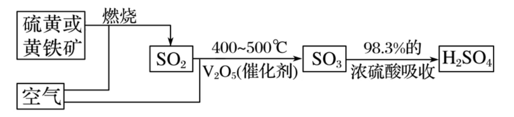

# 08 · 硫 $(\ce{S})$ 及其化合物

1. 游离态：硫单质俗称硫黄，主要存在于火山口附近或地壳的岩层中

2. 化合态：主要以 硫化物 和 硫酸盐 的形式存在

    |   黄铁矿    |    黄铜矿     |          生石膏           |        熟石膏         |           芒硝          |
    | :---------: | :-----------: | :---------------------: | :-----------------------: | :-----------------------: |
    | $\ce{FeS2}$ | $\ce{CuFeS2}$ | $\ce{CaSO4 \cdot 2H2O}$ |  $\ce{2CaSO4 \cdot H2O}$   |   $\ce{Na2SO4 \cdot 10H2O}$  |

    > $\ce{S}$ 的常见化合价：$-2,-1,0,+1,+2,+3,+4,+6,+7,+8$ （无 $+5$ 价）

## 硫单质

### 物理性质

1. 色态：黄色晶体，质脆，易研成粉末

2. 溶解性：**难溶于水，微溶于酒精、乙醚，易溶于二硫化碳 $\ce{CS2}$** ，易溶于热煤油（化工题常考）
    > 因此二硫化碳可用于洗涤内壁附着硫单质的试管
    
    > 浓氢氧化钠溶液可以与硫单质反应：$\ce{3S + 6NaOH ->[\Delta] 2Na2S + Na2SO3 + 3H2O}$，也可用于除去S

### 化学性质

硫单质既表现 **氧化性** ，又表现 **还原性**

1. 与 $\ce{H2}$ 反应：$\ce{H2 +S\xlongequal{\Delta}H2S}$

    > 硫化氢，$\ce{H2S}$，臭鸡蛋味，有剧毒

2. 与 $\ce{O2}$ 反应：$\ce{O2 +S\xlongequal{点燃}SO2}$

    > 无论氧气是否过量，产物均为二氧化硫（三氧化硫只在特殊的催化条件下生成）。发出明亮的蓝紫色火焰

3. 与金属反应

    $\ce{Fe +S\xlongequal{\Delta} \overset{+2}{Fe}S}\newline \ce{2Cu +S\xlongequal{\Delta} \overset{+1}{Cu2}S}\quad$
   
    > $\ce{S}$ 的氧化性比 $\ce{F、Cl}$ 弱，只能生成金属的低价态；
   
    $\ce{Hg +S\xlongequal{} HgS}$
   
    > 用于覆盖实验室撒落的汞以处理汞。
   

## 硫酸

### 物理性质

纯硫酸是无色、黏稠的油状液体，沸点高、**难挥发**。常用的浓硫酸的质量分数是 $98\%$（物质的量浓度为 $18.4 mol/L$），密度 $1.84g/cm^3$

### 化学性质

1. **难挥发性**：用于制备挥发性酸（如 $\ce{HCl、HNO3}$ ）

    $\ce{NaCl +H2SO4(浓)\xlongequal{微热}NaHSO4 +HCl ^}$

    $\ce{NaNO3 + H2SO4 (浓)\xlongequal{微热}NaHSO4 + HNO3↑}$

2. **强酸性**

    制磷酸：$\ce{Ca3(PO4)2 +3H2SO4(浓)\xlongequal{}3CaSO4 +2H3PO4}$
    
        > 一般使用 $70\%$ 的浓硫酸，因为 $98\%$ 的浓硫酸氢离子浓度过小

3. **吸水性**

    浓硫酸具有 **强烈的吸水能力** ，能 **吸收空气中的水分** ，甚至能 **吸收结晶水合物的水** ，故浓硫酸常用作 **干燥剂** ，干燥一些 **不与浓硫酸反应的气体** 。

    > 用浓 $\ce{H2SO4}$ 可干燥 $\ce{O2、H2、N2、CO2、Cl2、HCl、CO2、CO、CH4}$ 等气体，但不能干燥 $\ce{NH3、H2S(酸碱反应)、HI、HBr(氧化还原)}$ 等气体
    >
    > 运用：在乙酸乙酯的制备实验中，用浓硫酸吸水，促进反应正向移动，提高乙酸乙酯的产率

4. **脱水性**

    浓硫酸具有很强的腐蚀性，能按氢、氧原子 $2:1$ 的比例脱去纸、棉布、木条等有机物中的氢、氧元素；浓硫酸具有强腐蚀性与脱水性有很大关系，如浓硫酸会使蓝色石蕊试纸先变红，后变黑（碳化）

    > 1. 蔗糖的脱水实验：$\begin{cases}First.&\ce{C12H22O11->[浓H2SO4]12C +11H2O}\\Second.&\ce{C +H2SO4(浓)\xlongequal{\Delta}CO2 ^ +2SO2 ^ +2H2O}\end{cases}\\$
    >
    > 既体现浓硫酸的 **脱水性** 又体现 **强氧化性** 
    >
    > 2. 醇的消去反应：$\ce{C2H5OH->[浓 H2SO4][170°C]CH2=CH2 ^ +H2O}$

5. **强氧化性**

    硫酸中的硫元素处于最高价态。**浓硫酸** 能与许多物质发生氧化还原反应，是常见的氧化剂

    - 与铜反应：$\ce{Cu +2H2SO4(浓)\xlongequal{\Delta}CuSO4 +SO2 ^ +2H2O}$

        > 不浓不热不反应

    - 与木炭反应：$\ce{C +H2SO4(浓)\xlongequal{\Delta}CO2 ^ +2SO2 ^ +2H2O}$

6. 其他

    - 在常温下，浓 $\ce{H2SO4}$ 与 $\ce{Fe、Al}$ 反应，生成了致密的氧化膜阻止金属与浓 $\ce{H2SO4}$ 接触，从而保护了金属。因此常温下可用 $\ce{Fe、Al}$ 制容器盛放浓 $\ce{H2SO4}$ ；浓 $\ce{H2SO4}$ 与 $\ce{Fe、Al}$ 可以反应，浓 $\ce{H2SO4}$ 与 $\ce{Cu}$ 常温下不反应
    - 金属单质或低价金属的盐与浓 $\ce{H2SO4}$ 反应时，浓 $\ce{H2SO4}$ 既显氧化性又显酸性（与铜反应

## 二氧化硫

### 物理性质

无色、有刺激性气味的有毒气体，密度比空气大，易溶于水（1 体积的水能溶解约 40 体积的二氧化硫），可用于杀菌消毒和防氧化（向葡萄酒中加入适量二氧化硫）

### 化学性质

**Ⅰ $\ce{SO2}$ 是 **酸性氧化物**，具有酸性氧化物的通性**

1. 与水反应：$\ce{\overset{+4}{S}O2 +H2O <=> H2\overset{+4}{S}O3}$

    > $\ce{H2SO3}$ 为二元酸；$\ce{SO2\sim H2SO3\overset{完全}{\sim} 2OH-}$
    >
    > $\ce{H2SO3}$ 为中强酸，$\ce{HSO^-_3}$ 电离大于水解，因此 $\ce{NaHSO3}$ 显酸性（$\ce{H3PO4}$ 同理）

2. 与碱反应：

    1. 少量 $\ce{SO2}$ 通入 $\ce{NaOH}$ 溶液：$\ce{SO2 +2OH- \xlongequal{}SO^2-_3 +H2O}$
    2. 过量 $\ce{SO2}$ 通入 $\ce{NaOH}$ 溶液：$\ce{SO2 +OH- \xlongequal{} HSO^-_3 }$
   
3. 制备：$\ce{Na2SO3 +H2SO4(浓) \xlongequal{} Na2SO4 +SO2 ^ +H2O}$

**Ⅱ $\ce{SO2}$ 既有氧化性，又有还原性，以还原性为主**

1. 还原性

    1. 二氧化硫在适当的温度并有催化剂存在的条件下，可以被氧气氧化，生成三氧化硫

        $\ce{2SO2 +O2 <=>[V2O5][\Delta]2SO3}$

        > 三氧化硫也是一种酸性氧化物，溶于水时与水发生剧烈反应，生成硫酸
        >
        > $\ce{SO3 +H2O\xlongequal{}H2SO4}$
        >
        > 应用：工业制备硫酸（接触法制硫酸）
        >
        > 
        >
        > 工业上一般以硫磺（ $\ce{S}$ ）或其它含疏物（如黄铁矿 $\ce{FeS2}$ ）为原料来制备硫酸。金属冶炼时产生的含二氧化硫废气经回收后也可用于制备硫酸
        >
        > $\ce{4FeS2 +11O2\xlongequal{高温}2Fe2O3 +8SO2}$ 或 $\ce{S +O2\xlongequal{点燃}SO2}$
        >
        > $\ce{2SO2 +O2 <=>[V2O5][\Delta]2SO3}$
        >
        > $\ce{SO3 +H2O\xlongequal{}H2SO4}$
        >
        > （一般工业上不用水吸收三氧化硫，而是使用98%浓硫酸，因为三氧化硫溶于水大量放热，水沸腾形成酸雾，酸雾随着气流离开，减少对三氧化硫的吸收效果）

    2. 能被 $\ce{H2O2、Cl2、Br2、I2、Fe^3+、KMnO4、HNO3、ClO-}$ 等强氧化剂氧化生成 $\ce{SO^2-_4}$

        - $\ce{SO2 +H2O2\xlongequal{}H2SO4}$
        - $\ce{SO2 +Cl2(Br2/I2) +2H2O\xlongequal{}H2SO4 +2HCl(HBr/HI)}$
        - $\ce{SO2 +2Fe^3+ +2H2O\xlongequal{}SO^2-_4 +2Fe^2+ + 4H+}$
        - $\ce{5SO2 +2MnO^-_4 +2H2O \xlongequal{} 2Mn^2+ +5SO^2-_4 +4H+}$
      
        > 二氧化硫不与浓硫酸反应，因为两者如果反应，会归中反应至+5 价，而+5 价的硫化物不稳定
        >
        > 因此，二氧化硫可以用浓硫酸干燥

2. 氧化性

    $\ce{SO2}$ 与 $\ce{H2S}$ 反应： $\ce{SO2 +2H2S\xlongequal{}3S +2H2O}$

        > $\ce{H2S}$ 已是最低价态，只能表现还原性，二氧化硫表现氧化性

3. 漂白性

    - $\ce{SO2}$ 具有漂白作用，能使 **品红溶液** 等有色物质褪色
    
    - 漂白的原理是 **$\ce{SO2}$ 与有色物质结合生成了不稳定的无色物质**，与其氧化性无关。**加热后又显红色**，是由于不稳定的无色物质又分解为原来的物质
    
    - $\ce{SO2}$ 能漂白品红、鲜花等有机色素，**不能漂白酸碱指示剂，如酚酞、石蕊等**
    
    - 工业上常用 $\ce{SO2}$ 来漂白纸浆、毛、丝、草帽辫等，还用于消毒、杀菌等
   
    > - 将 $\ce{SO2}$ 通入含酚酞的 $\ce{NaOH}$ 溶液中，溶液褪色，与其漂白性无关， $\ce{SO2}$ 溶于水形成 $\ce{SO^-_3}$ ，与 $\ce{NaOH}$ 中和，使得溶液由碱性变酸性，因此酚酞变色
    >
    > - $\ce{SO2}$ 使溴水、高锰酸钾褪色，与其漂白性无关，是由于其 **还原性**
    
    > - **氯水的漂白原理与 $\ce{SO2}$ 不同**，氯水的漂白原理是 $\ce{Cl2}$ 与 $\ce{H2O}$ 反应后生成了 $\ce{HClO}$ 具有 **强氧化性**，将有色的物质氧化为无色的物质，**褪色后不能恢复原来的颜色**
    > - 将氯水与 $\ce{SO2}$ 混合，会使得漂白性消失（ $\ce{SO2 +Cl2 +2H2O\xlongequal{}H2SO4 +2HCl}$ ）

####  $\ce{SO2}$ 的实验室制备

1. 不加热型制备

    反应原理：$\ce{Na2SO3 +H2SO4(浓) \xlongequal{} Na2SO4 +SO2 ^ +H2O}$

    离子方程式：$\ce{SO^{2-}_3 +2H+ \xlongequal{} SO2 ^ +H2O}$

    > 一般使用 $75\%$ 的浓硫酸，$98\%$ 的浓硫酸氢离子浓度过小；但也不能过小，因为会导致反应速率慢、$\ce{SO2}$ 过多溶解在水中

2. 加热型制备

    $\ce{Cu +2H2SO4(浓) \xlongequal{\Delta} CuSO4 +SO2 ^ +2H2O}$ （不浓不热不反应）

    > 常考有关阿伏伽德罗常数问题，无法根据 $\ce{Cu}$ 的量判断实际生成的 $\ce{SO2}$ ，**因为浓硫酸浓度随反应降低而停止反应**

3. 干燥：使用浓 $\ce{H2SO4}$ 干燥（两者不反应）

4. 收集：密度比空气大，向上排空气法

5. 尾气处理：$\ce{NaOH}$ 溶液

### $\ce{SO3}$ 

1. 物理性质：**标况下为无色固体，常温下为无色液体**，熔点为 $16.8°\ce{C}$， 易升华，极易溶于水并放出大量热

2. 化学性质：

    1. 与水反应：$\ce{SO3 +H2O=H2SO4}$

    2. 与碱性氧化物反应

        $\ce{CaO +SO3 = CaSO4}$

        $\ce{Na2O +SO3 = Na2SO4}$

    3. 与碱反应：$\ce{SO3 +2OH- = SO^2-_4 +CO2}$

    4. 与某些盐溶液反应：$\ce{SO3 +Ba^2+ +H2O = BaSO4 v +2H+}$

        > 用于鉴别 $\ce{SO2}$ 与 $\ce{SO3}$ ：$\ce{SO2}$ 加入 $\ce{BaCl2}$ 溶液中无沉淀

 ## 硫酸根离子的检验

1. 原理：在溶液中，$\ce{SO^2-_4}$ 可与 $\ce{Ba^2+}$ 反应，生成 **不溶于稀盐酸** 的白色 $\ce{BaSO4}$ 沉淀

    > 强酸根形成的沉淀往往难溶于强酸，例如 $\ce{BaSO4}$ 、 $\ce{AgCl}$ 不溶于盐酸、硝酸

2. 操作方法

    1. 取少许待测液于洁净试管中，先加入足量稀盐酸酸化

        > $\ce{Ba^2+}$ 与 $\ce{SO^2-_4、CO^2-_3、SO^2-_3}$ 形成沉淀，$\ce{Ag+}$ 与 $\ce{Cl-}$ 形成沉淀；稀盐酸可排除 $\ce{CO^2-_3、SO^2-_3、Cl-}$ 的干扰

    2. 上一步后无明显现象（若有沉淀，则静置后取上层清液），滴加 $\ce{BaCl2}$ 溶液

    3. 若有白色沉淀产生，则说明待测液中含有 $\ce{SO^2-_4}$ 

        若无白色沉淀产生，则说明待测液中不含 $\ce{SO^2-_4}$ 

3. 注意事项

    - 不能只加入 $\ce{BaCl2}$ ，且盐酸和 $\ce{BaCl2}$ 的顺序不可以颠倒

        > 例如：待测液先加入 $\ce{BaCl2}$ ，发现白色沉淀，再加入稀盐酸，观察到沉淀不消失，不可判断是 $\ce{SO^2-_4}$ 
        >
        > 因为虽然排除了 $\ce{BaCO3}$ 和 $\ce{BaSO3}$ 的干扰，但也有可能是 $\ce{AgCl}$ （$\ce{HCl}$ 不会使 $\ce{AgCl}$ 沉淀消失）

    - 不可以引入硝酸根，例如不可以加 $\ce{HNO3}$ 酸化或是加 $\ce{Ba(NO3)2}$ 这是因为酸性环境下的 $\ce{NO3^{-}}$具强氧化性，将溶液中可能存在的亚硫酸根离子氧化成硫酸根，因而干扰检验

## 硫及其化合物的转化

