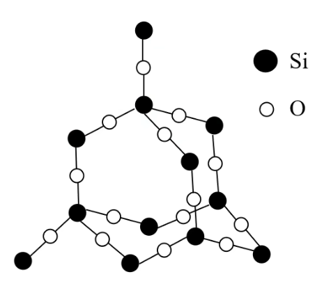
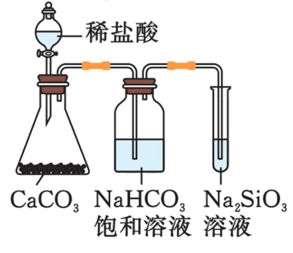
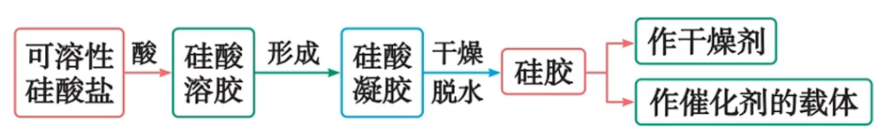

# 09 · 硅 $(\ce{Si})$ 及其化合物

## 单晶硅 $\ce{Si}$

1. 单晶硅的结构与金刚石的相似，为正四面体的立体网状结构。晶体中每个 $\ce{Si}$ 原子与其他 ${4}$ 个 $\ce{Si}$ 原子相连接
2. 单晶硅是带有金属光泽的灰黑色固体，熔点高、硬度大、有脆性，在常温下化学性质不活泼
3. 单晶硅的导电性介于导体和绝缘体之间，是良好的半导体材料

### 化学性质

1. **与非金属单质反应**
    - $\ce{Si + 2F2 \xlongequal{} SiF4}$
    
    - $\ce{Si + 4HF \xlongequal{} SiF4 ^ +2H2 ^}$
    
    - $\ce{Si + 2NaOH +H2O \xlongequal{} Na2SiO3 + 2H2 ^}$
    
        > $\ce{Si}$ 与 $\ce{Al}$ 都可以和 $\ce{NaOH}$ 反应生成 $\ce{H2}$，而且前者是非金属，后者是金属。在元素推断题中常出现

    - $\ce{Si + 2Cl2 \xlongequal{\Delta} SiCl4}$
    - $\ce{Si + O2 \xlongequal{\Delta} SiO2}$
    - $\ce{Si + C \xlongequal{高温} \underset{\text{金刚砂}}{SiC}}$

1. **与水反应**
    - 野外制氢：$\ce{Si + H2O + 2NaOH \xlongequal{} Na2SiO3 + 2H2 ^}$

## 二氧化硅 $\ce{SiO2}$

1. **结构**
    
    1. 杂化方式：$sp^3$ 杂化
    
    2. 在 $SiO_2$ 晶体中，每个硅原子均与 $4$ 个氧原子结合；每个氧原子与 $2$ 个硅原子结合
    
    3. 在 $SiO_2$ 晶体中硅原子与氧原子个数之比是 $1:2$
    
    4. 在 $SiO_2$ 晶体中，每个硅原子形成 $4$ 个共价键；每个氧原子形成 $2$ 个共价键
    
    5. 在 $SiO_2$ 晶体中，最小环为十二元环，有 $6$ 个硅原子和 $6$ 个氧原子
    
    6. 硅原子个数与 $Si-O$ 共价键个数之是 $1:4$ ；氧原子个数与 $Si-O$ 共价键个数之比是 $1:2$ 
    
    7. $SiO_2$ 晶体中并不存在 $SiO_2$ 分子

2. **物理性质**

    - 硬度大、熔沸点高、常温下为固体、难溶于水、不导电

3. **化学性质**

    **$SiO_2$ 是一种酸性氧化物**

    1. 与强碱反应：
        $$\ce{SiO2 + 2NaOH \xlongequal{} Na2SiO3 + H2O}$$（装 $\ce{NaOH}$ 溶液不用玻璃塞）
    2. 与唯一一种能与之反应的酸———氢氟酸 反应：
        $$\ce{SiO2 + 4HF \xlongequal{} SiF2 ^ + 2 H2O}$$（腐蚀玻璃、玻璃雕花）
    3. 与碱性氧化物反应：氧化硅与碱性氧化物反应，不与水反应（与水反应产物为硅酸，是沉淀，阻止反应进行）
    4. 与碱性盐反应
        - $\ce{SiO2 + Na2CO3 \xlongequal{高温} Na2SiO3 + CO2 ^}$（制作玻璃）
        - $\ce{SiO2 + CaCO3 \xlongequal{高温} CaSiO3 + CO2 ^}$（造渣反应）
    5. 与碳反应
        - $\ce{SiO2 + 2C \xlongequal{高温} Si + 2CO ^}$
        - $\ce{SiO2 + 3C \xlongequal{高温} SiC + 3CO ^}$
    6. SiO2的精炼
        1. $\ce{SiO2 + 4Mg \xlongequal{高温} Mg2Si + 2MgO}$
        2. $\ce{Mg2Si + 4HCl \xlongequal{} 2MgCl2 + SiH4 ^}$
        3. $\ce{SiH4 + 2O2 \xlongequal{} SiO2 + 2H2O}$（自燃）
      
    7. 高纯硅(9N+)的制备
       1. $\ce{SiO2 + 2C ->[1800-2000^\circ C] Si + 2CO \uparrow}$
       2. $\ce{Si + 3HCl ->[300^\circ C] SiHCl3 + H2}$
       3. $\ce{SiHCl3 + H2 ->[1100^\circ C] Si + 3HCl}$

## 硅酸 $\ce{H2SiO3}$

- 白色胶状沉淀

- 弱酸性

    不使酸碱指示剂变色，酸性小于碳酸

- 不稳定性

    $\ce{H2SiO3 \xlongequal{\Delta} SiO2 + H2O}$

- 硅酸浓度大时在水中易聚合形成透明、胶冻状的硅酸凝胶，硅酸凝胶经干燥脱水后得到多孔的硅酸干凝胶，成为“硅胶”

    **硅胶是多孔状，吸附水分子能力强，常用作（食品级）干燥剂，或作催化剂的载体**

- 向硅酸盐溶液中加入盐酸或通入 $\ce{CO2}$，可制得硅酸胶体（凝胶）或沉淀

    - $\ce{Na2SiO3 +2HCl \xlongequal{} H2SiO3(胶体) +2NaCl}$

    - $\ce{Na2SiO3 + CO2 + H2O \xlongequal{} Na2CO3 + H2SiO3 v}$

    > 制备硅酸的原理是“强酸制弱酸”，这一原理可用来设计酸性强弱比较的实验，如：证明盐酸 > 碳酸 > 硅酸
    >
    > 
    >
    > - $\ce{CaCO3 + 2HCl \xlongequal{} CaCl2 + H2O + CO2 ^}$ 证明酸性：盐酸 > 碳酸
    > - $\ce{NaHCO3}$ 饱和溶液用于除去 $\ce{CO2}$ 中的 $\ce{HCl}$，防止其挥发而干扰实验
    > - $\ce{Na2SiO3 + CO2 + H2O \xlongequal{} Na2CO3 + H2SiO3 v}$ 证明酸性：碳酸 > 硅酸
    > - 注意：该实验不能用于验证非金属性 $\ce{Cl>C>S}$ ，用于其要用最高价氧化物对应的水化物的酸性强弱来比较

## 硅酸钠 $\ce{Na2SiO3}$

最简单的硅酸盐

1. 白色、可溶于水的粉末状固体，其水溶液俗称水玻璃，是一种矿物胶，有很强的粘合性（所以装 $\ce{NaOH}$ 溶液不用玻璃塞）
2. 可以与酸（盐酸、碳酸等）反应，生成硅酸凝胶
3. 用途：制备硅胶，作木材、纺织品的防腐剂、防火剂

