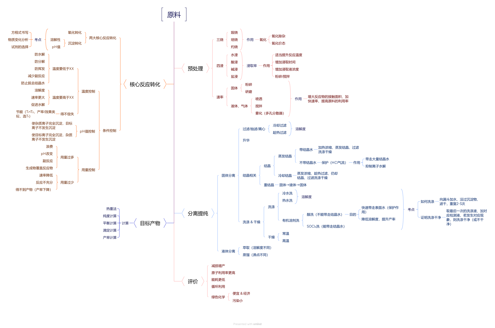

# 10 · 金属材料与金属矿物开发

## 金属冶炼

1. **金属的存在形式**

    金、铂等化学性质不活泼的金属，在自然界以游离态存在；化学性质较活泼的金属在自然界中以化合态存在

    > 金属活动性越强，人类开发、利用该金属的时间就越晚
    >
   
2. **金属冶炼的实质**

    金属冶炼的过程就是把金属从化合态还原为游离态的过程

3. **金属冶炼的方法**
    $$
    化合态\ce{->[\underbrace{K、Ca、Na、Mg、Al}_{电解法}、\underbrace{Zn、Fe、Sn、Pb、Cu}_{高温热还原法}、\underbrace{Hg、Ag}_{热分解法}][金属活动性逐渐减弱、金属阳离子得电子能力逐渐增强]}游离态
    $$

    1. **电解法**

      $\ce{Na:2NaCl(熔融)\xlongequal{电解}2Na +Cl2 ^}$

      $\ce{Mg:MgCl2(熔融)\xlongequal{电解}Mg +Cl2 ^}$

      $\ce{Al:2Al2O3(熔融)\xlongequal[冰晶石]{电解} 4Al +3O2 ^}$ 冰晶石可溶解氧化铝以降低其熔点，使铝的冶炼更加经济

    2. **高温热还原法**

      高温下利用碳、二氧化碳、氢气、铝等还原剂将金属元素从化合物中还原出来
   
      - 焦炭还原法：$\ce{C +2CuO\xlongequal{高温}2Cu +CO2 ^}$
   
      - $\ce{H2}$ 还原法：$\ce{3H2 +WO3\xlongequal{\Delta}W +3H2O}$
   
      - 活泼金属还原法：$\ce{2Al +Fe2O3\xlongequal{高温}2Fe +Al2O3}$
   
        > **铝热反应**
        >
        > 应用：
        >
        > 1. 冶炼难溶的金属（如钒、铬、锰，金属活动性在铝之后）
        >
        >    $\ce{2Al +Cr2O3\xlongequal{高温}2Cr +Al2O3}$
        >
        > 2. 焊接钢轨等大截面钢材部件
        >
        > 3. 军事上用作铝热弹
        >
        > 4. 传统的烟火剂
        >
        > 实验要点：
        >
        > 1. 镁条：作引燃剂，燃烧放出热能量，引发铝热反应
        > 2. 氯酸钾：作助燃剂，受热放出氧气，以保证镁条的持续燃烧 
        > 3. 沙子：承接熔融的铁水，防止损坏实验台
   
      - $\ce{CO}$ 还原法：$\ce{3CO +Fe2O3\xlongequal{高温}2Fe +3CO2}$ 
   
        > 高炉炼铁
        >
        > 1. 产生还原剂：$\ce{C +O2\xlongequal{点燃}CO2}$ 、 $\ce{CO2 +C\xlongequal{高温}2CO}$
        > 1.  还原铁矿石：$\ce{3CO +Fe2O3\xlongequal{高温}2Fe +3CO2}$ 
        > 1. 造渣（除去 $\ce{SiO2}$ ）：$\ce{CaCO3 \xlongequal{高温} CO2 +CaO}$ 、 $\ce{CaO +SiO2 \xlongequal{高温} CaSiO3}$ 
   
    3. **热分解法**
   
      $\ce{Hg:2HgO\xlongequal{\Delta}2Hg +O2 ^}$
   
      $\ce{Al:2Ag2O\xlongequal{\Delta}4Ag +O2 ^}$
      
    4. **其他冶金方法**
   
      1. 湿法冶金：利用溶液中发生的化学反应冶炼金属
   
         $\ce{CuSO4 +Fe \xlongequal{} Cu +FeSO4}$
   
      2. 富集法：利用物理方法筛选、淘洗，适用于 $\ce{Pt、Au}$ 

## 无机工业流程

