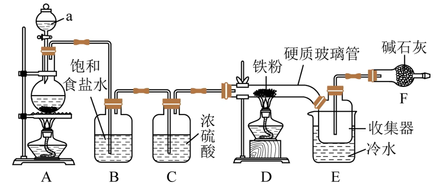
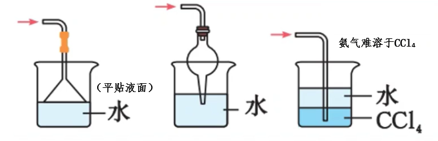

# 化学实验 · 三 · 「常见实验」

## 制备 $\ce{FeCl3}$

A：$\ce{MnO2 + 4HCl(浓) \xlongequal{\Delta} MnCl2 +Cl2 ^ +2H2O}$

B（饱和食盐水）：吸收氯化氢气体

C（浓硫酸）：除去氯气中的水分

F（碱石灰）：Ⅰ尾气吸收；Ⅱ防止外界水蒸气进入

E： $\ce{FeCl}_{3}$ 易升华，使用冷水使其变为固体，方便收集

>  $\ce{FeCl3}$ 水解程度较大（$\ce{FeCl3 +3H2O<=>Fe(OH)3 +3HCl}$），因此要注意不能使外界水蒸气进入，同时如果要制备 $\ce{FeCl3}$ 溶液时，应先将 $\ce{FeCl3}$ 固体溶于少量盐酸（使反应逆向移动），再加水稀释

## 制备 $\ce{Cl2}$

1. 原理：$\ce{MnO2} +\ce{4HCl}(浓)\xlongequal{\Delta}\ce{MnCl2} +\ce{Cl2^} +\ce{2H2O}$（**不浓不热不反应**）
2. 装置：
    1. 分液漏斗：固液加热生成气体所需，用于调节浓盐酸滴入速率
    2. 饱和食盐水：降低 $\ce{Cl2}$ 对水的溶解性，减少损耗（$\ce{Cl2 +H2O <=>H+ +Cl- +HClO}$，氯化钠促进平衡逆移）；用于除 $\ce{HCl}$ 气体（氯化氢极易溶于水）
    3. 浓硫酸：用于除 $\ce{H2O}$ 蒸汽
    4. 向上排空气法：氯气密度比空气大（或排饱和食盐水法）
    5. $\ce{NaOH}$ 水溶液：$\ce{2NaOH + Cl2 \xlongequal{} NaCl + NaClO + H2O}$
3. 验满：将湿润的 $\ce{KI -}$ 淀粉试纸靠近瓶口，若试纸立即变蓝，则证明氯气已经收集满

## 制备 $\ce{NH3}$

原理：$\ce{Ca(OH)2 +2NH4Cl \xlongequal{\Delta} CaCl2 +2NH3 ^ +2H2O}$ （固固加热型）

收集方法：向下排空气法（导管伸入，接近试管底部）

验满方法：将湿润的红色石蕊试纸放在管口（或 将沾有浓盐酸的玻璃棒靠近瓶口，有白烟生成）

棉花（用水或稀硫酸浸湿）的作用：防止 $\ce{NH3}$ 与空气对流，同时吸收多余的 $\ce{NH3}$ ，防止污染空气

试管口略向下倾斜，防止产生的水蒸气冷凝回流炸裂试管

> - 不使用 $\ce{NaOH}$ 与 $\ce{NH4Cl}$ 共热来制备，因为 $\ce{NaOH}$ 碱性过强，在加热条件下易腐蚀玻璃（玻璃耐酸不耐碱）
>
> - 不得直接加热 $\ce{NH4Cl}$ 来制备氨气，因为生成的 $\ce{HCl}$ 和 $\ce{NH3}$ 在瓶口遇冷重新化合为 $\ce{NH4Cl}$ 
>
> - 使用碱石灰来干燥氨气，不能用浓硫酸、$\ce{P2O5}$、无水 $\ce{CaCl2}$ 作干燥剂（$\ce{NH3}$ 与 $\ce{CaCl2}$ 反应生成 $\ce{CaCl2・8NH3}$）
>
>  
>
> - 要防止倒吸
>
>  