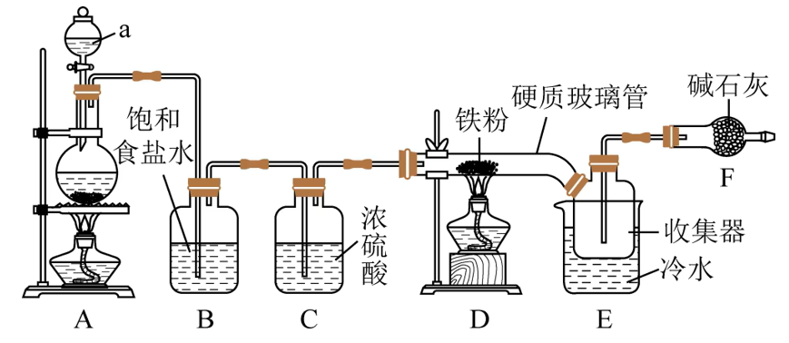

# 03 · 常见实验
<Badge type="warning" text="部分实验在前面的章节已经提到，不再赘述。" />

**物质制备类** （气体、无机物、有机物）：掌握试剂选择、反应原理、装置搭建、除杂干燥

**分离提纯类**（过滤、蒸发、蒸馏、萃取、分液、洗涤、干燥）：掌握操作要点、仪器选择、适用范围

**定量测定类**（滴定、量气、称重）：掌握误差分析、计算方法、操作规范

**性质探究类**（氧化还原、速率、平衡）：掌握控制变量、现象分析、原理推导

**离子检验 & 物质推断**：掌握试剂选择、现象判断、排除干扰

## 粗盐提纯

**实验**：溶解 → 过滤 → 蒸发 → 除杂（$\ce{Ca^{2+}}$、$\ce{Mg^{2+}}$、$\ce{SO4^{2-}}$）

**试剂及作用**：
- $\ce{BaCl2}$溶液：除去粗盐中的$\ce{SO4^{2-}}$
- $\ce{Na2CO3}$溶液：除去$\ce{Ca^{2+}}$和过量的$\ce{Ba^{2+}}$
- $\ce{NaOH}$溶液：除去$\ce{Mg^{2+}}$
- 稀$\ce{HCl}$：除去过量的$\ce{OH-}$和$\ce{CO3^{2-}}$

**反应方程式**：
- $\ce{BaCl2 + Na2SO4 = BaSO4 v + 2NaCl}$
- $\ce{Na2CO3 + CaCl2 = CaCO3 v + 2NaCl}$；$\ce{Na2CO3 + BaCl2 = BaCO3 v + 2NaCl}$
- $\ce{2NaOH + MgCl2 = Mg(OH)2 v + 2NaCl}$
- $\ce{HCl + NaOH = NaCl + H2O}$；$\ce{Na2CO3 + 2HCl = 2NaCl + H2O + CO2 ^}$

**知识点**：
- 过滤操作需遵循“一贴、二低、三靠”的原则
- 除杂顺序：$\ce{BaCl2}$ → $\ce{Na2CO3}$ → $\ce{NaOH}$ → $\ce{HCl}$
- 蒸发：当出现大量固体时停止加热，利用余热蒸干剩余液体

**注意事项**：除杂时$\ce{Na2CO3}$需在$\ce{BaCl2}$之后加入（除去过量$\ce{Ba^{2+}}$）；$\ce{HCl}$最后加入（除去过量$\ce{OH-}$、$\ce{CO3^{2-}}$）；蒸发时玻璃棒不停搅拌，避免局部过热导致液体飞溅。

## 蒸馏 & 萃取分液

### （1）蒸馏（物理变化）
**考点**：适用对象、装置、操作
**试剂及作用**：碎瓷片/沸石：防止液体暴沸
**知识点**：
- 蒸馏适用于沸点不同的物质分离
- 温度计水银球需放在支管口处
- 冷凝水需“下进上出”，加入碎瓷片可防止暴沸
**题型**：装置图判断、选择、操作改错
**注意事项**：蒸馏时温度计水银球不能插入液面下；冷凝水“下进上出”保证冷凝充分；蒸馏烧瓶需垫石棉网加热。

### （2）萃取分液（物理变化）
**考点**：适用对象、萃取剂选择、分液操作
**试剂及作用**：$\ce{CCl4}$（四氯化碳）：萃取溴水/碘水中的$\ce{Br2}$/$\ce{I2}$（萃取剂，与水不互溶、不反应，对$\ce{Br2}$/$\ce{I2}$溶解度远大于水）
**知识点**：
- 可用$\ce{CCl4}$萃取溴水或碘水中的$\ce{Br2}$、$\ce{I2}$
- 分液操作时需先放出下层液体，再倒出上层液体
**题型**：装置图判断、选择、操作改错
**注意事项**：萃取剂不能与原溶剂互溶（如不能用酒精萃取碘水）；分液时下层液体从下口放出，上层液体从上口倒出，避免交叉污染；振荡分液漏斗后需放气。

## 一定物质的量浓度溶液配制
**知识点**：
- 配制步骤：计算 → 称量 → 溶解 → 冷却 → 转移 → 洗涤 → 定容 → 摇匀
- 所需仪器：容量瓶、烧杯、玻璃棒、胶头滴管、托盘天平/量筒
- 误差判断：俯视读数偏小，仰视读数偏大
**注意事项**：溶解后的溶液需冷却至室温再转移至容量瓶（防温度过高影响容量瓶精度）；洗涤烧杯和玻璃棒2~3次，洗涤液全部转移至容量瓶；定容时胶头滴管垂直悬空，不接触容量瓶内壁。

## 制备 $\ce{FeCl3}$

- A：$\ce{MnO2 + 4HCl(浓) \xlongequal{\Delta} MnCl2 + Cl2 ^ + 2H2O}$
- B（饱和食盐水）：吸收氯化氢气体
- C（浓硫酸）：除去氯气中的水分
- E： $\ce{FeCl3}$ 易升华，使用冷水使其变为固体，方便收集
- F（碱石灰）：Ⅰ尾气吸收；Ⅱ防止外界水蒸气进入

> $\ce{FeCl3}$ 水解程度较大（$\ce{FeCl3 + 3H2O <=> Fe(OH)3 + 3HCl}$），因此要注意不能使外界水蒸气进入，同时如果要制备 $\ce{FeCl3}$ 溶液时，应先将 $\ce{FeCl3}$ 固体溶于少量盐酸（使反应逆向移动），再加水稀释。

## 化学平衡移动（以 $\ce{FeCl3 + KSCN}$、$\ce{NO2}$ 二聚为例）
**试剂及作用**：
- $\ce{FeCl3}$溶液、$\ce{KSCN}$溶液：建立 $\ce{Fe^{3+} + 3SCN- <=> Fe(SCN)3}$ 平衡
- 浓$\ce{HCl}$/$\ce{NaOH}$溶液：改变离子浓度
- $\ce{NO2}$球：建立 $\ce{2NO2 <=> N2O4}$ 平衡，热水/冷水改变温度

**反应方程式**：
- $\ce{Fe^{3+} + 3SCN- <=> Fe(SCN)3}$（血红色）
- $\ce{2NO2(g)}$（红棕色） $\ce{<=>}$ $\ce{N2O4(g)}$（无色） $\Delta H < 0$

**注意事项**：
- 探究单一变量时，需保证其他条件相同（如探究温度影响时，浓度、催化剂用量一致）
- 催化剂只改变反应速率，不影响平衡移动
- 观察现象时需及时记录，避免因反应放热/吸热导致温度变化干扰实验

## 弱电解质电离 & 盐类水解

### （1）弱电解质的电离（盐酸/醋酸对比）
**实验**：同浓度盐酸/醋酸 pH、导电性
**反应方程式**：
- $\ce{HCl = H+ + Cl-}$
- $\ce{CH3COOH <=> H+ + CH3COO-}$

### （2）盐类的水解
**试剂及作用**：
- $\ce{NaCl}$、$\ce{CH3COONa}$、$\ce{NH4Cl}$溶液：不同类型盐，测酸碱性
- pH试纸：判断溶液酸碱性
- 酚酞/石蕊：显色剂

**反应方程式**：
- $\ce{CH3COO- + H2O <=> CH3COOH + OH-}$
- $\ce{NH4+ + H2O <=> NH3.H2O + H+}$（或写作 $\ce{NH3\cdot H2O}$）

**知识点**：
- 弱电解质电离不完全，强电解质电离完全
- 盐类水解规律：越弱越水解，谁强显谁性

**注意事项**：
- 测pH时，pH试纸需干燥，不能湿润（避免稀释溶液影响结果）
- 导电性实验需在相同温度下进行（温度影响离子迁移速率）
- 盐类水解吸热，加热可促进水解，需控制实验温度一致

## 沉淀溶解平衡
**实验**：沉淀转化（$\ce{AgCl}$ → $\ce{AgI}$ → $\ce{Ag2S}$）
**考点**：溶度积、沉淀先后、转化方向
**试剂及作用**：
- $\ce{AgNO3}$溶液：提供 $\ce{Ag+}$，生成 $\ce{AgCl}$ 沉淀
- $\ce{NaCl}$溶液：提供 $\ce{Cl-}$
- $\ce{KI}$溶液：提供 $\ce{I-}$，实现 $\ce{AgCl}$ → $\ce{AgI}$ 转化
- $\ce{Na2S}$溶液：提供 $\ce{S^{2-}}$，实现 $\ce{AgI}$ → $\ce{Ag2S}$ 转化

**反应方程式**：
- $\ce{AgNO3 + NaCl = AgCl v（白色） + NaNO3}$
- $\ce{AgCl + KI = AgI v（黄色） + KCl}$
- $\ce{2AgI + Na2S = Ag2S v（黑色） + 2KI}$

**注意事项**：
- 沉淀转化实验需控制离子浓度一致，确保实验现象由 $K_{sp}$ 大小决定
- $\ce{AgNO3}$溶液需少量滴加，避免过量导致现象干扰
- 实验后废液需处理（含重金属离子），不能直接排放

## 电化学（原电池 & 电解池）

### （1）原电池（以铜锌原电池为例）
**试剂及作用**：
- $\ce{Zn}$片、$\ce{Cu}$片：电极（$\ce{Zn}$为负极，$\ce{Cu}$为正极）
- 稀 $\ce{H2SO4}$/$\ce{ZnSO4}$/$\ce{CuSO4}$ 溶液：电解质溶液，提供离子，形成闭合回路

**反应方程式**：
- 负极（$\ce{Zn}$）：$\ce{Zn - 2e- = Zn^{2+}}$（氧化反应）
- 正极（$\ce{Cu}$）：
  - 酸性电解质：$\ce{2H+ + 2e- = H2 ^}$
  - 硫酸铜电解质：$\ce{Cu^{2+} + 2e- = Cu}$
- 总反应：
  - $\ce{Zn + H2SO4 = ZnSO4 + H2 ^}$
  - $\ce{Zn + CuSO4 = ZnSO4 + Cu}$

### （2）电解池（以电解饱和食盐水、电解 $\ce{CuCl2}$ 溶液为例）
**试剂及作用**：
- 石墨电极/$\ce{Cu}$电极：阳极/阴极
- 饱和 $\ce{NaCl}$ 溶液/$\ce{CuCl2}$ 溶液：电解质溶液
- 淀粉-$\ce{KI}$试纸：检验电解食盐水生成的 $\ce{Cl2}$

**反应方程式**：
- 电解 $\ce{CuCl2}$（石墨电极）：
  - 阳极：$\ce{2Cl- - 2e- = Cl2 ^}$
  - 阴极：$\ce{Cu^{2+} + 2e- = Cu}$
  - 总反应：$\ce{CuCl2 \xlongequal{电解} Cu + Cl2 ^}$
- 电解饱和食盐水（石墨电极）：
  - 阳极：$\ce{2Cl- - 2e- = Cl2 ^}$
  - 阴极：$\ce{2H2O + 2e- = H2 ^ + 2OH-}$
  - 总反应：$\ce{2NaCl + 2H2O \xlongequal{电解} 2NaOH + H2 ^ + Cl2 ^}$

**知识点**：
- 原电池：负极发生氧化反应，正极发生还原反应（负氧正还）
- 电解池：阳极发生氧化反应，阴极发生还原反应（阳氧阴还）

**注意事项**：
- 原电池两极需为不同活泼性金属（或一极为非金属导体），电解质溶液需能与负极反应
- 电解池阳极若为活性电极，电极本身参与反应