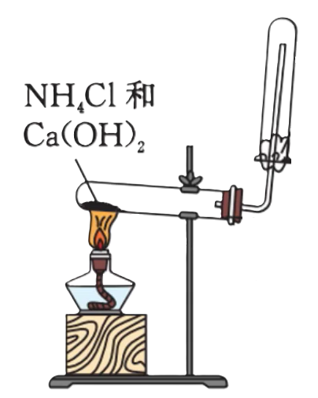
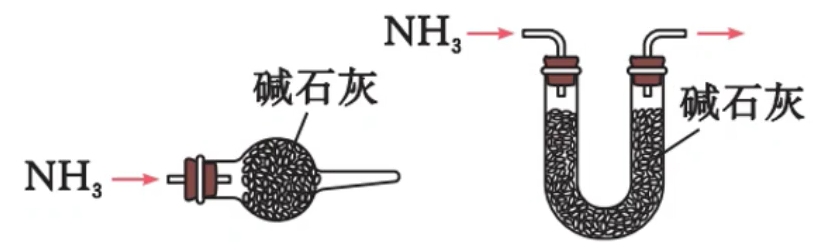
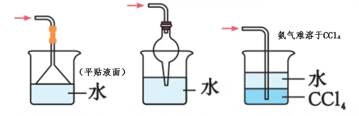

# 03 · 常见实验

   
## 化学实验重点整理（按年级划分） ##

### 一、高一实验（必修第一、二册）

#### 1. 粗盐提纯

**实验**：溶解→过滤→蒸发→除杂（$\ce{Ca^2+}$、$\ce{Mg²⁺}$、$\ce{SO₄²⁻}$）

**考点**：过滤操作、除杂试剂顺序、玻璃棒作用

**试剂及作用**：

- $\ce{BaCl2}$ 溶液：除去粗盐中的 $\ce{SO₄²⁻}$

- $\ce{Na₂CO₃}$ 溶液：除去 $\ce{Ca²⁺}$ 和过量的 $\ce{Ba²⁺}$

- $\ce{NaOH}$ 溶液：除去 $\ce{Mg²⁺}$

- 稀盐酸：除去过量的 $\ce{OH⁻}$ 和 $\ce{CO₃²⁻}$

**反应方程式**：

- $\ce{BaCl₂ + Na₂SO₄ \xlongequal{} BaSO₄↓ + 2NaCl}$

- $\ce{Na₂CO₃ + CaCl₂ \xlongequal{} CaCO₃↓ + 2NaCl}$；$\ce{Na₂CO₃ + BaCl₂ \xlongequal{} BaCO₃↓ + 2NaCl}$

- $\ce{2NaOH + MgCl₂ \xlongequal{} Mg(OH)₂↓ + 2NaCl}$

- $\ce{HCl + NaOH \xlongequal{} NaCl + H₂O}$；$\ce{Na₂CO₃ + 2HCl \xlongequal{} 2NaCl + H₂O + CO₂↑}$

**知识点**：

过滤操作需遵循一贴二低三靠的原则

除杂顺序：$\ce{BaCl₂}$ → $\ce{Na₂CO₃}$ → $\ce{NaOH}$ → $\ce{HCl}$

蒸发：当出现大量固体时停止加热，利用余热蒸干剩余液体

**题型**：选择、操作判断、除杂流程填空

**注意事项**：除杂时 $\ce{Na₂CO₃}$ 需在 $\ce{BaCl₂}$ 之后加入（除去过量 $\ce{Ba²⁺}$）；$\ce{HCl}$ 最后加入（除去过量 $\ce{OH⁻}$、$\ce{CO₃²⁻}$）；蒸发时玻璃棒不停搅拌，避免局部过热导致液体飞溅。

#### 2. 蒸馏 & 萃取分液

**（1）蒸馏（物理变化）**

**考点**：适用对象、装置、操作

**试剂及作用**：碎瓷片/沸石：防止液体暴沸

**知识点**：

蒸馏适用于沸点不同的物质分离

温度计水银球需放在支管口处

冷凝水需下进上出，加入碎瓷片可防止暴沸

**题型**：装置图判断、选择、操作改错

**注意事项**：蒸馏时温度计水银球不能插入液面下；冷凝水下进上出保证冷凝充分；蒸馏烧瓶需垫石棉网加热。

**（2）萃取分液（物理变化）**

**考点**：适用对象、萃取剂选择、分液操作

**试剂及作用**：$\ce{CCl₄}$（四氯化碳）：萃取溴水/碘水中的 $\ce{Br₂/I₂}$（萃取剂，与水不互溶、不反应，对 $\ce{Br₂/I₂}$ 溶解度远大于水）

**知识点**：

可用 $\ce{CCl₄}$ 萃取溴水或碘水中的 $\ce{Br₂}$、$\ce{I₂}$

分液操作时需先放出下层液体，再倒出上层液体

**题型**：装置图判断、选择、操作改错

**注意事项**：萃取剂不能与原溶剂互溶（如不能用酒精萃取碘水）；分液时下层液体从下口放出，上层液体从上口倒出，避免交叉污染；振荡分液漏斗后需放气。

#### 3. 一定物质的量浓度溶液配制

**考点**：计算、步骤、误差分析

**知识点**：

配制步骤：计算→称量→溶解→冷却→转移→洗涤→定容→摇匀

所需仪器：容量瓶、烧杯、玻璃棒、胶头滴管、托盘天平/量筒

误差判断：俯视读数偏小，仰视读数偏大

**题型**：选择题、实验填空、误差判断

**注意事项**：溶解后的溶液需冷却至室温再转移至容量瓶（防温度过高影响容量瓶精度）；洗涤烧杯和玻璃棒2~3次，洗涤液全部转移至容量瓶；定容时胶头滴管垂直悬空，不接触容量瓶内壁。

#### 4. 钠及其化合物实验

**（1）钠与水的反应**

**反应方程式**：$\ce{2Na + 2H₂O \xlongequal{} 2NaOH + H₂↑}$

**现象**：浮熔游响红

**（2）过氧化钠与水/$\ce{CO₂}$的反应**

**反应方程式**：$\ce{2Na₂O₂ + 2H₂O \xlongequal{} 4NaOH + O₂↑}$；$\ce{2Na₂O₂ + 2CO₂ \xlongequal{} 2Na₂CO₃ + O₂}$

**（3）碳酸钠与碳酸氢钠的热稳定性**

**反应方程式**：$\ce{2NaHCO₃ \xlongequal{\Delta} Na₂CO₃ + H₂O + CO₂↑}$；$\ce{CO₂ + Ca(OH)₂ \xlongequal{} CaCO₃↓ + H₂O}$

**题型**：现象、离子方程式、鉴别

**注意事项**：

钠需保存在煤油中，取用后立即放回，不可用手直接触摸（钠与水反应剧烈，防止灼伤）

$\ce{Na₂O₂}$ 易与水、$\ce{CO₂}$ 反应，需密封保存

加热$\ce{NaHCO₃}$时，试管口略向下倾斜，防止冷凝水倒流炸裂试管

#### 5. 氯气制备与性质

**实验**：$\ce{MnO2 + 4HCl(浓) \xlongequal{\Delta} MnCl2 + Cl2↑ + 2H2O}$（**不浓不热不反应**）

**装置：**

分液漏斗：固液加热生成气体所需，用于调节浓盐酸滴入速率
  
向上排空气法：氯气密度比空气大（或排饱和食盐水法）
  
- $\ce{NaOH}$ 水溶液：$\ce{2NaOH + Cl2 \xlongequal{} NaCl + NaClO + H2O}$

$\ce{MnO₂}$（二氧化锰）：氧化剂，氧化浓盐酸中的 $\ce{Cl⁻}$

浓盐酸：还原剂，提供 $\ce{Cl⁻}$；反应物

饱和食盐水：降低 $\ce{Cl2}$ 对水的溶解性，减少损耗（$\ce{Cl2 + H2O <=> H+ + Cl- + HClO}$，氯化钠促进平衡逆移）；用于除 $\ce{HCl}$ 气体（氯化氢极易溶于水）

浓硫酸：用于除 $\ce{H2O}$ 蒸汽

$\ce{NaOH}$ 溶液：吸收尾气$\ce{Cl₂}$，防止污染空气

**考点**：除杂、干燥、尾气处理

**反应方程式**：

- 制备：$\ce{MnO₂ + 4HCl(浓) \xlongequal{\Delta} MnCl₂ + Cl₂↑ + 2H₂O}$

- 尾气吸收：$\ce{Cl₂ + 2NaOH \xlongequal{} NaCl + NaClO + H₂O}$

**知识点**：

除杂顺序：饱和食盐水（除 $\ce{HCl}$）→ 浓 $\ce{H₂SO₄}$（干燥）

尾气处理：用 $\ce{NaOH}$ 溶液吸收 $\ce{Cl₂}$，防止污染空气
  
验满：将湿润的 $\ce{KI -}$ 淀粉试纸靠近瓶口，若试纸立即变蓝，则证明氯气已经收集满

**题型**：装置题、选择、方程式

**注意事项**：

必须用浓盐酸，稀盐酸不与 $\ce{MnO₂}$ 反应

实验需在通风橱中进行（$\ce{Cl₂}$ 有毒）

尾气吸收要彻底，避免 $\ce{Cl₂}$ 泄漏污染空气

加热时控制温度，防止浓盐酸挥发

#### 6. 铁及其化合物

**（1）$\ce{Fe²⁺ / Fe³⁺}$ 检验**

**试剂及作用**：

$\ce{KSCN}$ 溶液：检验 $\ce{Fe³⁺}$（显色剂，生成血红色配合物）

氯水/双氧水：将 $\ce{Fe²⁺}$ 氧化为 $\ce{Fe³⁺}$（检验 $\ce{Fe²⁺}$的氧化剂）

$\ce{K₃[Fe(CN)₆]}$（铁氰化钾）溶液：检验 $\ce{Fe²⁺}$（生成蓝色沉淀）

**反应方程式**：$\ce{2Fe²⁺ + Cl₂ \xlongequal{} 2Fe³⁺ + 2Cl⁻}$；$\ce{Fe³⁺ + 3SCN⁻ <=> Fe(SCN)₃}$（血红色）

**（2）铁与水蒸气的反应**

**试剂及作用**：

蒸馏水/湿棉花：提供水蒸气

肥皂液：检验生成的 $\ce{H₂}$（$\ce{H₂}$ 吹起肥皂泡，点燃有爆鸣声）

**反应方程式**：$\ce{3Fe + 4H₂O(g) \xlongequal{高温} Fe₃O₄ + 4H₂}$

**知识点**：

$\ce{Fe³⁺}$ 与 $\ce{KSCN}$ 溶液反应生成血红色配合物

$\ce{Fe²⁺}$ 需先加 $\ce{KSCN}$ 溶液无现象，再加氯水，溶液才会变红

**题型**：鉴别、离子推断、选择

**注意事项**：

检验 $\ce{Fe²⁺}$ 时，需先加 $\ce{KSCN}$ 无现象，再加氯水（避免 $\ce{Fe³⁺}$ 干扰）

$\ce{Fe}$ 与水蒸气反应时，需先通水蒸气排尽装置内空气，防止 $\ce{Fe}$ 被氧气氧化

实验结束后先停止加热，再停止通水蒸气

**（3）制备 $\ce{FeCl3}$**

A：$\ce{MnO2 + 4HCl(浓) \xlongequal{\Delta} MnCl2 + Cl2↑ + 2H2O}$

B（饱和食盐水）：吸收氯化氢气体

C（浓硫酸）：除去氯气中的水分

F（碱石灰）：Ⅰ尾气吸收；Ⅱ防止外界水蒸气进入

E： $\ce{FeCl}_{3}$ 易升华，使用冷水使其变为固体，方便收集

>  $\ce{FeCl3 + 3H2O <=> Fe(OH)3 + 3HCl}$，因此要注意不能使外界水蒸气进入，同时如果要制备 $\ce{FeCl3}$ 溶液时，应先将 $\ce{FeCl3}$ 固体溶于少量盐酸（使反应逆向移动），再加水稀释

#### 7. 氨气 & 铵盐

**（1）氨气的制备**

**实验**：$\ce{Ca(OH)2 + 2NH4Cl \xlongequal{\Delta} CaCl2 + 2NH3↑ + 2H2O}$ （固固加热型）

收集方法：向下排空气法（导管伸入，接近试管底部）

验满方法：将湿润的红色石蕊试纸放在管口（或 将沾有浓盐酸的玻璃棒靠近瓶口，有白烟生成）

棉花（用水或稀硫酸浸湿）的作用：防止 $\ce{NH3}$ 与空气对流，同时吸收多余的 $\ce{NH3}$ ，防止污染空气

试管口略向下倾斜，防止产生的水蒸气冷凝回流炸裂试管

> - 不使用 $\ce{NaOH}$ 与 $\ce{NH4Cl}$ 共热来制备，因为 $\ce{NaOH}$ 碱性过强，在加热条件下易腐蚀玻璃（玻璃耐酸不耐碱）
>
> - 不得直接加热 $\ce{NH4Cl}$ 来制备氨气，因为生成的 $\ce{HCl}$ 和 $\ce{NH3}$ 在瓶口遇冷重新化合为 $\ce{NH4Cl}$ 
>
> - 使用碱石灰来干燥氨气，不能用浓硫酸、$\ce{P2O5}$、无水 $\ce{CaCl2}$ 作干燥剂（$\ce{NH3}$ 与 $\ce{CaCl2}$ 反应生成 $\ce{CaCl2・8NH3}$）
>
>  
>
> - 要防止倒吸
>
>  

**（2）铵根离子的检验**

**试剂及作用**：

$\ce{NaOH}$溶液：与 $\ce{NH₄⁺}$ 加热生成 $\ce{NH3}$

湿润红色石蕊试纸：检验 $\ce{NH3}$

**反应方程式**：$\ce{NH₄⁺ + OH⁻ \xlongequal{\Delta} NH3↑ + H₂O}$

**（3）喷泉实验**

**试剂及作用**：

$\ce{NH3}$（氨气）：极易溶于水形成压强差

蒸馏水：溶解 $\ce{NH3}$，滴加酚酞显红色

**反应方程式**：$\ce{NH3 + H₂O <=> NH3·H₂O <=> NH₄⁺ + OH⁻}$

**知识点**：

氨气干燥需用碱石灰，不能用浓硫酸

$\ce{NH₄⁺}$检验：加 $\ce{NaOH}$ 溶液加热，用湿润红石蕊试纸检验，试纸变蓝

喷泉实验的原理：氨气极易溶于水，使装置内压强减小

**题型**：选择、实验填空

**注意事项**：

制备 $\ce{NH3}$ 时，试管口略向下倾斜，防止冷凝水倒流

不能用浓硫酸干燥 $\ce{NH3}$（二者反应生成硫酸铵）

喷泉实验需保证装置气密性良好，$\ce{NH3}$ 收集满后立即进行实验

### 二、高二实验（选择性必修）

#### 1. 化学反应速率与平衡

**实验**：浓度/温度/催化剂对速率影响（以过氧化氢分解、硫代硫酸钠与硫酸反应为例）

**考点**：控制变量、现象判断、平衡移动

**(1)探究浓度影响（$\ce{Na₂S₂O₃ + H₂SO₄}$）**

**试剂及作用**：

$\ce{Na₂S₂O₃}$ 溶液、稀 $\ce{H₂SO₄}$：反应物，反应生成$\ce{S}$沉淀使溶液浑浊，通过浑浊时间判断速率

蒸馏水：稀释溶液，控制浓度

**反应方程式**：$\ce{Na₂S₂O₃ + H₂SO₄ \xlongequal{} Na₂SO₄ + S↓ + SO₂↑ + H₂O}$

**(2)探究温度/催化剂影响（$\ce{H₂O₂}$ 分解）**

**试剂及作用**：

$\ce{MnO₂}$ 粉末/$\ce{FeCl₃}$ 溶液：催化剂（加快分解速率）

热水/冷水：控制反应温度

**反应方程式**：$\ce{2H₂O₂ \xlongequal{MnO_2/FeCl_3} 2H₂O + O₂↑}$；$\ce{2H₂O₂ \xlongequal{\Delta} 2H₂O + O₂↑}$

**(3)化学平衡移动（以 $\ce{FeCl₃ + KSCN}$、$\ce{NO₂}$ 二聚为例）**

**试剂及作用**：

$\ce{FeCl₃}$ 溶液、$\ce{KSCN}$ 溶液：建立 $\ce{Fe³⁺ + 3SCN⁻ <=> Fe(SCN)₃}$ 平衡

浓盐酸/$\ce{NaOH}$ 溶液：改变离子浓度

$\ce{NO₂}$ 球：建立 $\ce{2NO₂ <=> N₂O₄}$ 平衡，热水/冷水改变温度

**反应方程式**：$\ce{Fe³⁺ + 3SCN⁻ <=> Fe(SCN)₃}$（血红色）；$\ce{2NO₂(g)}$（红棕色）$\ce{<=> N₂O₄(g)}$（无色） $\Delta H<0$

**知识点**：

升温、增大浓度、加催化剂，反应速率加快

化学平衡只受温度、压强、浓度影响

**题型**：选择题、实验探究、图像题

**注意事项**：

探究单一变量时，需保证其他条件相同（如探究温度影响时，浓度、催化剂用量一致）

催化剂只改变反应速率，不影响平衡移动

观察现象时需及时记录，避免因反应放热/吸热导致温度变化干扰实验

#### 2. 弱电解质电离 & 盐类水解

**(1)弱电解质的电离（盐酸/醋酸对比）**

**实验**：同浓度盐酸/醋酸 pH、导电性

**反应方程式**：$\ce{HCl \xlongequal{} H⁺ + Cl⁻}$；$\ce{CH₃COOH <=> H⁺ + CH₃COO⁻}$

**(2)盐类的水解**

**试剂及作用**：

$\ce{NaCl}$、$\ce{CH₃COONa}$、$\ce{NH₄Cl}$ 溶液：不同类型盐，测酸碱性

pH 试纸：判断溶液酸碱性

酚酞/石蕊：显色剂

**反应方程式**：$\ce{CH₃COO⁻ + H₂O <=> CH₃COOH + OH⁻}$；$\ce{NH₄⁺ + H₂O <=> NH₃·H₂O + H⁺}$

**考点**：强弱电解质判断、盐溶液酸碱性

**知识点**：

弱电解质电离不完全，强电解质电离完全

盐类水解规律：越弱越水解，谁强显谁性

**题型**：pH 比较、离子浓度大小、选择

**注意事项**：

测 pH 时，pH 试纸需干燥，不能湿润（避免稀释溶液影响结果）

导电性实验需在相同温度下进行（温度影响离子迁移速率）

盐类水解吸热，加热可促进水解，需控制实验温度一致

#### 3. 沉淀溶解平衡

**实验**：沉淀转化（$\ce{AgCl→AgI→Ag₂S}$）

**考点**：溶度积、沉淀先后、转化方向

**试剂及作用**：

$\ce{AgNO₃}$ 溶液：提供 $\ce{Ag⁺}$，生成 $\ce{AgCl}$ 沉淀

$\ce{NaCl}$ 溶液：提供 $\ce{Cl⁻}$

$\ce{KI}$ 溶液：提供 $\ce{I⁻}$，实现 $\ce{AgCl→AgI}$ 转化

$\ce{Na₂S}$ 溶液：提供 $\ce{S²⁻}$，实现 $\ce{AgI→Ag₂S}$ 转化

**反应方程式**：

- $\ce{AgNO₃ + NaCl \xlongequal{} AgCl↓（白色） + NaNO₃}$

- $\ce{AgCl + KI \xlongequal{} AgI↓（黄色） + KCl}$

- $\ce{2AgI + Na₂S \xlongequal{} Ag₂S↓（黑色） + 2KI}$

**知识点**：

溶度积（$K_{sp}$）越小，物质越难溶

沉淀转化规律：$K_{sp}$ 大的沉淀可转化为 $K_{sp}$ 小的沉淀（$\ce{K_{sp}(AgCl)>K_{sp}(AgI)>K_{sp}(Ag₂S)}$）

**题型**：选择、计算、流程题

**注意事项**：

沉淀转化实验需控制离子浓度一致，确保实验现象由 $K_{sp}$ 大小决定

$\ce{AgNO₃}$ 溶液需少量滴加，避免过量导致现象干扰

实验后废液需处理（含重金属离子），不能直接排放

#### 4. 电化学（原电池 & 电解池）

**(1)原电池（以铜锌原电池为例）**

**试剂及作用**：

$\ce{Zn}$片、$\ce{Cu}$ 片：电极（$\ce{Zn}$ 为负极，$\ce{Cu}$ 为正极）

稀 $\ce{H₂SO₄/ZnSO₄/CuSO₄}$ 溶液：电解质溶液，提供离子，形成闭合回路

**反应方程式**：

- 负极（$\ce{Zn}$）：$\ce{Zn - 2e⁻ \xlongequal{} Zn²⁺}$（氧化反应）

- 正极（$\ce{Cu}$）：$\ce{2H⁺ + 2e⁻ \xlongequal{} H₂↑}$（酸性电解质）/ $\ce{Cu²⁺ + 2e⁻ \xlongequal{} Cu}$（硫酸铜电解质）

- 总反应：$\ce{Zn + H₂SO₄ \xlongequal{} ZnSO₄ + H₂↑}$ / $\ce{Zn + CuSO₄ \xlongequal{} ZnSO₄ + Cu}$

**(2)电解池（以电解饱和食盐水、电解$\ce{CuCl₂}$溶液为例）**

**试剂及作用**：

石墨电极/ $\ce{Cu}$ 电极：阳极/阴极

饱和 $\ce{NaCl}$ 溶液/ $\ce{CuCl₂}$ 溶液：电解质溶液

淀粉-$\ce{KI}$ 试纸：检验电解食盐水生成的 $\ce{Cl₂}$

**反应方程式**：

- 电解 $\ce{CuCl₂}$（石墨电极）：阳极 $\ce{2Cl⁻ - 2e⁻ \xlongequal{} Cl₂↑}$；阴极 $\ce{Cu²⁺ + 2e⁻ \xlongequal{} Cu}$；总反应 $\ce{CuCl₂ \xlongequal{电解} Cu + Cl₂↑}$

- 电解饱和食盐水（石墨电极）：阳极 $\ce{2Cl⁻ - 2e⁻ \xlongequal{} Cl₂↑}$；阴极 $\ce{2H₂O + 2e⁻ \xlongequal{} H₂↑ + 2OH⁻}$；总反应 $\ce{2NaCl + 2H₂O \xlongequal{电解} 2NaOH + H₂↑ + Cl₂↑}$

**考点**：电极判断、电子/离子移动、电极反应

**知识点**：

原电池：负极发生氧化反应，正极发生还原反应（负氧正还）

电解池：阳极发生氧化反应，阴极发生还原反应（阳氧阴还）

**题型**：选择、电极反应书写、计算

**注意事项**：

原电池两极需为不同活泼性金属（或一极为非金属导体），电解质溶液需能与负极反应

电解池阳极若为活性电极（除 $\ce{Pt}$、$\ce{Au}$ 外），电极本身参与反应

实验时注意电极连接正确，避免短路

#### 5. 有机化学实验

**（1）乙烯制备与性质**

**实验**：乙醇 浓硫酸 170℃ 制乙烯

**试剂及作用**：

浓硫酸：催化剂、脱水剂（使乙醇消去生成乙烯）

$\ce{NaOH}$ 溶液：除去乙烯中的 $\ce{SO₂}$、$\ce{CO₂}$ 杂质（浓硫酸脱水性导致副反应）

溴的 $\ce{CCl₄}$ 溶液/酸性 $\ce{KMnO₄}$ 溶液：检验乙烯的加成/还原性

**反应方程式**：

- 制备：$\ce{CH₃CH₂OH \xlongequal[170℃]{浓硫酸} CH₂=CH₂↑ + H₂O}$

- 副反应（除杂）：$\ce{C + 2H₂SO₄(浓) \xlongequal{\Delta} CO₂↑ + 2SO₂↑ + 2H₂O}$；$\ce{SO₂ + 2NaOH \xlongequal{} Na₂SO₃ + H₂O}$

- 性质：$\ce{CH₂=CH₂ + Br₂ → BrCH₂CH₂Br}$（加成）；$\ce{5CH₂=CH₂ + 12MnO₄⁻ + 36H⁺ \xlongequal{} 10CO₂ + 12Mn²⁺ + 28H₂O}$（氧化）

**题型**：鉴别、除杂、选择

**注意事项**：

温度需控制在 $170$ ℃（$140$ ℃会生成乙醚）

浓硫酸与乙醇体积比为 $3:1$，需将浓硫酸缓慢倒入乙醇中并搅拌（防暴沸）

生成的乙烯含 $\ce{SO₂}$ 杂质，需先除杂再检验性质

**（2）乙酸乙酯制备**

**试剂及作用**：

浓硫酸：催化剂、吸水剂（促进平衡正向移动，提高酯的产率）

饱和 $\ce{Na₂CO₃}$ 溶液：中和乙酸、溶解乙醇、降低乙酸乙酯的溶解度（便于分层）

**反应方程式**：$\ce{CH₃COOH + CH₃CH₂OH \xlongequal[\Delta]{浓硫酸} CH₃COOCH₂CH₃ + H₂O}$（可逆）

**知识点**：

浓硫酸在酯化反应中起催化剂和吸水剂作用

饱和 $\ce{Na₂CO₃}$ 溶液的作用：中和乙酸、溶解乙醇、降低乙酸乙酯溶解度

导管不伸入液面下，防止倒吸

**题型**：实验大题、装置改错、填空

**注意事项**：

加热时需水浴加热（控制温度，防止反应物挥发）

导管不伸入饱和 $\ce{Na₂CO₃}$ 溶液液面下，避免倒吸

实验结束后，分液分离乙酸乙酯时，需静置分层后再操作

**（3）有机物检验**

**1.葡萄糖的检验（银镜反应/斐林反应）**

**试剂及作用**：

葡萄糖溶液：含醛基的还原性糖，反应物

银氨溶液（$\ce{Ag(NH₃)₂OH}$）：弱氧化剂，检验醛基（银镜反应），现配现用

新制 $\ce{Cu(OH)₂}$ 悬浊液：弱氧化剂，检验醛基（斐林反应），需碱性环境

**反应方程式**：

- 银镜反应：$\ce{CH₂OH(CHOH)₄CHO + 2Ag(NH₃)₂OH \xlongequal{\Delta} CH₂OH(CHOH)₄COONH₄ + 2Ag↓ + 3NH₃ + H₂O}$

- 斐林反应：$\ce{CH₂OH(CHOH)₄CHO + 2Cu(OH)₂ + NaOH \xlongequal{\Delta} CH₂OH(CHOH)₄COONa + Cu₂O↓（砖红色） + 3H₂O}$

**2.淀粉的检验**

**试剂及作用**：碘水/碘的 $\ce{CCl₄}$ 溶液：检验淀粉（显色剂，形成蓝色包合物）

**3.蛋白质的检验**

**试剂及作用**：

浓硝酸：检验含苯环的蛋白质（显色反应）

酒精灯：加热促进显色

**反应方程式**：蛋白质（含苯环）+ 浓 $\ce{HNO₃ \xlongequal{\Delta}}$ 黄色硝基化合物（显色反应）

**知识点**：

葡萄糖：与银氨溶液加热生成银镜，与新制 $\ce{Cu(OH)₂}$ 加热生成砖红色沉淀

淀粉：遇碘水变蓝色

蛋白质：遇浓硝酸加热变黄，灼烧有烧焦羽毛味

**题型**：鉴别、选择

**注意事项**：

银氨溶液需现配现用（久置易爆炸）

新制 $\ce{Cu(OH)₂}$ 需呈碱性（加过量 $\ce{NaOH}$）

检验蛋白质时，浓硝酸需加热，且仅含苯环的蛋白质才会变黄

### 三、高考（综合+易错）

#### 1. 高考实验模块

**物质制备类**（气体、无机物、有机物）：掌握试剂选择、反应原理、装置搭建、除杂干燥

**分离提纯类**（过滤、蒸发、蒸馏、萃取、分液、洗涤、干燥）：掌握操作要点、仪器选择、适用范围

**定量测定类**（滴定、量气、称重）：掌握误差分析、计算方法、操作规范

**性质探究类**（氧化还原、速率、平衡）：掌握控制变量、现象分析、原理推导

**离子检验 & 物质推断**：掌握试剂选择、现象判断、排除干扰

#### 2. 高频易错点

加热固体：试管口略向下倾斜

蒸馏：温度计水银球在支管口

除杂：先除杂，后干燥

容量瓶：不能溶解、不能加热、需检漏

滴定管：0 刻度在上，酸式装酸，碱式装碱

有机加热：防暴沸加碎瓷片

#### 3. 高考常考题型

**选择题**：操作正误、装置判断、离子检验、除杂

**实验大题**：装置改错、试剂作用、操作目的、计算

**工艺流程**：溶解除杂、过滤、氧化还原、调节 pH

**滴定实验**：酸碱滴定、氧化还原滴定、计算