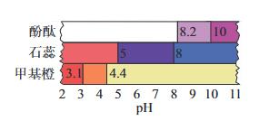

# 水溶液中的离子反应
<Badge type="warning" text="整理中" />

## 电离与水解

电离平衡

1. 定义：弱电解质电离与结合的的速率相同，各粒子浓度不变；

2. 注意：
   
   1. 电离过程吸热；

   3. 平衡时，转化率极小；

4. 影响因素：
 
   1. 自身性质；
 
   2. T增大，平衡右移；

5. 比较依据：$K_a$、$K_b$越大，越易电离，越显酸性、碱性。

盐类水解

1. 注意：

   1. 水解吸热；

   2. 水解一般极微弱；

3. 影响因素：自身因素、t、c；

4. 应用：

   1. 加热$\ce{Na_2CO_3(aq)}$更容易去污；

   2. 储存、配置易水解的盐加酸；

   3. 可溶性铝/铁盐净水；

   4. 制取$\ce{TiO_2}$、$\ce{SnO}$、$\ce{SnO_2}$等过渡金属氧化物；

   5. 判断溶液酸碱性；

   6. 制备固盐、胶体；

   7. 判断离子是否共存。

盐类的酸碱性

1. 强酸弱碱盐不水解，呈中性；

2. 弱酸根离子水解产生$\ce{OH^-}$，弱碱阳离子水解产生$\ce{H^+}$，因此强酸弱碱盐呈酸性，弱酸强碱盐呈碱性；

3. 弱酸弱碱盐应当看两种离子水解的K，$K_ha$大呈碱性，$K_hb$大呈酸性，相近则中性；

4. 弱酸酸式盐的酸碱性应当比较$K_a$和$K_h$，$K_h$大于$K_a$，溶液呈碱性，反之呈酸性。

强弱酸的判断

1. 0.1mol/L的溶液中，pH=1的为强酸，pH>1的为弱酸；

2. 同t同c的两种酸与金属反映的速率或导电能力；

3. 钠盐的pH。

水溶液中的三大守恒

1. 电荷守恒：所有的阴离子和阳离子浓度和相等；

2. 物料守恒：不同形式的相同元素之和之比是化学式之比；

3. 质子守恒：水电离出的以不同形式存在的H+和OH-的量相等。

## pH
公式：

$pH=-lg c(\ce{H^+})$；

意义：

1. 常温下，pH=7为中性，pH<7为酸性，pH>7为碱性；

2. pH越小则越酸，越大则越碱。

pH试纸

1. 操作：取一小块pH试纸于干燥洁净的玻璃片或表面皿上，用干燥清洁的玻璃板蘸取待测液于pH试纸上，与标准比色卡对准读数；

2. 种类：

   1. 广泛pH试纸：测定范围为(1,14)/(1,10)，可识别的差距为1；

   2. 精密pH试纸：测定范围较窄，差距为0.2或0.3；

   3. 专用pH试纸：只适用于酸性/碱性/中性溶液；

4. 注意：

   1. pH试纸本身为黄色，酸红碱蓝；

   2. pH试纸不能润湿，否则会导致酸性溶液结果偏大，碱性溶液结果偏小；

   3. pH试纸不能测量有漂白性、脱水性的物质。

pH计/酸度计：精密测量pH，量程0-14.

酸碱指示剂

## 沉淀溶解平衡

沉淀溶解平衡

1. 定义：一定条件下，沉淀/结晶的速度相等时，形成饱和的电解质溶液达到的平衡；

2. 移动：一般升温会使平衡正移，但也有例外，例如${Ca(OH)_2}$。

溶解度（s）

1. 定义：一定温度（压强）下，某一物质在100g溶液里的质量（体积）；

2. 影响因素：

   1. 溶质本身与溶剂、溶液的因素；

   2. 一般温度增大，固体的溶解度增加，气体减少；

   3. 一般压强增大，气体的溶解度增大。

溶解度大小的比较
   
   1. 阴阳离子之比相同的物质，Ksp越大，溶解度越大；
   
   2. 其他物质应当计算平衡时的浓度；
   
   3. 复分解反应中，溶解性大的生成溶解性小的。

沉淀生成

1. 方法：

   1. 调节pH；

   2. 加沉淀剂；

2. 应用：无机物的制备和提纯、废水处理等；

沉淀溶解

1. 原理：对于难溶的电解质，如果能设法不断移取生成物，使平衡向右移动，则可以使沉淀溶解；

2. 方法：

   1. 酸溶解法；

   2. 盐溶解法；

   3. 生成配合物法；

   4. 氧化还原法；

沉淀转化

1. 条件：一般溶解性大的转化为溶解性小的，但有时可以逆向转化；

2. 应用：

   1. 水垢；

   2. 工业废水。
